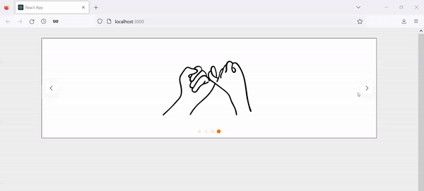
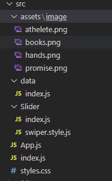

React를 배우기 시작하고 실제 웹사이트를 개발할 때, 그림 및 사진을 자주 활용할 기회가 있다. 특히 여러 사진을 한 영역 내에서 보여주는 형식을 흔하게 접할 수 있는데 React Swiper 라이브러리가 이 기능을 구현할 때 적합하다. 이 글을 통해 해당 라이브러리의 기본을 알아보자.



## 필수

- Component, props 등등 기초 React 배경지식
- 기본 React App
- React App이 없을 시, 아래 명령어로 입력하여 생성

```js
npx create-react-app [your project folder name]
```
## 폴더 구조


최종적으로 생성할 App의 폴더 구조를 나타내는 그림이니 참고하면 된다. 우선, Swiper 라이브러리에서 필요한 모듈을 import하고 Slder folder 하위에 Slider 컴포넌트가 들어있는 index.js를 생성한다. 이 컴포넌트 안에 우리가 원하는 Slider를 생성한다. 마지막으로 asset 폴더 안에 있는 data 폴더에서 Slider를 통해 보여줄 사진들이 저장되어 있다.

## Swiper library 설치
아래 명령어를 입력하여 라이브러리를 설치한다.

```js
npm install swiper
```

## Swiper modules 설치
Slider 폴더 안에 있는 index.js에 swiper 라이브러리에서 이 App에 활용할 4가지 모듈을 import한다. Navigation, Pagination, EffectFade, Autoplay가 해당 4가지 모듈이다. 다른 기능을 사용하고 싶다면 해당 모듈을 import하면 된다. 다른 모듈에 관한 설명은 Swiper 라이브러리 공식 [웹사이트](https://swiperjs.com/swiper-api#modules)에 나와 있으니 참고하면 된다.

Slider 컴포넌트:
```js
import {SliderWrap} from "./swiper.style";
// styled-component wrap
import {Swiper, SwiperSlide} from 'swiper/react';
// SwiperSlide is pretty self-explantory. it is one slide that would contain
// one of data you want to show
import SwiperCore, {Navigation, Pagination, EffectFade, Autoplay } from "swiper";

// install Swiper modules
SwiperCore.use([Navigation, Pagination, EffectFade, Autoplay]);

const Slider = ({children, settings}) => {
  const sliderOptions = {
    slidesPerView: 1,
    pagination: true,
    navigation: true,
    loop: true,
    // autoplay: {
    //  delay: 1000,
    //  disableOnInteraction: false,
    // },
    ...settings
    // Uncomment autoply option then you can see the swiper play automatically
    // you can override setting options pass settings props to this component
  };
  // swiper takes options as props
  // you can find more about options on the website link above

  return (
    <SliderWrap
      dots={sliderOptions?.pagination}
      arrows={sliderOptions?.navigation}
      // I pass dots and arrow props to custom pagination and navigation in styled-component
    >
      <Swiper
        {...sliderOptions}
      >
        {children}
      </Swiper>
    </SliderWrap>
  );
};

export {SwiperSlide as Slide};
export default Slider;
```

주석에 코드에 대한 설명들이 자세히 적혀 있으나 React를 처음 접하게 된 사람들은 swiper.style.js가 정확하게 어떤 역할을 하는지 그리고 어떻게 활용하는지 궁금하실 수도 있다. styled-component라는 라이브러리로 Slider 컴포넌트를 감싸서 해당 컴포넌트에 css를 적용하는 역할을 한다. swiper.style.js 안에 아래 코드와 같이 적어본다:

```js
import styled, {css} from "styled-components";

export const SliderWrap = styled.div`
  position: relative;
  .swiper {
    border: 1px solid #000;
    width: 80%;
    margin-top: 30px;
    margin-left: auto;
    margin-right: auto;
  }
 
  .swiper-slide {
    display: flex;
    justify-content: center;
    align-items: center;
    background: #fff;
    img {
      max-width: 50%;
      height: 300px;
    }
  }
  ${({arrows}) => arrows && css`
    .swiper-button {
      &-next,
      &-prev {
        top: 50%;
        z-index: 9;
        width: 40px;
        height: 40px;
        margin: auto;
        line-height: 40px;
        position: absolute;
        visibility: hidden;
        text-align: center;
        transform: translateY(-50%);
        color: #000000;
        transition: all 0.4s ease 0s;
        border-radius: 50%;
        background-color: #ffffff;
        box-shadow: 0 3px 25.5px 4.5px rgba(0, 0, 0, .06);
        &:hover {
          color: #212121;
          background-color: #ff7004;
        }
        &:after {
          font-size: 14px;
        }
      }
      &-prev {
        outline: 0; 
        right: auto;
        left: -20px;
        &:after {
          margin-right: 3px;
        }
      }
      &-next {
        outline: 0;
        left: auto;
        right: -20px;
        &:after {
          margin-left: 3px;
        }
      }
      &-disabled {
        opacity: 0.1;
      }
    }
    &:hover {
      .swiper-button {
        &-prev, &-next {
          visibility: visible;
        }
        &-prev {
          left: 10px;
        }
        &-next {
          right: 10px;
        }
      }
    }
  `}
  ${({dots}) => dots && css`
    .swiper-pagination {
      &-bullet {
        cursor: pointer;
        width: 10px;
        height: 10px;
        display: inline-block;
        border-radius: 50%;
        background: #ff7004;
        opacity: 0.2;
        border: 1px solid #ff7004;
        margin: 0 5px;
        box-shadow: none;
        transition: all 0.4s ease 0s;
        transform: scale(0.8);
        &:hover, &-active {
          background-color: #ff7004;
          border-color: #ff7004;
          transform: scale(1.0);
          opacity: 1;
        }
      }
    }
  `};
`
```

## 사진
```js
import Athelete from "../assets/image/athelete.png";
import Books from "../assets/image/books.png";
import Hands from "../assets/image/hands.png";
import PicPromise from "../assets/image/promise.png";

export const pictures = [
  {
    id: 1,
    title: "athelete",
    thumbnail: Athelete
  },
  {
    id: 2,
    title: "books",
    thumbnail: Books
  },
  {
    id: 3,
    title: "hands",
    thumbnail: Hands
  },
  {
    id: 4,
    title: "promise",
    thumbnail: PicPromise
  }
];
```

사진을 import 할 때, 정확한 path를 적어야 한다.

## App.js
```js
import Slider, {Slide} from "./Slider";
import { pictures } from "./data";

import "./styles.css";

import "swiper/css";
import "swiper/css/autoplay";
import "swiper/css/navigation";
import "swiper/css/pagination";
import "swiper/css/effect-fade";

function App() {
  return (
    <Slider
      settings={{
        navigation: true
      }}
    >
      {pictures.map((slide, index) => (
        <Slide 
          key={slide.id ? slide.id : index}
        >
          
        </Slide>
      ))}
    </Slider>
  );
}

export default App;
```

필수적으로 import 해야 하는 css 파일들이 있어야 동작이 된다.

## 결론
간단한 React App으로 Slider를 구현했다. Swiper 라이브러리는 이 글에서 보여준 기능 이외에도 다른 기능들이 있으니 사용자의 의도와 목적에 맞게 적절하게 개발하시길 바란다.

이 글이 React Swiper에 관해 찾는 분들께 도움이 되었으면 좋겠습니다!

_**읽어 주셔서 감사합니다. To be continued!**_

_이 글은 [Medium](https://medium.com/@shkim04/how-to-use-react-swiper-58eef325b09f)에도 업로드 되었습니다._
_놀러 오세요!_