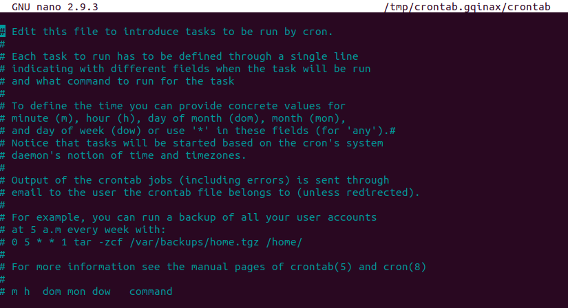

소프트웨어 환경을 설정하고 관리하는 리눅스 사용자는 `cron`을 통해 스케줄 작업을 합니다. 반복적인 작업에 큰 도움이 됩니다.

필자가 개발하고 관리하는 어플리케이션 서버들 중 VM에 실행되고 한 포트에 24시간 열려 있어야 하는 서버가 있다. 그런데 이 서버가 가끔 종료가 되곤 했는데 `cron` 덕분에 꺼질 때마다 직접 다시 실행시킬 필요가 없었다. 구체적으로 어떤 상황이었고 `cron`을 어떻게 해결했는지 공유한다.

## 필수
- Linux 환경 — _필자는 Ubuntu를 사용한다_
- Linux에 관한 약간의 배경지식 — _간단한 명령어 등_
- bash 스크립트에 관한 약간의 배경지식

## 실제 적용 사례
필자는 회사 앱 서비스를 위해 필요한 데이터를 수집하고 가공하는 과정을 자동화시키는 어플리케이션 서버를 개발하고 관리한다. 

이 작업을 위해 회사는 웹사이트를 크롤링하는 소프트웨어 상품을 매일 사용하고 있다. 크롤링 작업량이 많고 빡빡한 이유인지 작업 요청을 처리하는 중에 자주 꺼지기도 한다. 그 결과, 앱에서 충분한 데이터를 보여주지 못한 경우가 있다. 문제 해결을 위해 _**sikulix**_ 라는 어플리케이션을 적용했는데 그래픽 이미지를 감지하고 감지한 이미지를 활용하도록 돕는 역할을 제공한다. 간단히 말하면 크롤링 소프트웨어가 꺼질 때마다 다시 켤 수 있게 사용하는 것이다.

sikulix 서버를 실행시킨 후 처음 몇 일은 기대한 대로 잘 동작했다. 크롤링 소프트웨어가 꺼지는 것을 감지하고 자동으로 열어주는 역할을 제대로 한 것이다. 

하지만 sikulix 서버 자체가 어떠한 이유로 자주 꺼지게 되면서 무용지물이 되었고 이 sikulix 서버가 꺼질 때 다시 자동으로 시작할 수 있는 방법을 찾아야 했다.

_**이 즈음 되서 약간 약이 올랐다.**_

다행히도 `cron`과 shell 스크립트로 문제를 해결했다. 이에 대해 이야기를 해보겠다.

## 간단한 예
1. `*/1 * * * * echo "Hello, World"`
2. ``50 1,2 * * * cd /home/cron_logs & touch cron-`date +\%F`.log``
3. `0 0 1* * find /home/cron_logs -name "*.log" -type f -mtime +30 -delete`

먼저 cron에 대한 기본을 알고 넘어가자. 위 코드는 `cron`으로 실행하는 스케줄이 된 작업들이다. 명령어는 2개 부분으로 나뉘는데 하나는 시간이고 나머지는 설정한 시간에 동작할 명령어다.

순서대로 어떤 작업인지 설명한다:

1. _**"Hello, World"**_ 가 매 1분마다 로그에 출력된다
2. cron_[_명령어가 실행된 시점_].log이라는 파일이 홈 경로에 있는 **cron_logs** 폴더 하위에 매일 오전 1:50과 2:50에 생성된다.
3. **cron_logs** 폴더 하위에 있고 파일 이름에 log가 있는 파일들 중 30일 이전에 생성된 파일은 매월 첫날 자정에 삭제된다

## 솔루션
문제 해결을 위한 접근 방식은 다음과 같았다. _**sikulix**_ 서버가 작업을 하기 몇 분 전에 동작을 하고 있는지 확인하는 것이고 동작하지 않을 경우 재시작시키는 것이다.
다음과 같은 순서로 이 시나리오를 구현했다:

1. 터미널을 열어 cron 에디터를 연다.
```bash
crontab -e
// edit cron jobs
```

2. 아래 코드를 에디터에 입력한다.
```bash
50 2,5,20,23 * * * /home/sikulix/handle_sikulix.sh >> ~/cron_logs/cron-`date +\%F`.log 2>&1
```

> 실행시킬 shell 스크립트의 절대경로를 입력했다는 것에 주목하자. Cron은 파일 이름만 덩그러니 적어주면 그 파일이 어디 있는지 알지 못한다.

ctrl+x를 눌러 완료한다.

3. cron을 재시작한다
```bash
sudo systemcrl restart cron
```

cron job이 적용이 되려면 `cron`을 재시작해야 한다.

4. handle_sikulix.sh 생성
```bash
#!/bin/bash

isRun="YES"
$(sudo netstat -tulpn | grep :[SIKULIX SERVER PORT] > /dev/null) || isRun=""

if [ "$isRun" = "YES" ]; then
    echo "Autorun server is running"
else
    export DISPLAY=:10.0
    cd /home/sikulix
    ./start_server.sh;bash
fi
```
이 shell 스크립트의 역할은 sikulix 서버가 실행되는 포트가 사용되고 있는지 여부를 확인한다. 

사용되고 있다면 **cron_logs** 폴더 하위에 있는 한 로그 파일에 _"**Autorun server is running**"_ 가 출력된다. 사용이 되고 있지 않다면 _**sikulix**_ 디렉토리로 이동하여 sikulx 서버를 실행하는 스크립트인 `start_server.sh`을 실행한다.

## 결론
_**Cron**_ 은 이해하는데 크게 어려움은 없다. `cron`이가 가지고 있는 문법 혹은 명령어에 대한 규칙 등을 알맞게 적용하여 사용자의 목적에 맞게 스케줄 작업을 진행하면 된다고 생각한다.

_**읽어 주셔서 감사합니다. To be continued!**_

_이 글은 [Medium](https://medium.com/@shkim04/how-i-used-crontab-to-schedule-jobs-on-linux-for-my-work-1cb290847904)에도 업로드 되었습니다._
_놀러 오세요!_