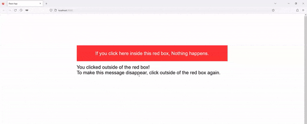

If you read this article, I think you are probably working on toggling visibility such as `modal` or `dropdown` menu — _Well, at least it was my case_. In fact, since `modal` and `dropdown` menu are the popular UI elements that are commonly used in React development, the chances are you want to know how to detect click outside a component sooner or later. Let’s figure out how to do it.

## ClickOutside Component
I simply name the component **ClickOutside** because it will detect whether a click event happens inside or outside of it. Feel free to name anything if you would like to. Here is how we will create it:

First, we will use `useRef` hook so that the outer `div` tag the component returns can be referenced through the component.

Second, we will have a handler function that catches an event, evaluate whether it happens inside or outside the outer `div` tag and then, do stuff based on its consequence.

Last, we add an event listener for `mousedown` so when we click, this handler function will be executed.

The code block below is the component:

```js
import { useRef, useEffect } from 'react';

export default function ClickOutside({ children, exceptionRef, onClick, className }) {
  const wrapperRef = useRef();

  useEffect(() => {
    document.addEventListener('mousedown', handleClickListener);
    
    return () => {
      document.removeEventListener('mousedown', handleClickListener);
    };
  }, []);

  const handleClickListener = (event) => {
    let clickedInside;
    if(exceptionRef) {
      clickedInside = (wrapperRef && wrapperRef.current.contains(event.target)) || exceptionRef.current === event.target || exceptionRef.current.contains(event.target);
    }
    else {
      clickedInside = (wrapperRef && wrapperRef.current.contains(event.target));
    }

    if (clickedInside) return;
    else onClick();
  }
  
  return (
    <div ref={wrapperRef} className={`${className || ''}`}>
      {children}
    </div>
  );
};
```

This component has 4 props that are passed from its parent component.

> **children** is anything that goes under the outer div tag that is referenced.
> 
> **exceptionRef** can be a component or a simple div tag that is referenced, which can be literally an exception for its function. That is, when exceptionRef is clicked, it is thought to happen in the insided of **ClickOutside** component
> 
> **onClick** is a handler function that is passed to this component. It will be executed when the click event happens outside of the component.
> 
> **className** makes the component have a className so you can apply css to the component.

## Example
```js
import { useState } from "react";
import ClickOuside from "./components/ClickOutside";
import './App.css';

function App() {
  const [visible, setVisible] = useState(false);

  const toggleText = () => {
    setVisible(prev => !prev);
  };

  return (
    <div className='container'>
      <ClickOuside
        onClick={toggleText}
      >
        <div className='red-box'>
          <div>
            If you click here inside this red box, Nothing happens.
          </div>
        </div>
      </ClickOuside>
      {
        visible && (
          <div className='hidden-text'>
            You clicked outside of the red box!<br/>To make this message disappear, click outside of the red box again.
          </div>
        )
      }
    </div>
  );
}

export default App; 
```

Let’s create a `div` tag whose class name is given red box that says _"**If you click here inside this red box, Nothing happens**"_. We will wrap the red box `div` tag around **ClickOutside** component. 

Then, we pass a handler function, which toggles visibility of a `div` tag containing a hidden text to **ClickOutside** component. 

What is expected to happen is when we click the outside of the red box, the hidden text will show up, saying _"**You clicked outside of the red box! To make this message disappear, click outside of the red box again**"_. If clicked again, it will disappear.

You can create another `div` tag and give it a reference by using `useRef` hook, then pass it as exceptionRef. When you click it, nothing will happens as you click the inside of **ClickOutside** component.

I think there are various ways to use this component on React applications. I hope you take the code and make it better for your application!

_**THANKS FOR READING. SEE YOU NEXT TIME!**_

_This is originally posted on my [Medium](https://medium.com/@shkim04/react-how-to-detect-click-outside-a-component-984fe2e003e8)._
_Let's connect!_