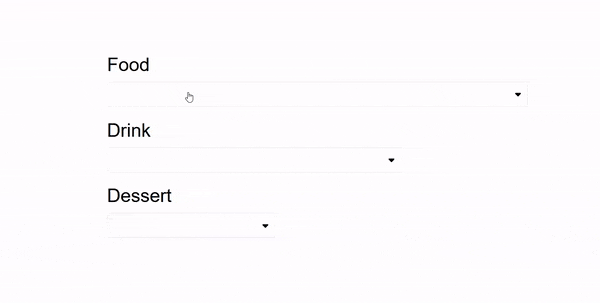

React 개발을 하면서 `select` 태그를 활용하거나 라이브러리를 통해 얻은 dropdown 메뉴를 사용하면서 만족한 경험을 한 다른 개발자들이 많을지 늘 의문이었다. 필자는 한번도 정확히 원하는 기능과 디자인을 찾은 적이 없기 때문이다. 그래서 그냥 직접 dropdown을 만들었다. 이 글에서는 **Dropdown** 컴포넌트를 어떻게 만들었는지 공유하려고 한다. React 개발을 하다가 비슷한 경험을 하신 분들에게 조금이나마 아이디어를 제공할 수 있지 않을까 싶다. 이제 시작해보자.

## 필수
- 연습용 react app
- 열정

## Fontawesome Icon 설치
Fontawesome Icons은 무료로 사용이 가능하다. dropdown 메뉴에 사용할 화살 아이콘을 import 한다.

```
npm install @fortawesome/react-fontawesome @fortawesome/free-solid-svg-icons
```

## Dropdown 컴포넌트

```js
import { useState, useRef } from 'react';

import { faCaretDown, faCaretUp } from '@fortawesome/free-solid-svg-icons';
import { FontAwesomeIcon } from '@fortawesome/react-fontawesome';

import ClickOutside from '../ClickOutside';
import './Dropdown.css';

export default function Dropdown({ 
  listItems,
  selectedValue,
  onClick
}) {
  const exceptionRef = useRef();
  const [isOpen, setIsOpen] = useState(false);

  const toggleDropdown = () => {
    setIsOpen(prev => !prev);
  };

  const handleValueClickEvent = (value) => {
    setIsOpen(false);
    onClick(value);
  };

  const handleOpenStyle = !isOpen ?
          {
            header: {
              borderRadius: '3px',
              border: '1px solid rgb(225, 225, 225)'
            }
          } : 
          {
            header: {
              fontWeight: '900',
              borderRadius: '3px 3px 0 0',
              borderTop: '1px solid #4da7d4',
              borderLeft: '1px solid #4da7d4',
              borderRight: '1px solid #4da7d4',
              borderBottom: '1px solid #f0f8ff'
            },
            ul: {
              borderRadius: '0 0 3px 3px',
              borderBottom: '1px solid #4da7d4',
              borderLeft: '1px solid #4da7d4',
              borderRight: '1px solid #4da7d4'
            },
            li: {
              borderBottom: '1px solid #f0f8ff'
            }
          }

  return (
    <div className='custom-dropdown-container'>
      <div
        tabIndex={-1}
        className='custom-dropdown-header'
        style={handleOpenStyle.header} 
        onClick={toggleDropdown}
        ref={exceptionRef}
      >
        <div className='selected-value'>
          { selectedValue }
        </div>
        { isOpen ? <FontAwesomeIcon icon={faCaretUp} /> : <FontAwesomeIcon icon={faCaretDown} /> }
      </div>
      {
        isOpen && (
            <ClickOutside
              className={'dropdown-list-container'}
              onClick={() => setIsOpen(false)}
              exceptionRef={exceptionRef}
            >
              <ul 
                className='dropdown-list'
                tabIndex={-1}
                style={handleOpenStyle.ul} 
              >
                {
                  listItems.map((item, index) => (
                    <li 
                      className='dropdown-list-item'
                      style={handleOpenStyle.li}
                      key={`dropdown-list-${index}`}
                      onClick={() => handleValueClickEvent(item)}
                      value={item}
                    >
                      {item}
                    </li>
                  ))
                }
              </ul>
            </ClickOutside>
          )
        }
    </div>
  );
};
```

코드 시작부터 쭉 살펴보자.

### Import
dropdown에 미를 한숟갈 더할 2개의 아이콘을 import한다.

### Props
**Dropdown** 컴포넌트는 3개의 prop을 가진다.
1. **listItems**은 메뉴에 보여줄 아이템의 배열이다.
2. **selectedValue**은 parent 컴포넌트로부터 전달받은 **listItems** 중 선택된 값을 말한다.
3. **onClick**은 parent 컴포넌트에서 선택된 값을 설정하는 핸들러 함수이다.

선택 값은 **Dropdown** 컴포넌트 안에서만 통제할 수 있지만 그 parent 컴포넌트에서 통제한다. 그래서 **selectedValue**와 **onClick**는 parent 컴포넌트로부터 내려받는다.

이유를 설명하자면 하나 이상의 dropdown이 있고 각각 다르게 선택된 값을 하나의 데이터셋으로 만들어 서버에 보낸다고 생각해보자. 만약 값들이 **Dropdown** 컴포넌트에서만 통제된다면 각각의 값들을 모을 수 없다. 왜냐하면 컴포넌트 특성상 선택된 값들은 각 **Dropdown** 컴포넌트에서만 접근이 가능하기 때문이다.

### State 와 Ref
컴포넌트 내에 정의된 변수를 살펴보자. 먼저 `useRef` 훅 사용해 정의한 exceptionRef가 있다. 컴포넌트 안에서 지칭이 된다. 그리고 `isOpen`이라는 이름으로 dropdown 메뉴 노출 유무 상태를 저장한 변수가 있다.

### Handler 함수
2개의 핸들러 함수가 있는데 하나는 사용자가 클릭하여 dropdown 메뉴 노출 유무를 정하는 함수이고 나머지는 dropdown 아이템을 선택하면 dropdown을 닫고 parent 컴포넌트에서 받은 **onClick** 함수를 실행하는 함수다.

### HandleOpenStyle
`isOpen` 상태에 맞춰 클릭을 할 경우에 맞는 시각 효과를 담은 _**css**_ 를 저장한 객체이다.

### 반환
`div` 태그로 만든 헤더 영역이 있다. 이 부분을 클릭하면 핸들러 함수가 실행이 되고 `isOpen` 상태를 true로 설정한다. 다음, 메뉴 아이템 목록을 이 헤더 바로 밑에서 보여주며 이 목록은 **ClickOutside** 컴포넌트로 감싸진 `ul` 태그가 사용된다. 사용자가 이 컴포넌트 바깥은 클릭하거나 메뉴 아이템을 클릭하면 핸들러 함수가 `isOpen`를 false로 설정하기 때문에 목록이 닫힐 것이다. 여기서 헤더를 보면 `tabIndex`가 있는데 이 필드에 -1을 주면 태그에 css로 focus 효과를 줄 수 있다.

**ClickOutside** 컴포넌트에 대해 궁금하실 수도 있다. 이름에서 알 수 있듯이 이 컴포넌트가 감싸고 있는 영역 밖에서 발생하는 클릭 이벤트를 알 수 있다. 또한, exceptionRef라는 prop으로 예외를 둘 수 있다. 더 자세한 내용은 [이전 글](https://shkim04.github.io/react-컴포넌트-밖-클릭-감지)를 참고하시길 바란다.

## Dropdown CSS
```css
.custom-dropdown-container {
    width: 100%;
}
  
@media (max-width: 400px) {
    .custom-dropdown-container {
        height: 100%;
        min-width: 80px;
    }
}
  
.custom-dropdown-header {
    height: 40px;
    padding: 5px 10px 5px 5px;
    display: flex;
    justify-content: space-between;
    align-items: center;
    font-size: 15px;
}

@media (max-width: 400px) {
    .custom-dropdown-header {
        font-size: 11px;
    }
}

.custom-dropdown-header:hover {
    cursor: pointer;
}

.dropdown-list-container {
    position: relative;
}

.dropdown-list-container ul {
    box-sizing: border-box;
    background-color: #ffffff;
    position: absolute;
    z-index: 999;
    width: 100%;
    max-height: 250px;
    padding: 0px;
    margin: 0px;
    overflow: auto;
    font-size: 15px;
}

.dropdown-list-container ul li {
    list-style: none;
    padding: 5px;
    cursor: pointer;
}

.dropdown-list-container ul li:hover {
    background-color: #2ea9da;
}
```

## App.js
Dropdown 컴포넌트가 어떻게 작동하는지 알아보자. 크기가 다른 3개의 dropdown 메뉴가 있다.

```js
import { useState } from "react";
import Dropdown from "./components/Dropdown";
import './App.css';

const FOOD_LIST = ['Bibimbap', 'Frikadeller', 'Sushi', 'Curry', 'Sandwich'];
const DRINK_LIST = ['Soju', 'Beer', 'Coke', 'Zero Coke', 'Sprite'];
const DESSERT_LIST = ['Bingsu', 'Icream', 'Cake', 'Snack', 'Chocolate'];

function App() {
  const [food, setFood] = useState('');
  const [drink, setDrink] = useState('');
  const [dessert, setDessert] = useState('');

  const handleFood = (value) => {
    setFood(value);
  };

  const handleDrink = (value) => {
    setDrink(value);
  };

  const handleDessert = (value) => {
    setDessert(value);
  };

  return (
    <div className='container'>
      <div className='menu-header'>
        Food
      </div>
      <div className='dropdown-container food-menu'>
        <Dropdown 
          listItems={FOOD_LIST}
          selectedValue={food}
          onClick={handleFood}
        />
      </div>
      <div className='menu-header'>
        Drink
      </div>
      <div className='dropdown-container drink-menu'>
        <Dropdown 
          listItems={DRINK_LIST}
          selectedValue={drink}
          onClick={handleDrink}
        />
      </div>
      <div className='menu-header'>
        Dessert
      </div>
      <div className='dropdown-container dessert-menu'>
        <Dropdown 
          listItems={DESSERT_LIST}
          selectedValue={dessert}
          onClick={handleDessert}
        />
      </div> 
    </div>
  );
}

export default App; 
```

```css
*, *::before, *::after {
    box-sizing: border-box;
}

#root {
    display: flex;
    justify-content: center;
    margin-top: 200px;
    height: 100vh;
    font-family: Arial, Helvetica, sans-serif;
}

.container {
    width: 50%;
    height: 200px;
}

.menu-header {
    margin-bottom: 10px;
}

.dropdown-container {
    margin-bottom: 20px;
}

.food-menu {
    width: 100%;
}

.drink-menu {
    width: 70%;
}

.dessert-menu {
    width: 40%;
}
```

어플리케이션을 실행하면 다음과 같은 결과를 보인다:



## 결론
이 코드를 활용하여 다른 css를 적용하고 컴포넌트를 수정하면 또 다른 custom dropdown 컴포넌트가 생길 것이다. 이 글을 읽고 계신 분들이 이 코드가 쓸만하다고 판단하여 더 괜찮은 버전을 만들기를 바라면서 마친다.

_**읽어 주셔서 감사합니다. To be continued!**_

_이 글은 [Medium](https://medium.com/@shkim04/react-how-to-create-a-custom-dropdown-component-4c3bedffe18e)에도 업로드 되었습니다._
_놀러 오세요!_