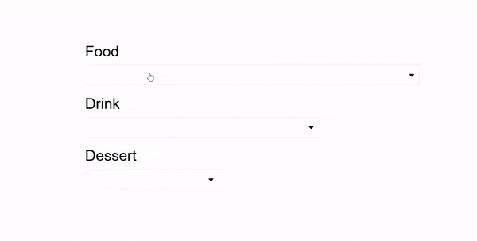

I am wondering how many of you are satisfied with a dropdown menu created with select tag or imported from some libraries because I have never been able to find one that fits best in exactly what I wanted. So, I just created my own dropdown menu. In this article, I will share how I created **Dropdown** component. If you have had the same experience while developing React application, I may give you some idea to your problems. Let's dive in.

## Prerequisite
- Simple react app for practice
- Passion

## Install Fontawesome Icon
Fontawesome Icons are free. We will import arrow icons that we need for custom dropdown menu.

```
npm install @fortawesome/react-fontawesome @fortawesome/free-solid-svg-icons
```

## Dropdown Component

```js
import { useState, useRef } from 'react';

import { faCaretDown, faCaretUp } from '@fortawesome/free-solid-svg-icons';
import { FontAwesomeIcon } from '@fortawesome/react-fontawesome';

import ClickOutside from '../ClickOutside';
import './Dropdown.css';

export default function Dropdown({ 
  listItems,
  selectedValue,
  onClick
}) {
  const exceptionRef = useRef();
  const [isOpen, setIsOpen] = useState(false);

  const toggleDropdown = () => {
    setIsOpen(prev => !prev);
  };

  const handleValueClickEvent = (value) => {
    setIsOpen(false);
    onClick(value);
  };

  const handleOpenStyle = !isOpen ?
          {
            header: {
              borderRadius: '3px',
              border: '1px solid rgb(225, 225, 225)'
            }
          } : 
          {
            header: {
              fontWeight: '900',
              borderRadius: '3px 3px 0 0',
              borderTop: '1px solid #4da7d4',
              borderLeft: '1px solid #4da7d4',
              borderRight: '1px solid #4da7d4',
              borderBottom: '1px solid #f0f8ff'
            },
            ul: {
              borderRadius: '0 0 3px 3px',
              borderBottom: '1px solid #4da7d4',
              borderLeft: '1px solid #4da7d4',
              borderRight: '1px solid #4da7d4'
            },
            li: {
              borderBottom: '1px solid #f0f8ff'
            }
          }

  return (
    <div className='custom-dropdown-container'>
      <div
        tabIndex={-1}
        className='custom-dropdown-header'
        style={handleOpenStyle.header} 
        onClick={toggleDropdown}
        ref={exceptionRef}
      >
        <div className='selected-value'>
          { selectedValue }
        </div>
        { isOpen ? <FontAwesomeIcon icon={faCaretUp} /> : <FontAwesomeIcon icon={faCaretDown} /> }
      </div>
      {
        isOpen && (
            <ClickOutside
              className={'dropdown-list-container'}
              onClick={() => setIsOpen(false)}
              exceptionRef={exceptionRef}
            >
              <ul 
                className='dropdown-list'
                tabIndex={-1}
                style={handleOpenStyle.ul} 
              >
                {
                  listItems.map((item, index) => (
                    <li 
                      className='dropdown-list-item'
                      style={handleOpenStyle.li}
                      key={`dropdown-list-${index}`}
                      onClick={() => handleValueClickEvent(item)}
                      value={item}
                    >
                      {item}
                    </li>
                  ))
                }
              </ul>
            </ClickOutside>
          )
        }
    </div>
  );
};
```

Let's break down this component from the top of the code block above.

### Import
We import two icons that we mentioned above to booster a beauty of our dropdown.

### Props
**Dropdown** component takes in 3 props. 
1. **listItems** is an array of items that we want to place in the menu.
2. **selectedValue** is literally a selected value from **listItems** which is passed from its parent component. 
3. **onClick** is a prop which is a handler function that sets the selected value in the parent component. 

Although a selected value can be handled in **Dropdown** component itself, it is handled by its parents component so, **selectedValue** and **onClick** are passed from the parent component.

To explain why, imagine you have a few of different dropdowns and have to collect all the selected values to send to a server. If selected values are just handled in **Dropdown** component, you cannot gather them together because each of the values can be only accessed in each of **Dropdown** component by nature.

### State and Ref
There are a few things that are defined. First of all, exceptionRef is defined using `useRef` hook. It will be referenced through the component. More explanation about this will be given later in this article. Also we have a state named `isOpen`, which contains information about whether dropdown menu is open or closed.

### Handler functions
We have two handler functions. One is to let users toggle the dropdown menu. The other is to close the dropdown menu and execute **onClick** function passed from the parent component when an item of the dropdown is clicked.

### HandleOpenStyle
To give a visible effect on events such as click, we define some _**css**_ rules depending on `isOpen` state.

### Return
We have this header section created by `div` tag. When it is clicked, a handler function will be executed so will set `isOpen` to true. Then, it will show the menu item list right beneath the header section, created by `ul` tag wrapped around **ClickOutside** component. It will be closed when users click outside this component or a menu item because the handler function will set the state `isOpen` to false. Another tip here is that there is `tabIndex` and set to -1 to make it focusable so we can add some effect using CSS.

You may want to know more about **ClickOutside** component. As you can guess from the name, it will detect click events outside the component wrapped in it. You can give it an exception by passing a prop to it(=exceptionRef). For more detail, check out my previous [post](https://shkim04.github.io/en/how-to-detect-click-outside-react-component).

## Dropdown CSS
```css
.custom-dropdown-container {
    width: 100%;
}
  
@media (max-width: 400px) {
    .custom-dropdown-container {
        height: 100%;
        min-width: 80px;
    }
}
  
.custom-dropdown-header {
    height: 40px;
    padding: 5px 10px 5px 5px;
    display: flex;
    justify-content: space-between;
    align-items: center;
    font-size: 15px;
}

@media (max-width: 400px) {
    .custom-dropdown-header {
        font-size: 11px;
    }
}

.custom-dropdown-header:hover {
    cursor: pointer;
}

.dropdown-list-container {
    position: relative;
}

.dropdown-list-container ul {
    box-sizing: border-box;
    background-color: #ffffff;
    position: absolute;
    z-index: 999;
    width: 100%;
    max-height: 250px;
    padding: 0px;
    margin: 0px;
    overflow: auto;
    font-size: 15px;
}

.dropdown-list-container ul li {
    list-style: none;
    padding: 5px;
    cursor: pointer;
}

.dropdown-list-container ul li:hover {
    background-color: #2ea9da;
}
```

## App.js
For practice and see how it works, we import Dropdown component and have 3 dropdown menu, each of which has a different size.

```js
import { useState } from "react";
import Dropdown from "./components/Dropdown";
import './App.css';

const FOOD_LIST = ['Bibimbap', 'Frikadeller', 'Sushi', 'Curry', 'Sandwich'];
const DRINK_LIST = ['Soju', 'Beer', 'Coke', 'Zero Coke', 'Sprite'];
const DESSERT_LIST = ['Bingsu', 'Icream', 'Cake', 'Snack', 'Chocolate'];

function App() {
  const [food, setFood] = useState('');
  const [drink, setDrink] = useState('');
  const [dessert, setDessert] = useState('');

  const handleFood = (value) => {
    setFood(value);
  };

  const handleDrink = (value) => {
    setDrink(value);
  };

  const handleDessert = (value) => {
    setDessert(value);
  };

  return (
    <div className='container'>
      <div className='menu-header'>
        Food
      </div>
      <div className='dropdown-container food-menu'>
        <Dropdown 
          listItems={FOOD_LIST}
          selectedValue={food}
          onClick={handleFood}
        />
      </div>
      <div className='menu-header'>
        Drink
      </div>
      <div className='dropdown-container drink-menu'>
        <Dropdown 
          listItems={DRINK_LIST}
          selectedValue={drink}
          onClick={handleDrink}
        />
      </div>
      <div className='menu-header'>
        Dessert
      </div>
      <div className='dropdown-container dessert-menu'>
        <Dropdown 
          listItems={DESSERT_LIST}
          selectedValue={dessert}
          onClick={handleDessert}
        />
      </div> 
    </div>
  );
}

export default App; 
```

```css
*, *::before, *::after {
    box-sizing: border-box;
}

#root {
    display: flex;
    justify-content: center;
    margin-top: 200px;
    height: 100vh;
    font-family: Arial, Helvetica, sans-serif;
}

.container {
    width: 50%;
    height: 200px;
}

.menu-header {
    margin-bottom: 10px;
}

.dropdown-container {
    margin-bottom: 20px;
}

.food-menu {
    width: 100%;
}

.drink-menu {
    width: 70%;
}

.dessert-menu {
    width: 40%;
}
```

If you run the app, you can see something like:



## Conclusion
I think that if you apply some different CSS rules and modify the component, you would have your own custom dropdown component that fits the best in your case. I would be happier if you make it even better!

_**THANKS FOR READING. SEE YOU NEXT TIME!**_

_This is originally posted on my [Medium](https://medium.com/@shkim04/react-how-to-create-a-custom-dropdown-component-4c3bedffe18e)._
_Let's connect!_