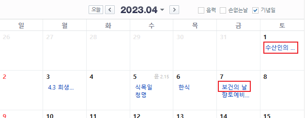
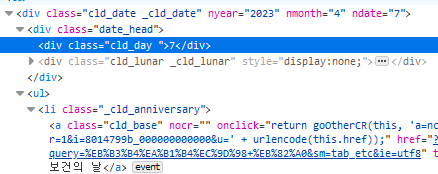
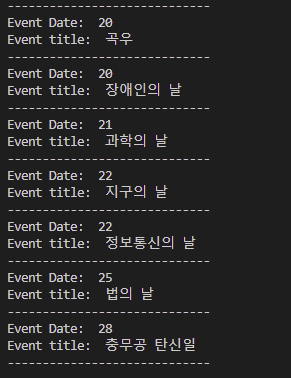

Selenium is a open source project that enables the automation of browers. What the automation means here is that you can do pretty much that happens on browers such as clicking elements or gettting a value from a target element. However, its capcity is simply beyond those mentioned. Also, we can write codes with it for all major web browsers according to what the documentation says.

Since I ocasionally have to write codes to crawl websites with selenium at work, I would like to share my experience and give useful tips. Let's get started.  

## Prerequisite
- Python - _3.10.0 for me_
- Knowledge about css selector or xpath

## Install
We need to install libraries required - _4.9.0 for me_.

```python
pip install selenium webdriver_manager
```

## Set up

```python
from selenium import webdriver
from selenium.webdriver.firefox.service import Service as FirefoxService
from selenium.webdriver.firefox.options import Options

from webdriver_manager.firefox import GeckoDriverManager

_options = Options()
_options.add_argument("--headless")

driver = webdriver.Firefox(service=FirefoxService(GeckoDriverManager().install()), options = _options)
```

Although it is so simple to set up selenium as you can see, there are a few of things to be explained in the code above. 

I have Firefox on my laptop, I import objects related to Firefox such as driver manager and options to pass. As previously mentioned, Webdrivers are supported in all major browers, you can take chrome if you want. 

I pass one option which is **--headless** to driver. It closes the brower when the driver works. In other words, if you do not pass that option, the brower pops up when the driver starts its job. There are more options to pass. Feel free to check other options to see if they suit your case.

## Example
I will actually give an example that is similar to what I did with selenium for some of my work. I hope you focus on thinking process that is presented throughtout this section.

### Goal
We will get all the titles of lists on each day of a whole month and dates on Naver Calendar.



https://search.naver.com/search.naver?where=nexearch&sm=top_hty&fbm=0&ie=utf8&query=%EB%8B%AC%EB%A0%A5

### Steps
Since it is not to just find a specific element but to find multiple elements sitting under some rule on html, we need steps to find a better way. Let's dig into the steps.

#### Find css selectors of the target elements
Open the dev tool of your browser and find a css selector of one of dates that has titles in it. In this case, I will take the css selector of the first title on 7th - _You will figure out why in the next steps_.


#### Find a pattern and modify the css selector
When you copy the css selector of the element you picked in the previous step, you will realize that it presents the exact position of the element as shown below.

```css
// FireFox
._calendarTableBody > tr:nth-child(2) > td:nth-child(6) > div:nth-child(1) > ul:nth-child(2) > li:nth-child(1) > a:nth-child(1)
```

```css
// If you use Chrome, it might be like
#direct_calendar > div > div.m_calendar._main_calendar > div.this_cld > table > tbody > tr:nth-child(2) > td:nth-child(6) > div > ul > li:nth-child(1) > a
```
Then, do we have to find each css selector of all the titles? Of course not!

I think that most of you might already have thought that there is a kind of a pattern to be abtracted here if you have learned **html**. Also, there must be a pattern in its html source if a website is well organized. To find any pattern, let's take the css selector of the title on 6th.

```css
._calendarTableBody > tr:nth-child(2) > td:nth-child(5) > div:nth-child(1) > ul:nth-child(2) > li:nth-child(1) > a:nth-child(1)
```

Also, if you take a look at the html structure of 8th, which does not have anything, you notice it is different from the ones that have titles.

We now can see the pattern. Both 6th and 7th have the similar structure and only difference is each of its position relative to _**td**_ tag. Since we need to find all the elements, the css selector of which is the same using a method called **find_elements**, we need to have one css selector that covers them. The css selector will be like:

```css
._calendarTableBody > tr:nth-child(2) > td > div:nth-child(1) > ul:nth-child(2) > li:nth-child(1) > a:nth-child(1)
```

However, I will take a step further from this. Instead of using **nth-child** when finding multiple elements, I will use **class name** if tags have their class name because sometimes one of them does not sit on the expected spot so, the web driver throws an error. Also, it will be still pretty fast for the driver to find them because we specify their class name. It can be written like:

```css
tbody._calendarTableBody > tr > td > div.cld_date > ul > li._cld_anniversary > a.cld_base
```

#### Find suitable css selector or xapth again
As you can see the css selector, each of the titles can be drawn from the **a** tags and we have found them all that have the titles. But, the **a** tags do not have any information about the date with respect to them.

Then, do we need to go through all the steps that have been taken so far? Thankfully we do not have to.

If we use css selector or xpath cleverly, we can overcome the hurdle. When we look at the dev tool, we can see that the tag containing a date is a sibling of the **ul** tag which is the parent element of the parent element of the **a** tag. 



We can write this relationship between **a** tag and the tag containing a date in **xpath** like - _I think the xpath is pretty self-explanatory_:

```
./ancestor::ul/preceding-sibling::div[contains(@class, "date_head")]/div[contains(@class, "cld_day")]
```

### Apply
We will iterate through all the **a** tags containing titles and find the tag containing a date with respect to a title in every **a** tag. Finally, we will draw text from an element using **text** method. To do this, the code will look like: 

```python
driver.get('https://search.naver.com/search.naver?where=nexearch&sm=top_hty&fbm=1&ie=utf8&query=%EB%8B%AC%EB%A0%A5')
driver.implicitly_wait(5)

event_days = driver.find_elements(By.CSS_SELECTOR, 'tbody._calendarTableBody > tr > td > div.cld_date > ul > li._cld_anniversary > a')
print('number of event days: ', len(event_days))

for event in event_days:
    event_date = event.find_element(By.XPATH, './ancestor::ul/preceding-sibling::div[contains(@class, "date_head")]/div[contains(@class, "cld_day")]').text
    event_title = event.text
    print('Event Date: ', event_date)
    print('Event title: ', event_title)
    print('-----------------------------')
```

Notice that elements found by **find_elements** method can be iterated and in the loop, **find_element** method is used to find an element containing a date from each element, **NOT** from the entire page.

If you run it, it will be printed like:



## Final Thoughts
Utilizing selenium still requires a great deal of work like finding suitable css selector, xpath or other methods given. But, it seems very obvious that it will help us in many ways once we get used to it.

_**THANKS FOR READING. SEE YOU NEXT TIME!**_