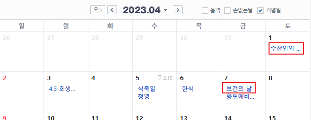
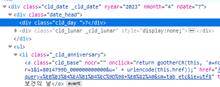
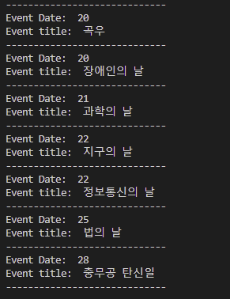

Selenium은 브라우저 자동화를 시켜주는 오픈 소스 프로젝트다. 여기서 자동화라는 것은 우리가 브라우저로 할 수 있는 많은 것들을 의미한다. 예를 들면 클릭을 하는 것이나 원하는 요소의 값을 얻는 것 등이다. 하지만 Selenium이 할 수 있는 일은 언급한 예들과 비교가 되지 않는다. 그리고 공식 문서에 따르면 주요 브라우저에서 맞는 코드를 작성할 수 있도록 지원한다.

회사에서 가끔 웹사이트 정보를 수집하기 위해 Selenium을 활용하고 있어서 경험과 팁이 될 수 있는 전달하려고 한다. 시작해보자.

## 필수
- Python - _필자는 3.10.0_
- css selector나 xpath에 대한 간단한 배경지식

## 설치
필요 라이브러리를 설치한다 - _필자는 4.9.0_.

```python
pip install selenium webdriver_manager
```

## 설정

```python
from selenium import webdriver
from selenium.webdriver.firefox.service import Service as FirefoxService
from selenium.webdriver.firefox.options import Options

from webdriver_manager.firefox import GeckoDriverManager

_options = Options()
_options.add_argument("--headless")

driver = webdriver.Firefox(service=FirefoxService(GeckoDriverManager().install()), options = _options)
```

보시다시피 Selenium을 설정하는 것은 그리 어려운 일이 아니지만 몇가지 설명하고 넘어갈 부분이 있다.

필자는 개인 컴퓨터에서 Firefox를 사용하고 있기 때문에 driver manager 등 Firefox에 관련된 필요 객체와 options를 import했다. 앞서 언급했듯이 Webdriver가 모든 주요 브라우저에서 지원되기 때문에 chrome을 선택해도 좋다.

**--headless**라는 옵션을 driver에 전달했다. 이 옵션은 driver가 동작할 때 브라우저를 닫아 준다. 다시 말해서 이 옵션을 전달하지 않으면 driver가 동작을 시작할 때, 브라우저가 열리게 된다. 다른 많은 옵션들이 있으니 사용자의 목적에 맞는 옵션들을 확인해보길 바란다.

## 예시
회사 업무와 비슷한 예시를 제공하려고 한다. 여기부터 어떤 생각을 가지고 접근했는지에 대해 초점을 맞추기를 바란다.

### 목표
네이버 달력에서 한 달 안에 적힌 제목들과 날짜를 수집한다.



https://search.naver.com/search.naver?where=nexearch&sm=top_hty&fbm=0&ie=utf8&query=%EB%8B%AC%EB%A0%A5

### 단계
특정 한 요소를 찾는 게 아니라 html 안에서 정해진 규칙으로 작성된 여러 요소들을 찾기 때문에 적절한 전략이 필요하다. 이 단계에 대해 살펴보자.

#### 목표 요소들의 css selector 찾기
브라우저의 개발자도구를 열고 제목이 포함된 날짜 중 하나의 css selector를 찾는다. 이 경우에는 필자는 7일 안에 있는 첫번째 제목의 css selector를 먼저 살펴볼 것이다 - _이유는 다음 단계들에서 드러난다_.


#### 패턴을 찾고 css seletor 수정
이전 단계에서 선택한 요소의 css selector를 복사했다면 이 selector는 해당 요소의 정확한 위치만을 나타낸다는 것을 알 수 있다.

```css
// FireFox
._calendarTableBody > tr:nth-child(2) > td:nth-child(6) > div:nth-child(1) > ul:nth-child(2) > li:nth-child(1) > a:nth-child(1)
```

```css
// Chrome을 쓰는 경우는 다음과 같을 것이다
#direct_calendar > div > div.m_calendar._main_calendar > div.this_cld > table > tbody > tr:nth-child(2) > td:nth-child(6) > div > ul > li:nth-child(1) > a
```
그러면 모든 제목의 css selector를 일일이 찾아야 하는가? 당연히 아니다.

**html**을 배우신 분이라면 패턴이 있다고 짐작했으리라고 생각한다. 그리고 잘 짜여진 웹사이트라면 html 안에 적절한 패턴을 보여야 한다. 이 패턴을 찾기 위해 6일에 있는 제목의 css selector를 살펴보자.

```css
._calendarTableBody > tr:nth-child(2) > td:nth-child(5) > div:nth-child(1) > ul:nth-child(2) > li:nth-child(1) > a:nth-child(1)
```

또한, 제목이 전혀 없는 8일의 html 구조를 살펴보면 제목이 있는 날짜들과 다르다는 것을 알 수 있다.

이제 패턴이 눈에 보일 것이다. 6일과 7일은 비슷한 구조를 가지고 있고 **td** 태그만 그 위치가 다르다. **find_elements**라는 메소드로 css selector들이 같은 모든 요소들을 찾아야 하므로 이 모두를 포함할 수 있는 css selector가 있어야 한다. 그 css selector는 다음과 같이 적을 수 있다:

```css
._calendarTableBody > tr:nth-child(2) > td > div:nth-child(1) > ul:nth-child(2) > li:nth-child(1) > a:nth-child(1)
```

필자는 여기서 한 번 더 생각하는 부분이 있다. 하나 이상의 요소를 찾을 때 **nth-child**를 사용하는 대신 태그에 **class 이름**이 있다면 class 이름을 사용한다. 왜냐하면 가끔 그 요소들 중 하나가 html에서 예상되는 곳에 놓여있지 않은 경우가 더러 있어 web driver가 에러를 낼 수 있다. 또한, class 이름으로 태그를 특정해주었기 때문에 속도 측면에서도 큰 문제가 없다. 이를 고려해서 다시 써보면 다음과 같다:

```css
tbody._calendarTableBody > tr > td > div.cld_date > ul > li._cld_anniversary > a.cld_base
```

#### 다시 적절한 css selector 혹은 xpath 찾기
css selector를 보시다시피 각 제목들은 **a** 태그에서 추출이 가능하며 제목을 포함한 모든 **a** 태그들을 찾았다. 하지만 이 태그는 날짜에 대한 정보가 전혀 없다.

그러면 지금까지 거친 단계들을 다시 거쳐야 하는가? 다행히도 그럴 필요가 없다.

css selector나 xpath를 잘 사용하면 이 문제를 해결할 수 있다. 개발자도구를 살펴보면 날짜를 포함하는 태그는 **ul** 태그의 형제 tag이다. 다시 이 **ul** 태그는 **a** 태그의 부모의 부모 태그이다.



**xpath**로 이 **a** 태그와 날짜를 포함한 태그의 관계를 적어보면 다음과 같다 - _이 xpath를 보기만해도 충분히 이해가 될 거라고 생각한다_:

```
./ancestor::ul/preceding-sibling::div[contains(@class, "date_head")]/div[contains(@class, "cld_day")]
```

### 적용
제목이 포함된 **a** 태그들을 루프로 돌린 후 각 **a** 태그에 있는 제목들이 적힌 날짜의 태그를 찾는다. 마지막으로 **text** 메소드를 통해 문자들을 추출한다. 코드는 다음과 같다: 

```python
driver.get('https://search.naver.com/search.naver?where=nexearch&sm=top_hty&fbm=1&ie=utf8&query=%EB%8B%AC%EB%A0%A5')
driver.implicitly_wait(5)

event_days = driver.find_elements(By.CSS_SELECTOR, 'tbody._calendarTableBody > tr > td > div.cld_date > ul > li._cld_anniversary > a')
print('number of event days: ', len(event_days))

for event in event_days:
    event_date = event.find_element(By.XPATH, './ancestor::ul/preceding-sibling::div[contains(@class, "date_head")]/div[contains(@class, "cld_day")]').text
    event_title = event.text
    print('Event Date: ', event_date)
    print('Event title: ', event_title)
    print('-----------------------------')
```

**find_elements** 메소드로 찾은 요소들을 루프로 돌릴 수 있다는 것과 루프 안에서 **find_element** 메소드로 날짜가 담긴 태그를 찾을 때 전체 페이지가 **아닌** 각 요소로부터 찾는다는 것을 알아두어야 한다.

어플리케이션을 실행하면 다음과 같은 로그가 출력된다:



## 정리
Selenium을 사용하면서 여전히 꽤 많은 작업량이 필요할 수 있다.하지만 익숙해지고 숙달이 된다면 여러 방면으로 도움이 될 거라는 것은 분명해 보인다.

_**읽어 주셔서 감사합니다. To be continued!**_