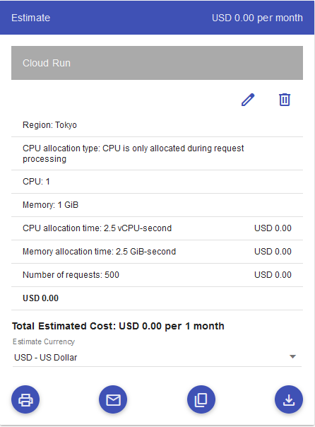
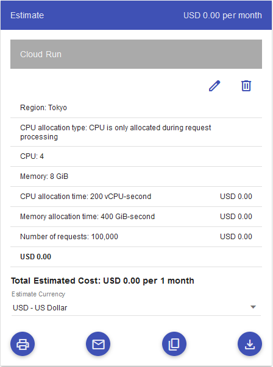
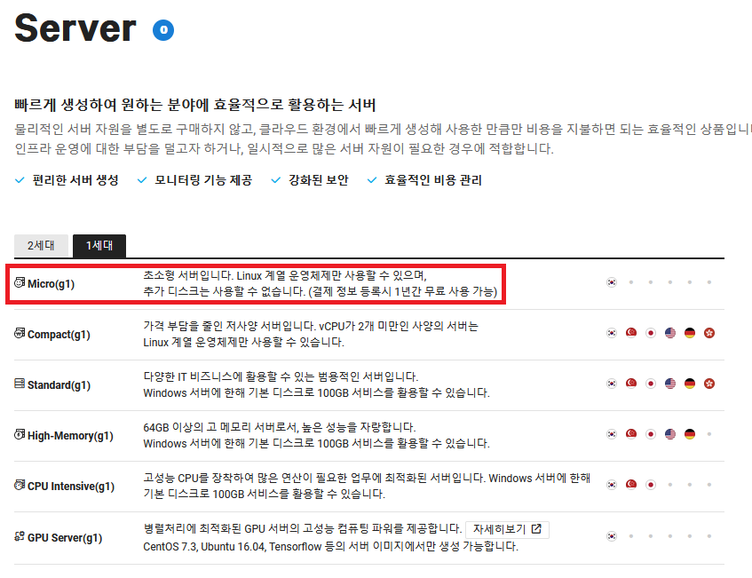
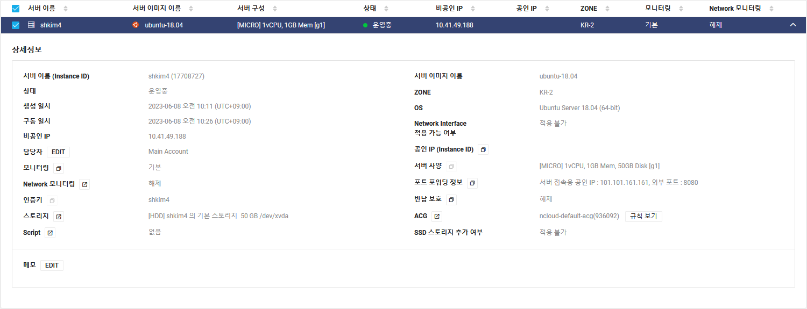
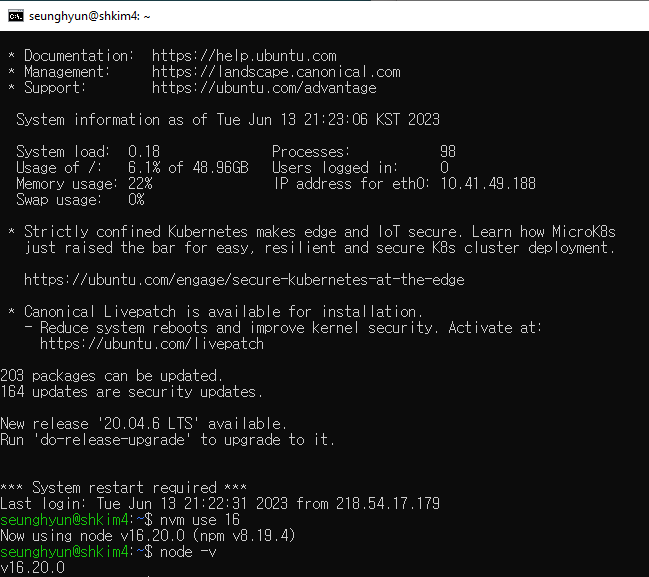

I recently thought about building my own app that could go on a large scale for a few reasons. First, that would be a great chance to not only learn skills that I haven't used yet but also, advance what I have already known to the next level. Second, I would like to have an app that is specifically for my interest even if people might not find it interesting. Lastly and most importantly, I am just wondering what I go through and learn during the entire journey.

The first things I want to do is to set up a server that serves requests from the frotend of the application first. To do that, I will look into a few of cloud services to run the server of the application. I will talk about the candidates and explain why in this article. Let's get started!

## Google Cloud Run

**Google cloud** is inargurably one of the most dominating cloud services along with **AWS Cloud** and **Microsoft Azure**. Based on [this article](https://kinsta.com/google-cloud-market-share/), as of Q4 2021, Google cloud market share is 9% worldwide, which made it 3rd among all the cloud services providers.

When we use Google cloud service, it means that we use Google's ecosystem, in other words, our apps are hosted in Google's data centers which is managed and secured by their engineers so, we do not have to worry about handling all the complex tasks.

With these facts in mind, the service that I would like to try is Google cloud run. It is _a managed compute platform that lets you run containers directly on top of Google's scalable infrastructure_ according to [Google's documentation](https://cloud.google.com/run/docs/overview/what-is-cloud-run). Like I mentioned, we do not have to spend time on configuring, scaling our apps. We can just enjoying writing some more codes.

The most important of all using cloud services is cost for sure. So, how much do we have to pay for Cloud run? The answer is as much as you use since it follows a pay-as-you-go model. But, I am still not sure about how much it would cost if my server grows so big. I might write about this if my server actually grows big later. To have some idea how much, here is their pricing calculator where I entered two distict options in it:

Surprising that both options show 0 dollar! It does not seem intuitive. I suppose that there is more than that beyond this calculation. I will look more into it and talk about it later in the future.

To sum up this section, if using Google cloud run:

1. We can focus on writing codes.
2. We can deploy and scale our apps without pain.
3. We might end up paying more price than expected.

Let's move on to Naver Cloud

## Naver Cloud

**Naver** is the biggest search engine in Korea. Even, they beat Google by 20-24% in relation to search engine at the moment I am writing. No matter how reliable the source I have found for the statistic, I strongly believe that it is accruate because Naver is the go-to engine for many Korean people - _Although the number of people who use Google for searching has increased drastically over the past years_.

They also provide cloud services so, I thought it was a good idea to look into their services and use one of them. Since their data center is in Korea and I live in Korea, I can probably take advantages of the same network pool such as reliability and latency.

In fact, I already ended up trying their cloud platform to create a server like below:

It is free for a year after you create your account and put your billing information if you live in Korea. If you create a server, the console would look like:

My impression is that it is fairly easy to set up and the console looks very neat. But, there are a few things to be checked. After a year of free tier, you need to pay 13,000 won a month, which is like 10 US dolloar, for the same resource. I think it is relatively more expensive than other cloud services. Another example is for 4 vCPU and 16GB of RAM, Amazon costs you about 110 dollars while Naver does 136 dollars a month - _Please correct me if you find this wrong_.

Plus, even if it is a free tier, to make the server public with IP, you have to pay 3 dollars to gain the IP that allows you to access publicly but, I think we can let 3 dollars slide - _To clarify, I do not talk about IP to access it via SSH but, make the server accessible like an API_.

I guess that is enough about Naver.

## DigitalOcean

I was surprised that I found the market share of **DigitalOcean** was about 2% because I thought they would have more than the number.

Anyway, I got a really good impression on them when I deployed my company's website and MongoDB staging server. First, it is really easy to deploy and set up what needed to be done since their instructions are very straightforward. More importantly, I think it is **VERY** cheap compared to other cloud service providers. Here is [an article](https://www.digitalocean.com/blog/aws-vs-digitalocean-cloud-platform) related to this matter - _Spoiler alert: the article is from DigitalOcean._

Although it seems the perfect fit for my side project, there is one thing that I wish I could get from them: _**Region**_. Their data center is not nearby any East asian countries. The closest region is **Sigapore**, which it takes us 6.5 hours to get to by a flight. It does not actually matter because my project will be small and could just end up being a test project. But, it could be nice for poeple who lives in East Asia if there is a close one.

Let's wrap things up.

## Conclusion

I could probably have gone further than this to find a better solution for my project. But, I am sure it will not make any significant difference so, I have stuck to the candidates shown above. After considering a few factors, I decided to use Cloud Run. Here are the two reasons.

1. I have wanted to use Google Cloud from the scratch even if I had some experience with it.
2. At early stage of building the project, I want to focus more on codes, since I will use NestJS which I have hardly used.

Now, let's beigin building! I will talk about how to set up and deploy a simple NestJS app on Cloud Run in the next article.

_**THANKS FOR READING. SEE YOU NEXT TIME!**_
