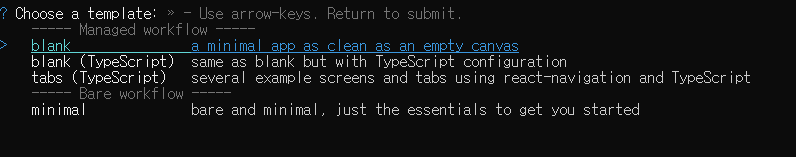
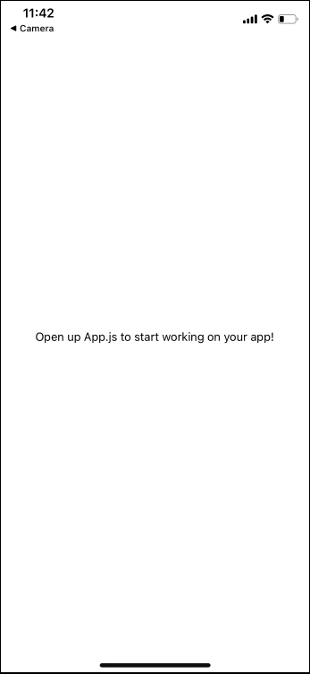
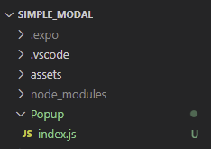
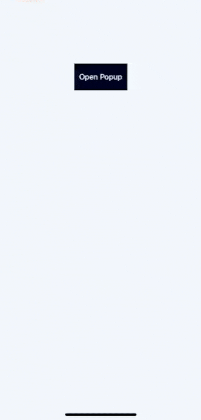

When I first developed a mobile application, I needed to have a small popup window on the same page in order to set up different dates to each items in a list and I wanted the popup window to disappear when I touched the outside of it. Thus, the popup window should be shorter than the full width of a screen. After a few of struggles, I found a simple but great way to create the popup window that fulfilled the conditions by using React Native Modal. Here, I will share the way to create it.

## Prerequisite
- Basic knowledge about Javascript or React
- Prepare for development by installing requirement tools such as Node js and Git

## Create Expo App
Open the terminal and enter the command shown below to create your expo app.

```
npm install -g expo-cli
// install expo-cli
expo init [your project name]
// once installed, initialize your project
```

You will see these options, choose blank - _simply, press the enter key when highlighted_



## Install dependencies
Once the expo app is installed, change the directory to the project folder and install dependencies.


```
cd [your project name]
// change the directory to the project folder
npm install
// install dependecies
npx expo install react-dom react-native-web @expo/webpack-config
// if you run the project on the web, you need to install these dependecies too
```

## Start a project
To start your project, enter the command shown below
```js
npm start
```
You will see a QR code and some instructions in the terminal. You can open your expo project on an actual device(Android, iOS) and an emulator. In order to start your project on an actual device, you need to download **Expo Go** app. I scanned the QR code with my iPhone camera. It showed my project and it looked like:



## Use Modal to create Popup component



First, you should import **StyleSheet, View, Modal, TouchableWithoutFeedback** from React Native. **StyleSheet** allows us to create a style object that stores and manages css rules for a component. **View** is simply an equivalent of a div in React. **TouchableWithoutFeedback** is actually self-explanatory which makes things inside of it touchable without any effect when clicked. **Modal** is the essential element we need to create Popup component. Here is the code:

```js
import { StyleSheet, View, Modal } from 'react-native';

export default function Popup({ children, visible, transparent, dismiss, margin }) {
  return (
    <Modal
      visible={visible}
      transparent={transparent}
      onRequestClose={dismiss}
    >
      <TouchableWithoutFeedback onPress={dismiss}>
        <View style={styles.modalOverlay} />
      </TouchableWithoutFeedback>

      <View 
        style={{
          ...styles.modalContent,
          margin: margin
        }}
      >
        {children}
      </View>
    </Modal>
  )
}

const styles = StyleSheet.create({
  modalContent: {
    justifyContent: "center",
    marginVertical: "100%"
  },
  modalOverlay: {
    position: "absolute",
    top: 0,
    bottom: 0,
    left: 0,
    right: 0,
    backgroundColor: "rgba(0,0,0,0.5)"
  },
});
```

**Popup component** takes **children, visible, transparent, dismiss, margin** as props. The component returns Modal. Here, Modal only takes **visible, transparent, onRequestClose** as props. But, there are other props you can use. You can check them on **[the official website](https://reactnative.dev/docs/modal)**.

Recall that I want the popup window to disappear when I click the outside of it. **TouchableWithoutFeedback** is where we do the trick. So, we will make it take up the full screen. To do that, we will set position to `absolute` and set top, bottom, left, right to `0`.

**Children** prop under View is where the popup window goes. We will pass a content as a prop from the parent component later. **Margin** prop will be used to set margin for View. What it actually does is to adjust the width of the popup window. If you pass `0` from the parent component, the popup window will take up 100% of the width of the screen. Also, if you pass `20px` or `10%`, the width of the popup content will be shortened.

## App.js
Now, we will import **Popup component** and create a button. If we click the button, the Popup will show up. Instead of importing Button from `react-native`, we will import **TouchableOpacity** and make it look like a button because it is easily noticeable when clicked.

To open and close the popup window, we should store the state of visibility, so we will import useState from `react`. Also, we need to create openPopup, closePopup handlers to set the state of visibility. When we press the button, it will trigger openPopup handler and set the state to `true`. The closePoup handler will be passed to Popup component we created to close itself by setting the state to `false`. Finally, We will add some css rules to the popup window so that we can see them properly.

```js
import { useState } from 'react';
import { TouchableOpacity, StyleSheet, Text, View } from 'react-native';
import Popup from './Popup';


export default function App() {
 const [visible, setVisible] = useState(false);
 
 const openPopup = () => {
  setVisible(true);
 }

 const closePopup = () => {
  setVisible(false);
 }

  return (
    <View style={styles.container}>
     <TouchableOpacity 
      style={styles.popupButton}
      onPress={openPopup}
     >
      <Text style={{color: "#fff"}}>Open Popup</Text> 
     </TouchableOpacity>
     <Popup
      visible={visible}
      transparent={true}
      dismiss={closePopup}
      margin={"25%"}
     >
      <View
       style={styles.popupContent}
      >
       <Text style={{fontSize: 18}}>Popup opened!</Text>
      </View>
     </Popup>
    </View>
  );
}

const styles = StyleSheet.create({
  container: {
    flex: 1,
    backgroundColor: '#fff',
    alignItems: 'center',
    marginTop: 150
  },
  popupButton: {
    justifyContent: "center",
    alignItems: "center",
    backgroundColor: "#000",
    width: 100,
    height: 50
  },
  popupContent: {
    justifyContent: "center",
    alignItems: "center",
    backgroundColor: "#fff",
    borderColor: "#000",
    borderWidth: "1px",
    height: 150
  }
});
```

When we save and start the project, it will look like:



## Conclusion
We created a simple but great popup window. It could be an alert message or date management box depending on your demand. You can add some more content to the popup window to see if it works great for you.

I hope you enjoyed this article!

_**THANKS FOR READING. SEE YOU NEXT TIME!**_

_This is originally posted on my [Medium](https://medium.com/@shkim04/rn-how-to-create-react-native-modal-component-with-expo-dfc87c406b0a)._
_Let's connect!_