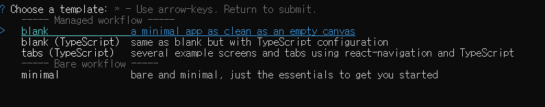
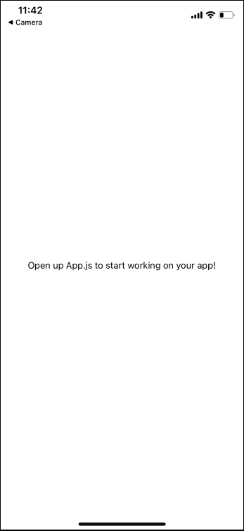

개발자로 일을 시작한 이후 처음으로 모바일 앱을 개발했을 때, 동일 페이지 안에 팝업 창을 띄워 날짜를 선택할 수 있으며 팝업 창 외의 영역을 눌렀을 때 사라질 수 있도록 구현하고 싶었습니다. 팝업 창은 화면 폭보다는 작은 크기로 만들려고 했으나 생각보다 쉽지 않았습니다. 여러 번의 시도 끝에 간단하지만 쓸만한 팝업 창을 만들었습니다. 이 글을 통해 어떻게 만들었는지 알아보겠습니다.

## 필수
- Javascript, React 기본 지식
- Node, git 등 개발에 필요한 기타 등등

## Expo App 만들기
다음의 명령어를 통해 expo app을 생성합니다.

```
npm install -g expo-cli
// install expo-cli
expo init [your project name]
// once installed, initialize your project
```

아래 그림과 같이 선택지가 출력이 되는데 엔터를 눌러 항목을 선택합니다.



## dependencies 설치
Expo 앱이 설치가 완료되면 프로젝트를 실행할 폴더를 열고 dependencies 설치합니다.


```
cd [your project name]
// change the directory to the project folder
npm install
// install dependecies
npx expo install react-dom react-native-web @expo/webpack-config
// if you run the project on the web, you need to install these dependecies too
```

## 프로젝트 시작
다음의 명령어를 입력해서 프로젝트를 시작합니다.
```js
npm start
```
터미널에 QR code와 간단한 설명이 출력이 됩니다. 이 때 실제 기기(Android, iOS)를 통해 프로젝트를 실행하거나 에뮬레이터를 통해 프로젝트를 실행할 수 있습니다. 하지만 iOS같은 경우에는 데스크탑, 노트북은 Apple 제품이 아니라면 에뮬레이터를 사용할 수 없으니 주의 바랍니다. 휴대전화를 통해 프로젝트를 실행시키려면 _**Expo Go**_ 앱을 다운받아 QR code를 스캔하면 프로젝트가 실행됩니다. 아래 사진은 프로젝트를 실행한 결과입니다:



## Modal을 활용한 Popup 컴포넌트


먼저 _StyleSheet, View, Modal, TouchableWithoutFeedback_ 모듈을 import합니다. **StyleSheet**는 한 컴포넌트 안에서 css rule이 담긴 객체를 생성하여 해당 컴포넌트에 적용하는 기능을 제공합니다.. **View**는 React에서 div 태그에 해당됩니다. **TouchableWithoutFeedback**는 이름에서 알 수 있듯이 클릭을 했을 시 다른 효과없이 터치만 가능하게 만들어주는 모듈입니다. 마지막으로 **Modal**은 Popup 컴포넌의 반환 값이 됩니다. 이 모듈들을 활용해 다음과 같이 코드를 작성합니다:

```js
import { StyleSheet, View, Modal } from 'react-native';

export default function Popup({ children, visible, transparent, dismiss, margin }) {
  return (
    <Modal
      visible={visible}
      transparent={transparent}
      onRequestClose={dismiss}
    >
      <TouchableWithoutFeedback onPress={dismiss}>
        <View style={styles.modalOverlay} />
      </TouchableWithoutFeedback>

      <View 
        style={{
          ...styles.modalContent,
          margin: margin
        }}
      >
        {children}
      </View>
    </Modal>
  )
}

const styles = StyleSheet.create({
  modalContent: {
    justifyContent: "center",
    marginVertical: "100%"
  },
  modalOverlay: {
    position: "absolute",
    top: 0,
    bottom: 0,
    left: 0,
    right: 0,
    backgroundColor: "rgba(0,0,0,0.5)"
  },
});
```

**Popup component**에 전달되는 props은 _children, visible, transparent, dismiss, margin_ 이고 Modal을 반환합니다. 이 Modal은 _visible, transparent, onRequestClose_ 을 props으로 전달하고 있지만 더 많은 기능들이 있으니 _**[공식 웹사이트](https://reactnative.dev/docs/modal)**_ 를 참조하시기 바랍니다.

앞서 필자는 팝업 창 이외의 영역을 눌렀을 때 팝업 창이 닫힐 수 있게 개발하고 싶다고 했습니다. TouchableWithoutFeedback이 이 기능을 구현하는데 핵심이 되는데 이 모듈의 크기를 화면을 모두 채울 수 있도록 설정해야 합니다. position을 "absolute"로 두고 top, bottom, left, right을 "0"으로 설정하면 됩니다.

View 하위에 있는 children prop에 팝업 창이 가게 될 것이고 parent 컴포넌트에서 content를 보내는 구조를 갖추게 됩니다. Prop으로 보내는 margin은 View에 적용할 margin을 나타내며 실제로는 팝업 창의 폭을 조절하는 데 쓰이게 됩니다. parent 컴포넌트로에서 margin에 "0"을 주면 팝업 창은 화면 폭을 꽉 채우게 되고 "20px" 혹은 "10%"를 주면 팝업 창이 줄어들게 됩니다. 

## App.js
App.js 스크립트 안에  **Popup** 컴포넌트와 버튼을 import를 합니다. 이 버튼은 팝업 창에 대한 스위치 역할을 위해 쓰입니다. 클릭을 더 쉽고 간단하게 확인할 수 있기 때문에  react-native에서 Button을 import하는 대신 **TouchableOpacity**을 import합니다.

useState 훅을 활용해서 팝업 창의 개폐 여부를 저장하는 visibility라는 이름의 state를 만들어 줍니다. state의 상태를 변화 시켜줄 핸들러 함수인 openPopup, closePopup을 만들어줍니다. 위에서 생성한 버튼을 누르면 openPopup을 실행시키고 visibility에 `true`로 저장해주게 됩니다. 반대로 closePopup은 visibility를 `false`로 저장해주어 팝업을 닫게 합니다. 마지막으로 적절하게 효과를 확인할 수 있도록 css 규칙을 적용해줍니다. 

```js
import { useState } from 'react';
import { TouchableOpacity, StyleSheet, Text, View } from 'react-native';
import Popup from './Popup';


export default function App() {
 const [visible, setVisible] = useState(false);
 
 const openPopup = () => {
  setVisible(true);
 }

 const closePopup = () => {
  setVisible(false);
 }

  return (
    <View style={styles.container}>
     <TouchableOpacity 
      style={styles.popupButton}
      onPress={openPopup}
     >
      <Text style={{color: "#fff"}}>Open Popup</Text> 
     </TouchableOpacity>
     <Popup
      visible={visible}
      transparent={true}
      dismiss={closePopup}
      margin={"25%"}
     >
      <View
       style={styles.popupContent}
      >
       <Text style={{fontSize: 18}}>Popup opened!</Text>
      </View>
     </Popup>
    </View>
  );
}

const styles = StyleSheet.create({
  container: {
    flex: 1,
    backgroundColor: '#fff',
    alignItems: 'center',
    marginTop: 150
  },
  popupButton: {
    justifyContent: "center",
    alignItems: "center",
    backgroundColor: "#000",
    width: 100,
    height: 50
  },
  popupContent: {
    justifyContent: "center",
    alignItems: "center",
    backgroundColor: "#fff",
    borderColor: "#000",
    borderWidth: "1px",
    height: 150
  }
});
```

프로젝트를 실행하게 되면 다음과 같이 동작하게 됩니다:


## Conclusion
팝업 창은 간단하지만 그 쓰임새는 다양할 것입니다. 개발하는 사람에 따라 경고를 띄우는 창이 될 수도 있고 날짜를 선택할 수 있는 창이 될 수도 있습니다. 이 글의 내용을 토대로 적절하게 팝업 창을 사용하시길 바라면서 마치겠습니다.

이 글이 많은 분들께 도움이 되었으면 좋겠습니다!

_**읽어 주셔서 감사합니다. To be continued!**_

_이 글은 [Medium](https://medium.com/@shkim04/how-to-use-react-swiper-58eef325b09f)에도 업로드 되었습니다._
_놀러 오세요!_