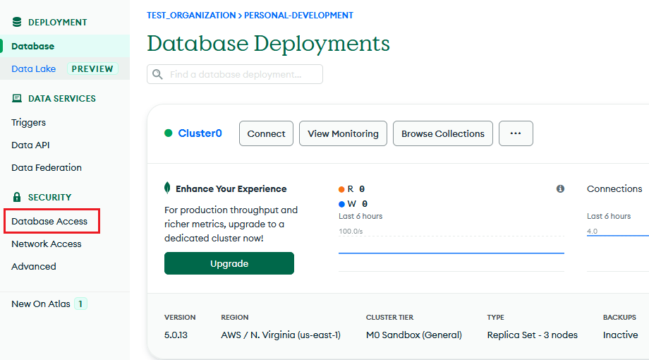
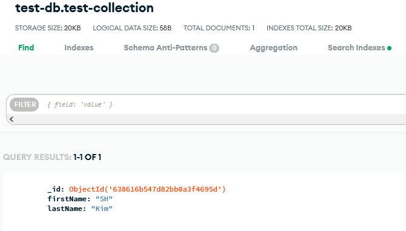

REST API는 마치 음식점의 메뉴와 같다. 손님이 메뉴를 보면 그 음식점이 어떤 음식들을 요리하는지 알 수 있는 것처럼 개발자가 한 소프트웨어 상품의 API 문서를 보면 무슨 기능을 제공하는지 알 수 있다. API 문서에는 흔히 요청 url이 적혀 있고 각 url에 대한 설명을 찾아볼 수 있다. 이 중 한 url에 요청을 보내면 그에 대한 응답을 받는 것이다. 개발자는 이 응답을 받아 가공 후 자신의 앱에 사용하면 된다. 이제 API를 만들어 보자.

## 필수

- Node.js + Typescript
- MongoDB
- Insomnia

## MongoDB 데이터베이스

먼저 MongoDB 설정부터 시작하겠다. MongoDB는 NoSQL 데이터베이스로 아주 많이 사용되는 데이터베이스 중 하나이다. 흔히 CRUD라고 말하는 create, retrieve, update, delete 요청을 적용하는 것이 아주 용이하다.

MongoDB 사용을 위해서 계정을 만들어야 한다. google이나 github 계정과 연동해서 쉽게 만들 수 있다. 계정을 생성해도 먼저 돈을 지불하지 않으며 추후에 큰 규모의 데이터를 처리할 때 처리량에 따라 지불하면 된다.

계정을 생성하고 로그인을 하면 다음과 같은 대시보드가 나온다:



개발하려고 하는 앱이 데이터베이스에 접근하게 하려면 데이터베이스 사용자를 생성하고 역할을 주어야 한다.

좌측 사이드바에 있는 **Database Access** 누르고 넘어간 페이지의 우측에 보이는 **ADD NEW DATABASE USER** 클릭한다.


사용자 이름과 비밀번호를 입력한다. 데이터베이스에 연결할 때 이 두 정보가 필요하니 꼭 기억해두어야 한다.

다음 해당 사용자에 **Atlas admin** 역할을 부여한다. 만약 단순히 읽기 역할만 주고 싶거나 읽기/쓰기 역할만 주고 싶을 때는 그에 맞게 권한을 부여하면 된다.

다시 대시보드로 페이지를 이동하고 _connect_ 를 클릭하면 개발할 API에 사용될 URI를 얻어야 한다.


다음과 같은 버튼을 클릭한다.


위에 보이는 URI가 API에 사용될 예정이다 - _Node.js API를 개발하는 것이기 때문에 driver 옵션은 넘어가도 된다_. 이 전 단계에서 생성한 사용자 이름과 비밀번호를 위 사진 속 빨간색 빈 칸에 _[your username:your password]_ 형태로 넣어야 한다. 필자와 함께 API를 개발하는 것이니 예시는 넘어가도 된다.

## 프로젝트 폴더 생성

새로운 프로젝트 폴더를 생성하고 터미널을 열어 아래와 같이 명령어를 입력한다. 해당 명령어를 입력하면 pacakge.json 파일이 생기는데 앱에 필요한 정보나 dependency들을 담고 있는 역할을 한다. 그리고 `app.ts` 파일을 만든다.

```
cd [project folder directory]
npm init -y
```

## Dependencies 설치

```js
npm install -g typescript
npm install express ts-node dotenv nodemon mongodb
npm install --save-dev cross-env @types/node @types/express
```

> **Express** _Node.js 웹 어플리케이션 프레임워크이며 가볍고 다양한 기능을 제공하며 특히 웹과 모바일 어플리케이션에 최적화되어 있다. Express가 API의 핵심 기능을 제공한다고 생각하면 된다._
>
> **Dotenv** _.env 파일에 선언한 환경 변수들을 process.env라는 객체를 통해 접근할 수 있게 도와주는 라이브러리이다._
>
> **Nodemon** _Node.js를 기반으로 하는 어플리케이션을 개발할 때 자주 쓰이며 코드를 수정할 시 자동으로 감지하여 어플리케이션을 재시작시켜준다. 배포에는 활용이 되지 않는다._
>
> **Typescript** _Javascript에 추가적인 문법이 적용되어 에디터에서 재빠르게 에러를 찾아낼 수 있도록 도와준다._
>
> **Ts-node** _Typescript가 적용된 스크립트가 실행되도록 Javascript로 변환해주는 역할을 한다._
>
> **MongoDB** _Node.js 용 [MongoDB](https://www.mongodb.com/) 드라이버이다._

## Typescript 설정

앞서 설명했듯이 Typescript는 타입 확인을 엄격하게 적용하여 에디터에서 쉽게 에러를 찾을 수 있도록 도와준다.

프로젝트 폴더 하위에 tsconfig.json이라는 파일을 만들고 아래 코드를 입력한다.

개발자의 원하는대로 **compilerOptions** 을 바꿔주면서 사용하면 된다. 이 설정에 관해서 자세한 설명은 생략하오니 더 많은 정보를 원한다면 [공식 웹사이트](https://www.typescriptlang.org/docs/handbook/tsconfig-json.html) 확인해주길 바란다.

```js
{
    "buildOnSave": false,
    "compileOnSave": false,
    "compilerOptions": {
        "charset": "utf8",
        "module": "commonjs",
        "target": "es2018",
        "lib": [
            "es2018",
            "dom"
        ],
        "noImplicitAny": true,
        "removeComments": true,
        "strictNullChecks": true,
        // "noImplicitThis": true,
        "noImplicitThis": false,
        "alwaysStrict": true,
        "preserveConstEnums": true,
        "sourceMap": true,
        // "esModuleInterop": true,
        "esModuleInterop": true,
        "noImplicitReturns": true,
        "allowJs": true
    },
    "include": [
        "src"
    ],
    "exclude": ["node_modules", "reference_deprecated", "dist", "scripts"],
    "typeRoots": [
        "node_modules/@types"
    ]
}
```

## package.json


package.json 안에 script 필드 하위에 명령어 두개를 추가해보자. 복잡한 명령어를 key 이름에 저장한 후 간단하게 `npm run [key name]` 입력하는 방식으로 해당 명령어를 실행할 수 있다.

`npm run dev`를 터미널에 입력하고 엔터를 누르면 실제로 `` cross-env NODE-ENV=development nodemon --exec ts-node ./`app.ts `` 가 실행된다. 개발모드로 실행되고 nodemon이 코드 수정이 있을 시 자동으로 재시작한다. **start**는 배포 시 사용된다.

## Express 서버

```js
import express, { Request, Response, NextFunction } from "express"

const app = express()

app.use(express.urlencoded({ extended: true }))
app.use(express.json())
// to parse json of body object

// get route -> path '/'
app.get("/", (req: Request, res: Response): void => {
  res.send("Here is the response")
})

app.listen(4000, () => {
  console.log("Server is running on 4000")
})
```

위 코드를 `app.ts` 파일에 입력한 뒤 `npm run dev`를 터미널에 입력하여 서버를 시작한다. 터미널에 다음과 같이 로그가 뜬다:

_the server is listening to the port 4000_.

각각의 라우트는 API를 사용하는 사람이 요청을 보낼 때 쓰이는 url이라고 보면 된다. 위의 코드에는 get 라우트 있는데 경로가 '/'이며 콜백 함수를 파라미터로 가지고 있다. 이 라우트에 요청을 보내게 되면 _**Here is the response**_ 라는 응답을 받게 된다. 브라우저를 열고 주소 창에 http://localhost:4000를 입력해보자 - _로컬 환경에서 개발하기 때문에 localhost에 접근할 수 있다_.

콜백함수는 주로 2가지 객체를 인자 값으로 받는데 Request와 Response 객체이다.

Request 객체는 API 사용자가로부터 서버가 받는 정보들의 집합이라고 생각하면 된다. API 개발자는 이 Request 객체가 어떤 필드 값을 가지고 있어야 하는지 목적과 방향에 맞게 사용할 수 있다. 사용자로부터 API 키 값을 필수적으로 받아야 하는 상황이 예가 될 수 있다.

Response 객체는 API 사용자가 해당 API 라우트로부터 받는 정보이다. API 서버의 목적과 개발 방향에 따라 그 정보가 달라질 것이다.

## 환경 변수

환경 변수는 보통 영어는 대문자로 쓰는 것이 일반적이다.

프로젝트 폴더 하위에 **development.env**와 **production.env** 파일을 만들고 아래와 같이 변수 이름들을 적어 준다.

MongoDB로부터 얻은 uri를 **MONGODB_URI**로 설정한다.

```js
PORT=4000

MONGO_URI=[your mongodb uri]
MONGO_DB=test-db // just name whatever you want for development
MONGO_COLLECTION=test-collection // just name whatever you want for development
```

## 환경 변수 지정

```js
const dotenv = require('dotenv');
let envFound = dotenv.config({ path: `${process.env.NODE_ENV}.env` });

if(!envFound) throw new Error('Could not find any .env file.');

let config = {
  port: parseInt(process.env.PORT!, 10),
  mongodb: {
    uri: process.env.MONGO_URI,
    db: process.env.MONGO_DB,
    collection: process.env.MONGO_COLLECTION,
  }
};

export default config;
```

어플리케이션을 개발할 때 배포 전에 무수히 많은 테스트를 거치는 것이 일반적이다. 이 때문에 개발 설정과 배포 설정을 나누는 것은 굉장히 중요하다.

cross-env는 환경에 따른 설정을 다르게 적용할 수 있게 도와주는 라이브러리인데 `cross-env NODE_ENV=production` 처럼 입력할 명령어 앞에 두어 어떤 환경인지 명시해 준다. 이 덕분에 다른 .env 파일을 환경에 맞게 설정해주기 때문에 같은 코드를 두번 작성할 필요가 없다.

`config.ts` 하위에 파일을 만든 뒤 dotenv를 import한다. 이 dotenv가 **[process.env.NODE_ENV].env** 파일에 담긴 정보를 읽어 오는 역할을 한다. 이 때 NODE_ENV는 명령어에서 명시해 줬던 development 혹은 production이 되겠다.

위 코드 안에 모든 환경 변수 앞에 process.env가 붙어 있다. Node.js에 전역에서 접근할 수 있는 객체이기 때문에 어플리케이션 전체에서 사용될 수 있다.

## 어플리케이션에 MongoDB 연결

```js
import config from "./config"
const { MongoClient } = require("mongodb")

const connectMongoDB: () => Promise<any> = () => {
  return new Promise((resolve, reject) => {
    MongoClient.connect(
      config.mongodb.uri,
      {
        useUnifiedTopology: true,
        useNewUrlParser: true,
      },
      (err: Error, client: object) => {
        if (err) {
          reject(err)
          return
        }

        resolve(client)
      }
    )
  })
}

export default connectMongoDB
```

프로젝트 폴더 하위에 파일 `db.ts`를 만든 뒤, MongoClient를 import한다. 그리고 파일 `config.ts` 만든 뒤 _config.mongodb.uri_ 을 인자 값으로 입력한다. 이 uri는 MongoDB 설정할 때 얻은 uri이다.

마지막으로 MongoDB를 비동기적으로 연결하도록 promise를 반환 값으로 받게 한다. 이제 API에 테스트 요청을 위해 코드를 수정해보자.

## 테스트 사용자 DB 등록

```js
import express, { Request, Response, NextFunction } from "express"
import config from "./config"
import connectMongoDB from "./db"

const app = express()

app.use(express.urlencoded({ extended: true }))
app.use(express.json())

app.get("/", (req: Request, res: Response): void => {
  res.send("Here is the response")
})

app.post("/", async (req: Request, res: Response): Promise<void> => {
  try {
    const firstName = req.body.firstName
    const lastName = req.body.lastName

    const client = await connectMongoDB()
    const db = await client.db(config.mongodb.db)
    const collection = await db.collection(config.mongodb.collection)

    await collection.insertOne({
      firstName: firstName,
      lastName: lastName,
    })

    res.status(200).send("Successfully Created in DB")
  } catch (err) {
    res.status(500).send("Error Occured in Server")
    console.log("<POST> '/' error occured", err)
  }
})

app.listen(config.port, () => {
  console.log("Server is running on", config.port)
})
```

post 라우트를 추가한다. 이 라우트는 API 사용자로부터 성과 이름을 받고 이를 데이터베이스에 넣는 기능이 목적이다. Request 객체의 body라는 필드에 사용자가 입력한 성과 이름이 저장이 된다.

MongoDB promise가 resolve한 값을 connect라는 변수를 선언하여 저장한다 - _`config.ts`에 저장한 데이터베이스와 콜렉션 이름이 여기 쓰인다_ - 요청에서 받은 성과 이름을 **insertOne** 이라는 함수로 데이터베이스에 입력하게 된다.

에러 없이 코드가 실행된다면 post 라우트가 status 코드 200과 함께 _**Successfully Created in DB**_ 라는 정보를 사용자에게 보낸다.

## Insomnia 요청 테스트


Insomnia는 오픈 소스 API 클라이언트인데 쉽게 말해서 API를 개발할 때 기능을 확인하는 데 유용한 도구이다. Insomnia를 통해 지금까지 개발한 API의 post 라우트에 요청을 해보자. Insomnia를 다운로드 받았다면 실행한 뒤 위 그림처럼 HTTP Request를 누른다.


헤더 안에 Content-Type을 application/json으로 설정하여 body 객체에 접근하게 한다.


타입을 JSON으로 두고 firstname, lastname이라는 필드를 가진 객체 형식으로 입력한 뒤 Send 버튼을 누른다.


MongoDB에 정보가 입력되었다면 다음과 같이 나타난다:



## 결론

API 서버는 보통 개발자 자신 혹은 회사의 목적에 따라 더욱 커지거나 복잡해진다. 크고 복잡한 API 서버를 개발하는 실력을 키우려면 직접 더 많은 크고 작은 프로젝트들을 개발해보는 방법이 가장 도움이 될 가능성이 높다. 예를 들면, 더 많은 라우트를 추가하거나 더 많은 타입 정의들을 써보거나 다른 데이터베이스를 써보는 것이라고 생각한다. 이 간단한 API로부터 더 멋진 API를 개발하기를 바라면서 마무리하겠다.

해당 글에서 사용된 코드는 개인 github [레파지토리](https://github.com/shkim04/express_typescript_simple_api)에 있으니 필요하시면 확인해 주세요!

_**읽어 주셔서 감사합니다. To be continued!**_

_이 글은 [Medium](https://medium.com/@shkim04/node-js-how-to-create-a-simple-rest-api-with-express-mongodb-and-typescript-54b1d801d073)에도 업로드 되었습니다._
_놀러 오세요!_
