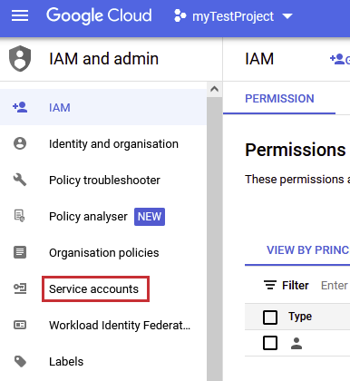
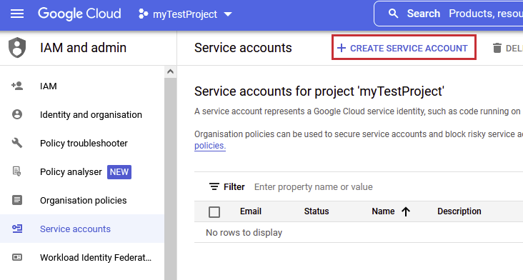
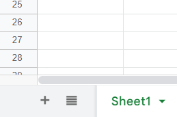
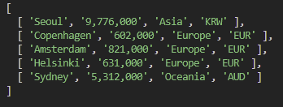

**Google Sheet**는 브라우저에서 동작하기 때문에 어디서나 사용할 수 있고 기능이 다양해서 아주 유용한 소프트웨어 상품이다. 이 Google Sheet는 Google이 API를 제공하기 때문에 어느 어플리케이션이라도 쉽게 연결할 수 있다. **Google Sheet API**를 통해서 google sheet에서 입력한 정보를 읽고 가공하는 것이 가능하다.

Google Sheet API를 사용하려면 먼저 가상의 사용자 계정을 만들어야 한다. 이 단계부터 시작해보자.

## 필수
- google cloud 계정 — _검색하면 쉽게 나온다. 결제 정보를 입력해야 하니 참고바란다_
- google sheet - _구글 계정이 있다면 누구나 만들 수 있다_
- Node

## Service 계정
google cloud에 로그인한 후 **Google Cloud IAM and admin**으로 이동한다. Service 계정이 글머리에서 언급한 가상의 사용자이다. 아래 빨간색으로 표시된 **Service accounts** 클릭한다.



다음, **CREATE SERVICE ACCOUNT**를 클릭한다.



추후에 잘 기억할 수 있도록 이름을 준다.


프로젝트나 팀 상황에 따라 이 계정에 부여하는 역할이 달라지지만 테스트이기 때문에 Service 계정에 **Owner role**을 준다.


완료되면 아래와 같이 service 계정을 클릭한다.


어플리케이션에 API를 연결하기 위해 *key*를 생성해야 한다. key에 이름을 주고 다운로드를 누르면 `json` 포맷으로 된 파일이 드라이브로 저장된다.


파일은 아래와 같다:


이 `json` 파일 안에는 구글 상품들과 연결할 때 필수적인 두 값이 있는데 하나는 **client email**이고 다른 하나는 **private key**이다.

## Google Sheet API 허용


Google Sheet API를 대시보드에서 허용해 주어야 사용할 수 있다. 프로젝트 하위에 **Go to API and services**로 이동하여 **ENABLE APIS AND SERVICES**를 클릭한다. 검색창에 _google sheet api_ 를 입력한 후 API를 허용해 준다.

## 테스트 Google Sheet
_google sheets_ 에서 빈 sheet를 생성한다. 어플리케이션을 google sheet에 연결하기 위해서는 꼭 필요한 절차가 있다. 가상의 사용자인 Service 계정에 sheet를 접근할 권한을 주어야 한다. 우측에 보이는 **Share**를 통해 가능하다. **Share** 버튼을 클릭한다.


팝업 창이 아래 사진처럼 나오게 되면 `json` key 파일에 있는 **client email**을 입력한다.


Google Sheet API를 연결하기 위해서 연결할 sheet의 id도 필요하게 된다. 이 id는 해당 sheet의 url에서 확인할 수 있으며 다음과 같다:

```
https://docs.google.com/spreadsheets/d/[your-sheet-id]/edit#gid=0
```

아래와 같이 간단한 데이터셋을 입력하고 다음 단계로 넘어가자.


## Node.js 어플리케이션 Google Sheet 연동
Node.js 어플리케이션이 없는 독자들은 아래와 같이 간단하게 생성하면 된다.
1. 프로젝트 폴더를 생성한다
2. 터미널에서 `npm init -y`를 입력한다
3. `app.js`라는 이름의 파일을 만든다 - _이름은 알아서 정해도 된다_

google sheet API를 사용하기 위해 필요한 라이브러리를 설치한다.

```js
npm install --save googleapis
```

아래 코드를 app.js 파일에 복사하여 붙여넣는다.:

```js
const { google } = require('googleapis');

const clientEmail = 'your service account client email';
const privateKey = 'your service account private key';
const googleSheetId = 'your google sheet id';
const googleSheetPage = 'your google sheet page name';

// authenticate the service account
const googleAuth = new google.auth.JWT(
    clientEmail,
    null,
    privateKey.replace(/\\n/g, '\n'),
    'https://www.googleapis.com/auth/spreadsheets'
);
```

앞서 언급했듯이 google sheet에 접근하기 위해서 필요한 값들은 `json` key 파일 안에 담긴 **client email, private key**와  **google sheet id, 해당 sheet 이름**이다.
해당 sheet 이름은 화면 아래 탭에 적혀 있다. 위 코드에 각각 알맞은 값을 적어 넣는다.



## Sheet 읽기

```js
async function readSheet() {
  try {
    // google sheet instance
    const sheetInstance = await google.sheets({ version: 'v4', auth: googleAuth});
    // read data in the range in a sheet
    const infoObjectFromSheet = await sheetInstance.spreadsheets.values.get({
        auth: googleAuth,
        spreadsheetId: googleSheetId,
        range: `${googleSheetPage}!A2:D6`
    });
    
    const valuesFromSheet = infoObjectFromSheet.data.values;
    console.log(valuesFromSheet);
  }
  catch(err) {
    console.log("readSheet func() error", err);  
  }
}

readSheet();
```

**readSheet** 함수에서 **get** 메소드를 통해 구글 시트에 적혀 있는 정보가 담긴 객체를 얻을 수 있다. 시트 내 범위를 **A2:D6** 설정해 주었는데 읽어오는 데이터의 행과 열을 나타낸다 - _헤더 행을 제외하기 위해 2번째 행부터 시작했다_.

터미널에 `node app.js` 입력하면 다음과 같은 로그를 보게 된다:



## Sheet 삭제

```js
async function clearSheet() {
  try {
    // google sheet instance
    const sheetInstance = await google.sheets({ version: 'v4', auth: googleAuth});
    // clear data in the range
    await sheetInstance.spreadsheets.values.clear({
        auth: googleAuth,
        spreadsheetId: googleSheetId,
        range: `${googleSheetPage}!A2:D6`,
    });
  }
  catch(err) {
    console.log("clearSheet func() error", err);  
  }
}

clearSheet();
```

**clear** 메소드로 행과 열에 담긴 데이터를 삭제할 수 있다. 어플리케이션을 실행하면 지정한 범위 내의 행과 열에 담긴 데이터가 삭제된다.

## Sheet 업데이트

```js
async function updateSheet() {
  try {
    // google sheet instance
    const sheetInstance = await google.sheets({ version: 'v4', auth: googleAuth});

    const updateToGsheet = [
      [ 'Seoul', '9,776,000', 'Asia', 'KRW' ],
      [ 'Copenhagen', '602,000', 'Europe', 'EUR' ],
      [ 'Amsterdam', '821,000', 'Europe', 'EUR' ],
      [ 'Helsinki', '631,000', 'Europe', 'EUR' ],
      [ 'Sydney', '5,312,000', 'Oceania', 'AUD' ]
    ];
    
    // update data in the range
    await sheetInstance.spreadsheets.values.update({
        auth: googleAuth,
        spreadsheetId: googleSheetId,
        range: `${googleSheetPage}!A2:D6`,
        valueInputOption: 'RAW',
        resource: {
          values: updateToGsheet,
        },
    });
  }
  catch(err) {
    console.log("updateSheet func() error", err);  
  }
}

updateSheet();
```
**update** 메소드로 지정된 범위의 값들을 업데이트 시킬 수 있다. 값들은 배열의 배열이어야 하며 지정된 행과 열과 크기가 동일한지 확인할 필요가 있다. **updateToGsheet** 변수의 처음 인자가 **A2부터 D2**에 입력되고 다음 인자가 **A3부터 D3**에 입력되며 차례대로 이 같은 방법으로 입력된다.

어플리케이션을 실행하고 시트 안에 값들이 변했는지 확인한다 - _지정된 행과 열에 값이 있었다면 새로운 값으로 덮어 씌어진다_.

## 결론
간단하게 Node.js로 Google Sheet API를 연결하여 읽기, 쓰기, 삭제하는 방법을 알아보았다. 간단한 모델이기에 독자들이 본인의 의도에 맞게 추가 개발하여 심화시키면 좋을 거 같다.

_**읽어 주셔서 감사합니다. To be continued!**_

_이 글은 [Medium](https://medium.com/@shkim04/beginner-guide-on-google-sheet-api-for-node-js-4c0b533b071a)에도 업로드 되었습니다._
_놀러 오세요!_