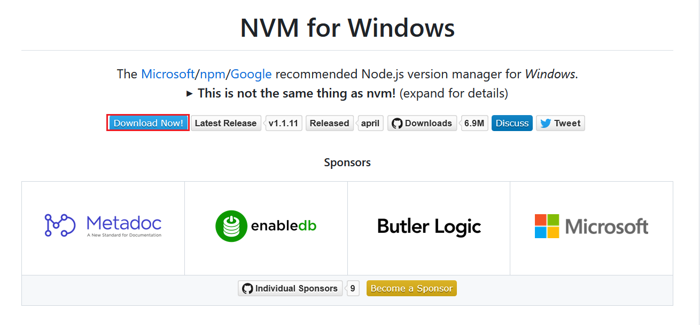
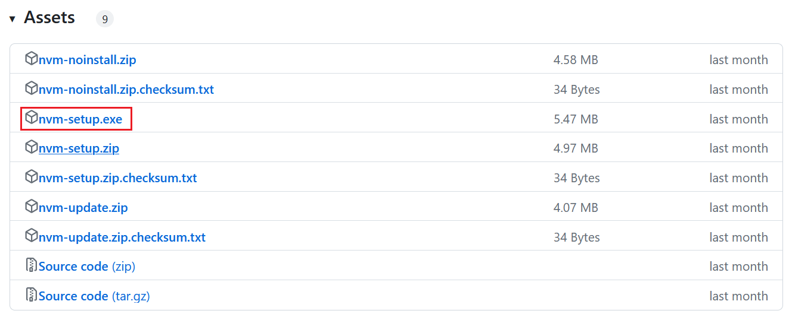
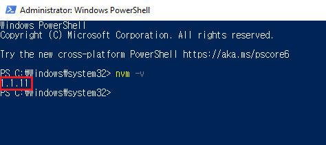
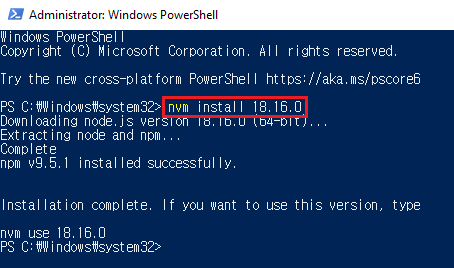
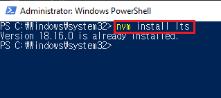

**nvm** stands for Node Version Manager. With its help, you can switch between multiple Node.js versions based on projects you are working on. To clarify, **nvm** does not support Windows but MacOS and Linux. Instead, you can install **nvm-windows** and use it to install Node.js and manage versions of multiple installations. Without further ado, Let's begin to learn how to install it.

## Prerequisite
- Delete any existing Node.js installation directories - _which is probably C:/Program Files/nodejs_ - you can just simply remove Node.js app from Apps

## Download nvm
Go to the [official repository](https://github.com/coreybutler/nvm-windows) to download nvm-windows. It looks like:

After you click **Download Now!** and then, scroll down to Assets, click **nvm-setup.exe** to download nvm-windows.

Open the setup file and follow the installation wizard to install it. Once finished, you can open PowerShell or Command Prompt to confirm the installation. To do it, enter `nvm -v` as shown below:

## Install Node
It is time to install Node using nvm-windows. Open either PowerShell or Command Prompt - _Make sure you run it as an admistrator_. Enter `nvm install target-node-version-number` as shown below:

Alternatively, you can just download lts version simply entering `nvm install lts` - _The reason why **Version 18.16.0 is already installed** instead of being installed is that 18.16.0 is lts version now_.

You can also check out the list of Node versions to install entering `nvm list available`. So, feel free to install any version you want to use.

## Choose Node Version
To check out Node versions installed on a machine, enter `nvm list`. It will show us the list of versions installed.

To use one of the versions. Enter `nvm use target-node-version-number` and confirm the node version you choose entering `node -v`.

If nvm-windows has been successfully installed, you are ready to handle different projects that are dependent on each of different Node versions.

_**THANKS FOR READING. SEE YOU NEXT TIME!**_