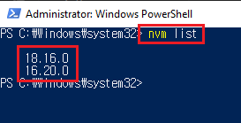
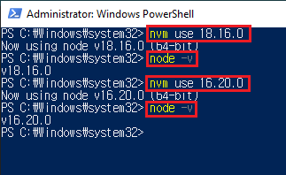

**nvm**은 Node Version Manager의 약자이다. 작업하고 있는 프로젝트에 따라 여러 Node.js 버전들 중 맞는 버전을 선택할 수 있게 해준다. 사실 **nvm**은 대부분 MacOS나 Linux를 지원하고 Windows는 지원하지 않는다. 대신에 **nvm-windows**를 설치하여 Node.js를 설치하고 버전을 관리하면 된다. 거두절미하고 설치하는 방법에 대해 알아보자.

## 필수
- 기존 Node.js 설치 폴더를 삭제한다 - _C:/Program Files/nodejs일 가능성이 높다_ - Apps에서 Node.js 앱을 삭제하면 된다

## nvm 다운로드
[공식 레파지토리](https://github.com/coreybutler/nvm-windows)를 들어간다. 다음과 같이 생겼다:

**Download Now!** 을 클릭하여 설치 페이지 하단에 있는 Assets으로 이동한 후에 **nvm-setup.exe** 클릭한다.

셋업 파일을 열고 설치를 시작한다. 완료가 되면 PowerShell이나 Command Prompt를 열어 설치가 완료된 것을 확인하기 위해 아래와 같이 `nvm -v`를 입력한다:

## Node 설치
nvm-windows을 이용하여 Node를 설치해보자. PowerShell이나 Command Prompt를 연다 - _관리자 모드로 실행하는 것을 명심하자_. 아래와 같이 `nvm install target-node-version-number`을 입력한다:

간단하게 `nvm install lts` 입력하여 lts 버전을 설치할 수도 있다 - _설치가 진행되는 대신 **Version 18.16.0 is already installed**라는 로그가 출력된 이유는 현재 18.16.0이 lts 버전이기 때문이다_.

`nvm list available`을 통해 설치하고 싶은 Node 버전들을 확인할 수도 있다. 사용하고 싶은 버전을 설치하면 된다.

## Node 버전 선택
설치된 Node 버전들을 확인하기 위해 우선 `nvm list` 명령어를 입력한다. 

`nvm use target-node-version-number`을 입력하여 사용할 버전을 정하고 `node -v`을 입력하여 Node 버전이 맞는지 확인한다.

nvm-windows가 성공적으로 설치가 되었다면 각기 Node 버전이 다른 프로젝트를 진행할 수 있게 된 것이니 잘 활용하기 바라면서 마친다.

_**읽어 주셔서 감사합니다. To be continued!**_