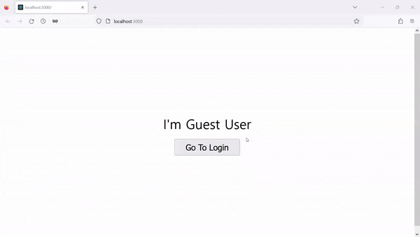

Session은 일정한 시간동안 저장되며 클라이언트와 서버 사이에서 소통할 때 사용된다. 오늘은 Next.js에 세션을 적용하는 법에 알아보고자 한다. 세션이 Next.js에서 어떻게 동작하는지 간단한 어플리케이션을 만들어 확인하려고 한다. 시작해보자.

## 필수
- Next.js와 typescript에 대한 기본 지식

## 설치
[iron-session](https://github.com/vvo/iron-session)을 사용할 것이다. 이유는 Next.js 문서에 언급이 되었으며 적용하는데 어려움이 없는 라이브러리이기 때문이다. 다음과 같이 Next.js 어플리케이션에 iron-session을 설치한다:
```
npm install iron-session
```

## 목표
두 개의 페이지를 만든다. 하나는 index 페이지이고 다른 하나는 login 페이지다. index 페이지에서 로그인한 사용자의 이름을 보여주고 아니면 기본값으로 _**I'm Guest User**_ 를 보여준다. 로그인 페이지에서는 log-in 요청을 API에 보낸다. 요청이 성공적으로 완료되면 index 페이지로 이동시킨다. 마지막으로 log-in 요청을 처리하는 API가 필요한데 여기에서 세션을 저장하게 된다.

사용자가 로그인하면 해당 사용자의 이름이 출력이 되는지 확인하고 페이지를 새로고침하였을 때, 그 이름이 지정된 시간동안 그대로 남아 있는지 확인하는 것이 목표다.

## App 구조
프로젝트 폴더 하위에 중요 부분의 구조만 나타내면 다음과 같다:  
```
├── lib
│   ├── withSession.tsx
├── pages
│   ├── api
│   │   ├── login.tsx
│   ├── login
│   │   ├── index.tsx
│   ├── index.tsx
│   ├── _app.tsx
```

## lib/withSession.tsx
세션을 처리하는 두 개의 wrapper 함수를 만든다. 이름에서 유추할 수 있듯이 하나는 API에 쓰이고 다른 하나는 **getServersideProps** 함수에 사용된다.

몇 가지 짚고 넘어갈 부분이 있다.
1. typescript를 사용하기 때문에 세션에 무엇을 저장할 지 명시해야 한다 - _**username**이 IronSessionData interface에 추가되었다_
2. 세션 옵션에 최소 32자의 문자를 지닌 비밀번호를 입력해야 한다
3. 사용자의 필요에 맞게 **cookieOptions**를 설정한다

```js
import { GetServerSidePropsContext, GetServerSidePropsResult, NextApiHandler } from "next";
import { withIronSessionApiRoute, withIronSessionSsr } from "iron-session/next";

declare module "iron-session" {
  interface IronSessionData {
    username?: string;
  }
}

const sessionOptions = {
  password: "cookie-password-must-be-at-least-32-character-long",
  cookieName: "my-cookie-name",
  // secure: true should be used in production (HTTPS) but can't be used in development (HTTP)
  cookieOptions: {
    secure: process.env.NODE_ENV === "production",
    maxAge: 100
  },
};

export function withSessionRoute(handler: NextApiHandler) {
  return withIronSessionApiRoute(handler, sessionOptions);
}

export function withSessionSsr<P extends { [key: string]: unknown } = { [key: string]: unknown } >(
  handler: ({req, res}: GetServerSidePropsContext) => GetServerSidePropsResult<P> | Promise<GetServerSidePropsResult<P>>,
) {
  return withIronSessionSsr(handler, sessionOptions);
}
```

## pages/index.tsx
**getServerSideProps**이 세션 wrapper 함수에 인자 값으로 들어가는 것을 볼 수 있다. **getServerSideProps**에서 세션 정보에 접근이 가능하고 Home 컴포넌트에 prop으로 보낼 수 있게 된다. 사용자 이름이 세션에 저장이 되었다면 그 이름이 클라이언트에서 출력이 될 것이다.

```js
import Link from "next/link";
import { withSessionSsr } from "../lib/withSession";

interface Props {
  username: string;
}

export default function Home({ username }: Props) {
  return (
    <div>
      <div className="name">I'm {username || "Guest User"}</div>
      <button><Link href={"/login"}>Go To Login</Link></button>
    </div>
  )
}

export const getServerSideProps = withSessionSsr(
  async function getServersideProps({ req, res }) {
    try {
      const username = req.session.username || "";
      
      return {
        props: {
          username: username
        }
      }
    }
    catch(err) {
      console.log("page Home error", err);

      return {
        redirect: {
          destination: '/login',
          statusCode: 307
        }
      }
    }
  }
)
```

## pages/login/index.tsx
Login 컴포넌트는 사용자 정보를 다루고 `api/login`에 요청을 보낸다. 만약 사용자가 로그인이 되었다면 Home 라우트로 이동시킨다.

```js
import { FormEvent, useRef, useEffect } from "react";
import { useRouter } from "next/router";
import { withSessionSsr } from "../../lib/withSession";

interface Props {
  username: string
}

export default function Login({ username }: Props) {
  const router = useRouter();
  const emailRef = useRef<HTMLInputElement>(null);

  useEffect(() => {
    if(username) {
      router.push({pathname: "/"});
    }
  }, [])

  async function login(event: FormEvent<HTMLFormElement>) {
    event.preventDefault();
    if(!emailRef.current) return;

    const email = emailRef.current.value;
    try {
      const options = {
        method: "POST",
        headers: {
          "Content-Type": "application/json"
        },
        body: JSON.stringify({ email: email })
      }
      const response = await fetch('/api/login', options);
      if(response.status !== 200) throw new Error("Can't login")
      router.push({ pathname: "/" });
    }
    catch(err) {
      console.log(err);
    }
  }
  return (
    <div>
      <form onSubmit={login}>
        <input type="text" ref={emailRef} />
        <button type="submit">Login</button>
      </form>
    </div>
  )
}

export const getServerSideProps = withSessionSsr(
  async function getServersideProps({ req, res }) {
    try {
      const username = req.session.username || "";

      return {
        props: {
          username: username
        }
      }
    }
    catch(err) {
      console.log(err);

      return {
        redirect: {
          destination: '/login',
          statusCode: 307
        }
      }
    }
  }
)
```

## pages/api/login.tsx
이 endpoint는 클라이언트로부터 log-in 요청을 받고 데이터베이스에서 사용자를 찾는다. 그리고 조건에 맞는 사용자를 확인하면 그 정보를 세션에 저장한다 - _아시다시피 아래와 같이 **mockUsers**를 사용하는 대신 실제 개발에서는 데이터베이스를 적용해야 한다_.

```js
import { withSessionRoute } from "../../lib/withSession";

const mockUsers = [
  {
    username: "Admin User",
    email: "admin@gmail.com"
  },
  {
    username: "Just User",
    email: "justuser@gmail.com"
  }
];

export default withSessionRoute(
  async function handler(req, res) {
    switch (req.method) {
      case "POST":
        const { email } = req.body;
				const loggedInUsername = mockUsers.find(user => user.email === email);

        if(!loggedInUsername) {
          res.status(404).send("Can't find the user");
          break;
        }

        req.session.username = loggedInUsername.username;
        await req.session.save();

        res.status(200).send('Found the user');
        break;
      default: 
        res.status(405).end(`${req.method} Not Allowed`);
        break;
    }
  }
);
```

## 실행
코드를 실행하여 다음과 같이 시도해본다:



**Admin User**라는 사용자가 로그인하고 페이지를 새로고침했을 때, 지정한 시간만큼 세션에 정보가 저장되어 있기 때문에 여전히 **Admin User**를 출력한다.

Next.js에서 세션이 어떻게 동작하는지에 중점을 두었기 때문에 아주 간단한 예를 들었지만 중요 개념을 이해하고 개인의 프로젝트에 맞게 응용/발전시켜 보기를 바란다.

_**읽어 주셔서 감사합니다. To be continued!**_