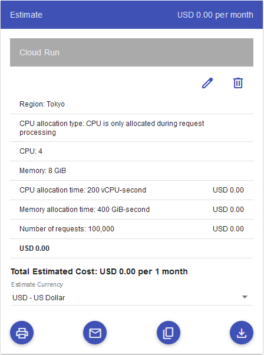

몇가지 이유로 최근 크게 확장이 될 수도 있는 풀스택 어플리케이션을 만들어 보기로 했습니다. 우선, 아직 사용해보지 못한 기술들을 배울뿐만 아니라 이미 알고 있는 지식들도 발전시킬 수 있는 좋은 기회일 것입니다. 두번째로 사람들이 관심을 가지지 않게 되더라도 지극히 개인적인 어플리케이션을 갖고 싶었습니다. 마지막으로 가장 중요한 이유로는 이 개발 여정동안 무엇을 겪고 배울지 궁금하기 때문입니다.

가장 먼저 하려고 하는 작업은 어플리케이션 프론트엔드로부터 요청을 받아들이는 서버를 설정하는 것입니다. 이를 위해 어플리케이션의 서버를 동작시킬 클라우드 서비스들을 살펴보려고 합니다. 이제 시작해보겠습니다!

## Google Cloud Run

**Google Cloud**는 **AWS Cloud**와 **Microsoft Azure** 더불어 가장 많이 활용되는 클라우드 서비스 중 하나입니다. 이 [기사](https://kinsta.com/google-cloud-market-share/)에 따르면 2021년 4분기에 구글 클라우드의 시장 점유율이 9% 이었다고 합니다. 모든 클라우드 서비스 중 세번째로 많이 쓰인 것입니다.

구글 클라우드 서비스를 사용한다는 것은 우리가 Google의 시스템을 사용한다는 것을 의미합니다. 다시 말해 Google의 데이터 센터에서 앱이 호스팅(hosting)이 된다는 것입니다. 또한, Google의 데이터 센터는 그들의 엔지니어들이 관리하고 보호하기 때문에 우리는 다른 복잡하고 어려운 일들을 다룰 필요가 없게 됩니다.

이러한 사실들을 고려한 후 필자가 사용하고 싶은 서비스는 Cloud run입니다. Cloud run은 [Google의 공식 문서](https://cloud.google.com/run/docs/overview/what-is-cloud-run?hl=ko)의 표현을 빌리자면 _Google의 확장 가능한 인프라에서 직접 컨테이너를 실행할 수 있게 해 주는 관리형 컴퓨팅 플랫폼입니다._ 앞서 말했듯이 앱을 확장하고 설정을 하는데 시간을 쓸 필요가 없습니다. 우리는 단순히 코드 작성을 더 즐길 수 있게 됩니다.

클라우드 서비스를 사용할 때 가장 중요한 것은 역시 비용입니다. Cloud run을 사용하려면 얼마나 내야할까요? Google은 사용한 대로 과금을 하는 정책을 가지고 있기 때문에 쓰는 만큼 비용이 청구됩니다. 하지만 필자는 서버가 커지게 되면 비용이 얼마나 청구될지 전혀 모르겠습니다. 이후에 서버가 정말 커지게 되면 이를 다루는 기사를 써보도록 하겠습니다. 얼마가 청구될지 감을 잡기 위해 다음과 같이 구글 클라우드 비용 계산기에 두 개의 옵션을 적어 출력해보았습니다:

놀랍게도 두 개 모두 0 달러를 보여주네요! 뭔가 맞지 않아 보입니다. 필자는 분명히 이 계산 이상으로 청구되는 비용이 있을 거라고 생각합니다. 이후에 비용에 대해 더 자세히 알아보고 이야기하도록 하겠습니다.

정리를 해보자면 Cloud run을 사용하게 되면:

1. 코드에 더 집중할 수 있다.
2. 두통을 일으키는 일 없이 앱을 배포할 수 있다.
3. 예상치를 뛰어 넘는 비용을 지불할지도 모른다.

이제 네이버 클라우드로 넘어가겠습니다.

## Naver Cloud

**네이버**는 한국에서 가장 큰 검색 엔진입니다. 심지어 검색 엔진에 대해서는 구글을 20-24% 차이로 앞서고 있습니다. 이 통계에 대한 출처의 신뢰성과는 상관없이 필자는 아주 정확하다고 생각합니다. 이유는 많은 한국인들의 주로 찾는 검색 엔진이기 때문입니다. - _지난 몇 년간 검색을 구글로 하는 사람의 수가 괄목할 만큼 증가하기는 했습니다._

네이버도 클라우드 서비스를 제공하고 있기 때문에 어떤 서비스가 있는지 살펴보고 사용하는 것도 좋을 거 같다고 생각했습니다. 또한, 네이버의 데이터 센터는 한국에 있고 필자 역시 한국에 살고 있기 때문에 분명히 신뢰성이나 속도같이 근거리 네트워크의 이점을 얻을 수 있을 것입니다.

사실 필자는 이미 아래와 같은 서버용 클라우드 플랫폼을 사용해보았습니다:

한국에 거주한다는 조건 하에 계정을 생성하고 비용 청구 정보를 입력하게 되면 1년 동안 무료로 사용할 수 있습니다. 서버를 생성하게 되면 콘솔 창은 다음과 같을 것입니다:

설정이 쉽고 콘솔이 깔끔하다는 인상을 받았습니다. 하지만 몇가지 짚고 넘어갈 부분이 있습니다. 1년이라는 무료 기간이 지나고 나면 같은 서버에 대해 월 13,000원씩 지불해야 합니다. 개인적으로 다른 클라우드 서비스보다 상대적으로 비싸다는 생각이 듭니다. 다른 예를 들자면 4 vCPU와 16GB RAM에 대해 아마존은 월 110 달러이고 네이버는 136 달러입니다 - _틀리다면 정정 요청 부탁드립니다._

이에 더해 무료 티어이긴 하지만 서버 공인 IP를 얻으려면 4,000원 정도를 지불해야 합니다. 그래도 이 정도면 눈 감아줄 만한 것 같습니다 - _여기서 말하는 공인 IP는 API처럼 서버에 접근하게 만들어 주는 IP 주소를 말하며 SSH로 연결할 때 사용하는 IP가 아님을 알려드립니다._

네이버에 대한 것은 여기까지.

## DigitalOcean

디지털오션의 시장 점유율이 2% 밖에 되지 않는다는 것을 알고 꽤 놀랐습니다. 그 수치보다는 더 많을 거라고 예상했기 때문이죠.

여하튼 필자는 회사에서 웹사이트와 MongoDB 스테이징 서버를 배포할 때 디지털오션에 좋은 인상을 받았습니다. 우선, 설명이 이해가 쉽고 직관적이라 설정이나 배포가 아주 쉽습니다. 그리고 무엇보다 중요한 것은 다른 클라우드 서비스에 비해 **아주** 저렴하다는 것입니다. 여기 이에 대한 [글](https://www.digitalocean.com/blog/aws-vs-digitalocean-cloud-platform)가 하나 있습니다 - _스포일러: 디지털오션에 있는 기사입니다._

필자의 프로젝트에 적격으로 보이지만 한가지 아쉬운 점이 있습니다: _**지역**_. 어떤 동아시아 국가에도 그들의 데이터 센터가 없습니다. 가장 가까운 지역은 **싱가포르**인데 비행기로 6시간 반이 걸립니다. 사실 프로젝트가 작고 그냥 그런 프로젝트로 끝날지 몰라 지역이 상관없을 수도 있습니다.

자, 이제 정리를 해보겠습니다.

## 결론

사실 이보다 더 많은 조사가 가능했을지 모릅니다. 하지만 커다란 차이를 보이지 않을 것이기에 위에 언급한 후보들만 고려했습니다. 몇가지 요소들을 고민한 결과 Cloud run을 사용하기로 했습니다. 두 가지 이유가 있습니다.

1. 이미 조금 경험한 바 있지만 초기 단계부터 사용해보고 싶었습니다.
2. 어플리케이션 개발 초기에 코드에 더 집중하고 싶은데 거의 써보지 않은 NestJS를 사용할 예정이기 때문입니다.

이제 프로젝트를 시작할 때가 됐습니다! 다음 글에서는 간단한 NestJS 앱을 Cloud run에 배포해보는 것에 대해 이야기 해보겠습니다.

_**읽어 주셔서 감사합니다. To be continued!**_
