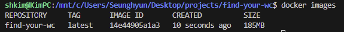
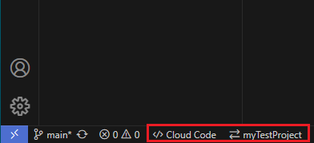
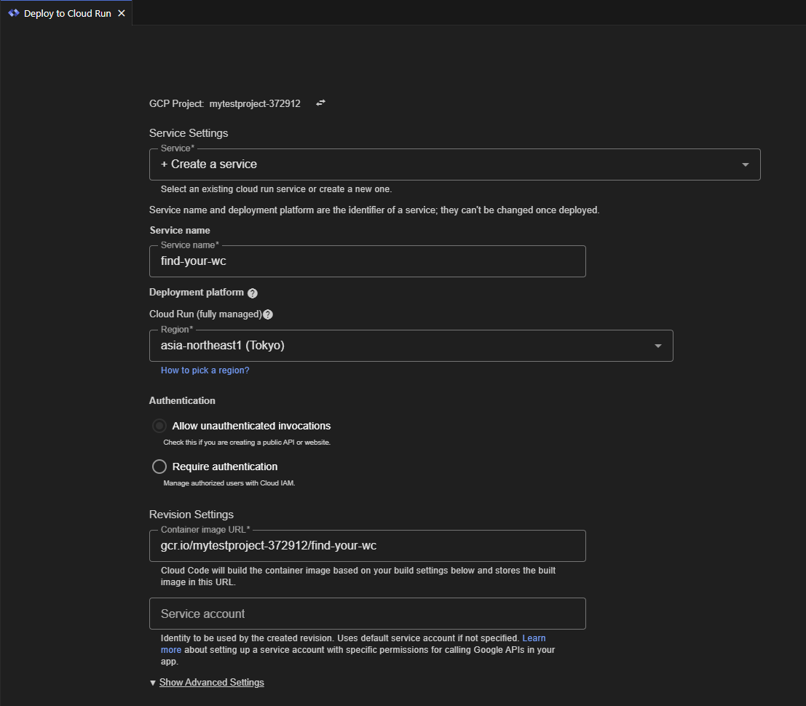

이전 글에서 개인 프로젝트에 Nestjs를 사용할 것이며 개발 초기에는 Cloud run에 배포를 하기로 결정했다고 했습니다. Cloud run에 기본 Nestjs 앱을 배포시켜 잘 동작하는지 확인해봤습니다. 혹시 이 주제에 관심을 가지고 읽을 독자를 위해 어떻게 했는지 이야기해보겠습니다.

## Nestjs 기본 어플리케이션

Nestjs의 공식문서에 있는 설명을 따라 Nestjs 어플리케이션을 설치해보겠습니다.

```bash
npm i -g @nestjs/cli
nest new [your-project-folder-name]
// 패키지 매니저로 yarn 혹은 pnpm을 선택할 수 있습니다.
```

완료가 되면 프로젝트 폴더로 이동해 어플리케이션을 실행하겠습니다.

```bash
cd [your-project-folder-name]
npm run start
```

디폴트로 설정된 포트 3000에서 동작을 잘하는지 확인해 보겠습니다. `localhost:3000`을 브라우저의 주소란에 입력하면 다음과 같이 `Hello, World`가 보일 것입니다:


## Docker 이미지 생성 및 로컬 환경에서 실행

Cloud run은 컨테이너를 만들어야 사용할 수 있기 때문에 Nestjs 앱에 대한 Docker 컨테이너가 있어야 합니다. Cloud run에 배포하기 전에 우선 Docker 이미지를 만들고 로컬 환경에서 실행해보겠습니다 - _필자와 같은 윈도우 사용자들은 메모리/디스크 사용량에 대한 설정을 하길 권장합니다. 이 [링크](https://learn.microsoft.com/en-us/windows/wsl/wsl-config)를 확인해보세요._

이미지를 만들기 위해 Dockerfile을 생성하고 아래에 있는 코드를 적습니다:


이미지를 만듭니다.

```
docker build -t [your-image-name] .
```



이제 실행시켜 볼까요?

```
docker run -p 3000:3000 [your-image-name]
```


여기서 한가지 언급하고 싶은 것은 Docker 컨테이너는 호스트 OS위에 고유의 시스템을 가지고 있습니다. 그러므로, Docker의 포트와 호스트의 포트를 연결시켜줘야 합니다. `-p 3000:3000`이 그 역할을 해줍니다.

다시 `localhost:3000`을 입력했을 때 `Hello, World`가 보이는지 확인해봅니다. 보인다면 다음으로 넘어가겠습니다!

## VS code에서 Cloud run으로 배포하기

Cloud build API로 Google 콘솔에서 배포하는 대신에 Cloud code라는 extension을 사용하여 VS code에서 배포할 수 있습니다. 두 방법 모두 실행해봤지만 후자가 더욱 쉽고 관리가 용이해보였습니다. 본격적으로 이야기하기 전에 gcloud cli가 설치되었으며 Google cloud platform에 프로젝트가 생성되어야 합니다. 다음은 방법에 대한 설명입니다.

### 로그인

1. Cloud code expention을 다운받고 활성화 시킨다.
2. 왼쪽 사이드바에 **Cloud Run**을 클릭한다.
3. **Click here**를 클릭한다.
4. ID로 로그인한다.

### 배포

1. VS code 하단에 **Cloud code** 클릭한다.

   

2. VS code 상단에 뜨는 메뉴에서 **Deploy to Cloud run** 클릭한다.
3. **Service name**과 **Region**을 입력/선택하고 **Deploy**를 누른다 - _최소 설정으로 유지하기 위해 나머지는 그대로 둔다_.

   

빌드가 완료가 되면 서비스 url이 페이지의 상단에 다음과 같이 나타납니다:


`[service url]`을 주소란에 입력하여 배포된 앱이 잘 동작한다면 `Hello, World`를 보여줄 것입니다:


이렇게 Nestjs 앱을 배포해보았습니다!

_**읽어 주셔서 감사합니다. To be continued!**_

### 참조

- https://www.tomray.dev/nestjs-docker-production
- https://medium.com/dsckiet/a-guide-for-cloud-run-deployment-locally-using-visual-studio-code-8eb6688679f0
