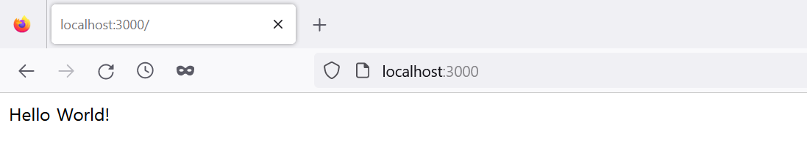
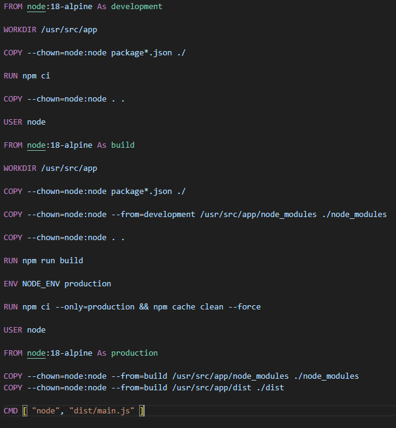
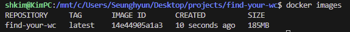
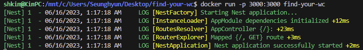
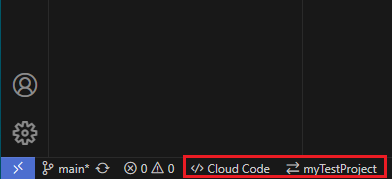
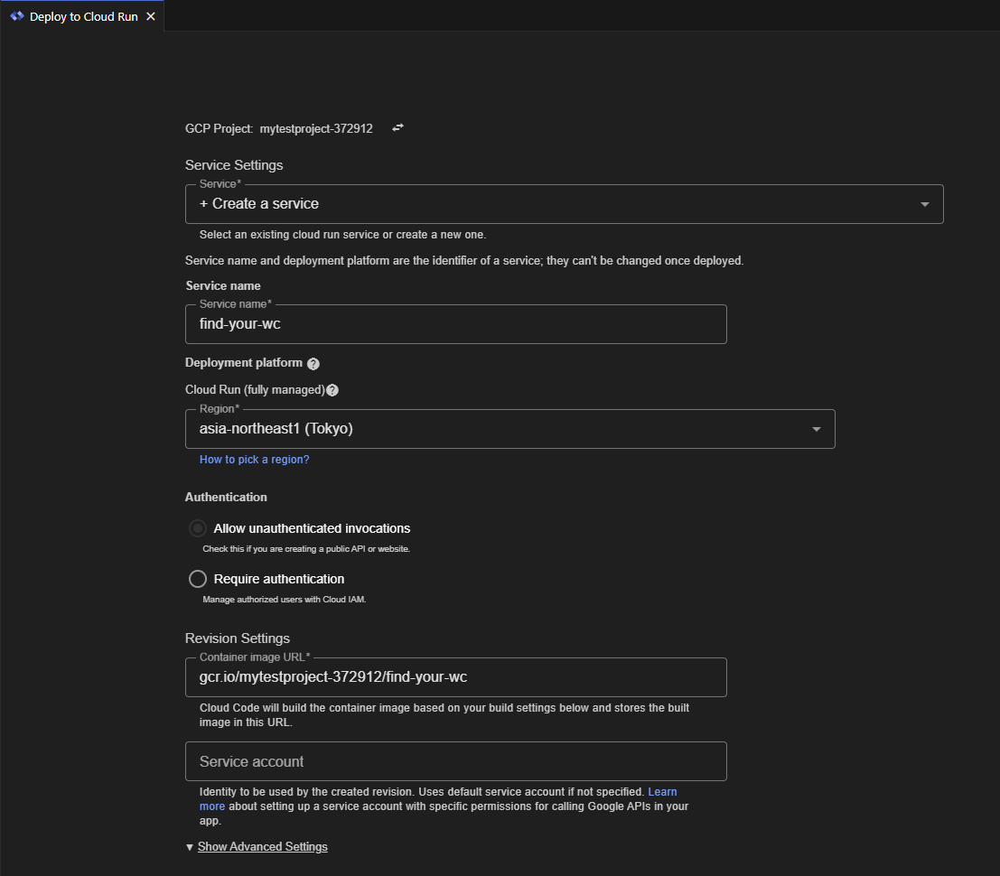
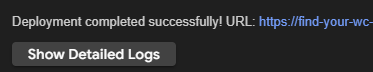
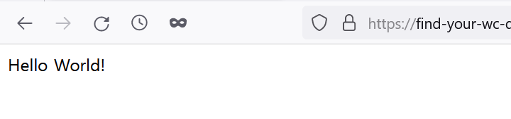

In the last article, I said that I decided to use Nestjs and deploy it to Cloud run at an early stage of my project. So, I wanted to deploy a simple Nestjs app to Cloud run first to see if it works well. For any of those who might read this article and are interested in this topic, Here is how I did it.

## Nestjs basic application

Let's install a Nestjs application by following the instructions from Nestjs's documentation.

```bash
npm i -g @nestjs/cli
nest new [your-project-folder-name]
// you can choose yarn or pnpm for package manager when creating
```

Once it is done, change the directory to the project folder and run the application.

```bash
cd [your-project-folder-name]
npm run start
```

We will check if the application works fine on port 3000 which have already been set as the default. When we hit `localhost:3000` in the addreess bar in a browser. It will say `Hello, World` like this:



## Create Docker image and run it locally

Since Cloud run works with a container, we should have a Docker container for our Nestjs app. Before deploying to Cloud run, we will build a Docker image and run it locally first - _For Windows user like me, it is a good practice to configure some options like memory and disk usage. Check out [this link](https://learn.microsoft.com/en-us/windows/wsl/wsl-config)_.

To build an image, we will create a Dockerfile and write the code below:



Let's build an image.

```
docker build -t [your-image-name] .
```



Now, run it.

```
docker run -p 3000:3000 [your-image-name]
```



Only thing I want to mention here is a Docker container has its own system on the top of Host OS. Therefore, we should map its port to Host's port. That is what `-p 3000:3000` does.
Check if `Hello, World` shows up when you hit `localhost:3000` again. If it does, then we are good to go.

## Deploy to Cloud run from VS code

Instead of deploying in Google console using Cloud build API, we can deploy from VS code using Cloud code extension. I found it much easier and seemingly manageable when I tried both ways. Before starting, ensure that you have gcloud cli installed and working project on Google cloud platform. Here is the quick instruction.

### Login

1. Download and enable Cloud code extension.
2. Click on **Cloud Run** button in the sidebar.
3. Click on **Click here** for Login button.
4. Sing in with your ID

### Deploy

1. Click **Cloud code** at the bottom of VS code.

   

2. Click **Deploy to Cloud run** when the dropdown pops up on the top of VS code.
3. Click **Deploy** after entering **Service name** and choosing **Region** - _Leave all the rest as they are since it is the minimum set up_.

   

Once the build is done, the service url will pop up on the top of the page like:



Time to check if our app works fine. When we hit `[your service url]` in the address bar, it should say `Hello, World`:



Finally, we deployed our Nestjs app!

_**THANKS FOR READING. SEE YOU NEXT TIME!**_

### Reference

- https://www.tomray.dev/nestjs-docker-production
- https://medium.com/dsckiet/a-guide-for-cloud-run-deployment-locally-using-visual-studio-code-8eb6688679f0
