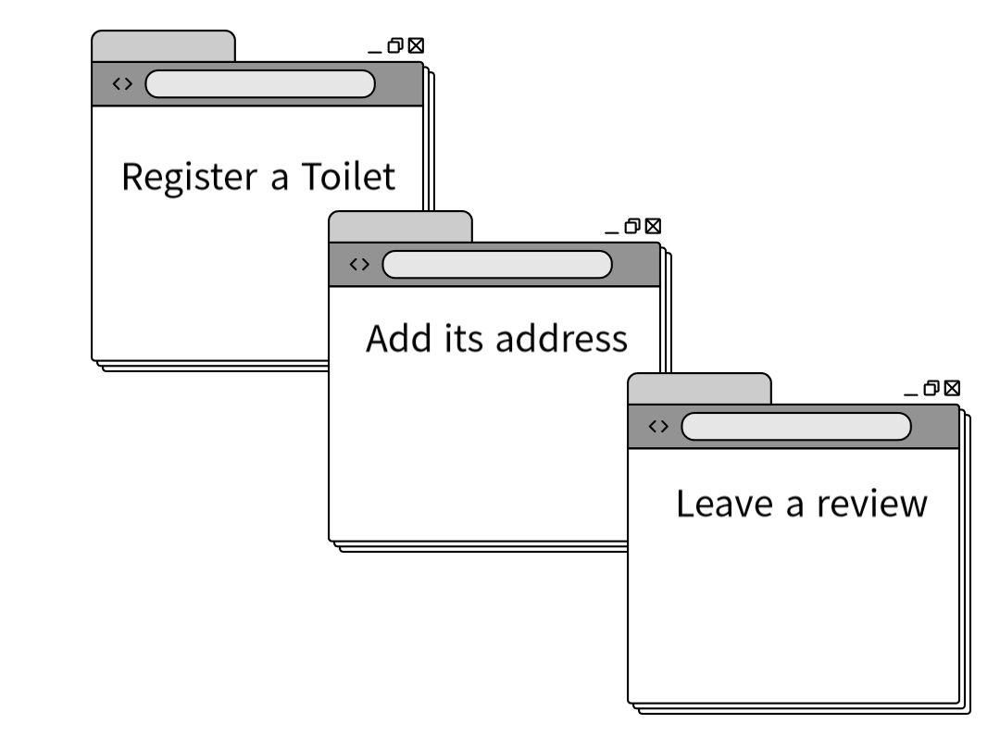
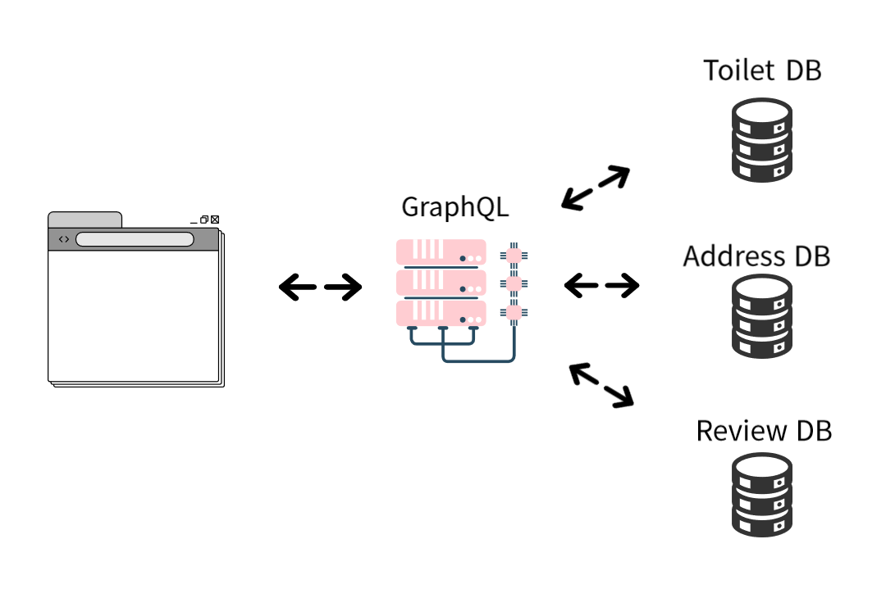

이전의 두 글에서 필자는 개인적인 프로젝트를 진행하고 있다고 말했습니다. 프로젝트가 구동이 될 클라우드 서비스를 먼저 알아보고 싶었기 때문에 어떤 프로젝트인지에 대한 설명이 조금 늦어졌습니다. 드디어 그 프로젝트에 대해 설명하려고 합니다!

## Find Your W.C.
이미 눈치채셨겠지만 화장실에 관한 것입니다. 필자는 여행할 때마다 좋고 편안한 화장실이 어디 있는지 안다면 정말 좋을 거 같다는 생각을 매번 했습니다. 그래서 특정 지역에 있는 화장실에 대한 정보를 현지인들과 여행자들이 공유할 수 있는 어플리케이션을 만들기로 했습니다.

## 기본 사용자 행동
필자가 생각하는 어플리케이션 사용자의 예상 행동입니다.

- 리뷰를 남기려는 사람이 기본 정보가 담긴 화장실을 등록한다
- 화장실 정보에 주소를 추가한다
- 구조화된 형식(청결도, 설명 등)으로 리뷰를 남긴다
- 다른 사용자가 이미 존재하는 화장실 리뷰에 자신의 리뷰를 추가한다

## 단순화한 비즈니스 로직
위에 나열된 사용자 행동에 따른 필자가 개발하려는 기본 로직입니다.

- 화장실 정보가 담긴 요청이 올 때 그 변수에 담아 저장해놓는다 - _아직 데이터 베이스에 저장하지 않는다_
- 주소가 담긴 정보가 왔을 때 데이터 베이스에 존재하는지 여부를 확인한다
- 위 단계에서 내린 결론으로 어떤 응답을 보낼지 결정한다
- 해당 화장실에 대한 리뷰를 저장하려는 요청이 올 때 일치하는 화장실 id와 함께 리뷰를 저장한다

다음 글에서는 Nestjs + Graphql + Prisma + PostgreSQL을 설정하고 시작하는 법에 대해 글을 쓰겠습니다.

_**읽어 주셔서 감사합니다. To be continued!**_
