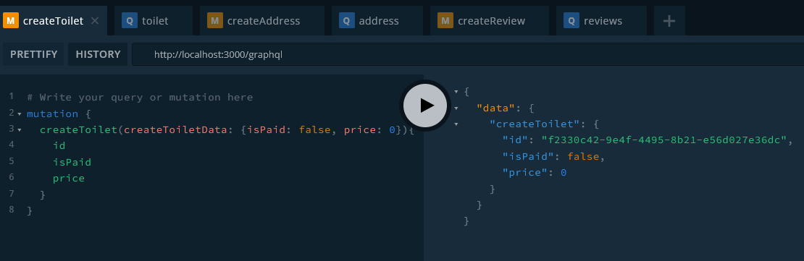
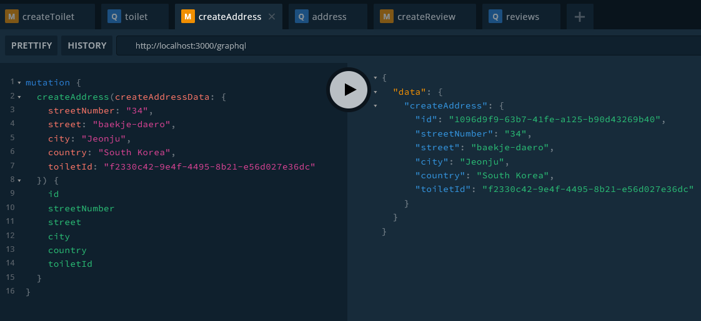
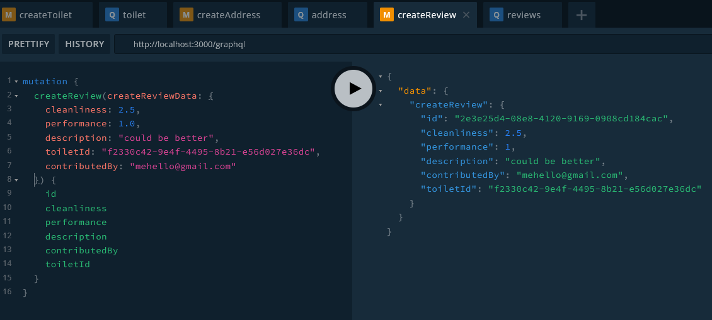
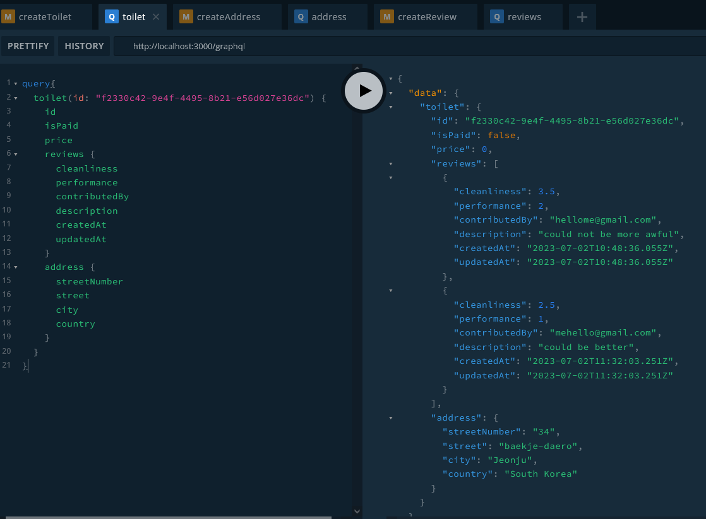

_You can see the whole code on the [graphql-prisma-postgresql](https://github.com/shkim04/find-your-wc/tree/graphql-prisma-postgresql) branch._

To develop the business logic mentioned in [the last article](https://shkim04.github.io/en/project-find-your-wc/), we will have to define the data model. **Prisma** will be used for the purpose since it is intuitive and type-safe. After defining the model, we will migrate it to a database we want to use. And then, we will have a **GraphQL** server that are responsible for handling requests and responses between clients and our database.

## Prisma

First, we will create Prisma schema file using the commands shown below.

```
npm install prisma
npx prisma init

```

I defined the data model for the project as shown below. Here, we have **Toilet**, **Address** and **Review** tables in our database. Notice **Toilet** has some relation to both **Address** and **Review**.

```js
model Toilet {
  id      String   @id @default(uuid())
  address Address?
  reviews Review[]
  isPaid  Boolean
  price   Int
}

model Address {
  id           String  @id @default(uuid())
  streetNumber String
  street       String
  city         String
  country      String
  toiletId     String  @unique
  toilet       Toilet? @relation(fields: [toiletId], references: [id])
}

model Review {
  id            String   @id @default(uuid())
  cleanliness   Float
  performance   Float
  description   String?  @db.VarChar(1024)
  contributedBy String   @unique
  toiletId      String
  toilet        Toilet?  @relation(fields: [toiletId], references: [id])
  createdAt     DateTime @default(now())
  updatedAt     DateTime @updatedAt
}
```

## Migrate to PostgrSQL

We will set up **PostgreSQL** database on our local machine for development using **Docker**. Even though this is a local development, we will use environment varaibales to run the database as if we deployed it on production.

To begin to set it up, add the following variables in `.env` file:

```js
POSTGRES_HOST='localhost'
POSTGRES_PORT=5432
POSTGRES_USERNAME='your-user-name'
POSTGRES_PASSWORD='your-password'
POSTGRES_NAME='your-postgres-name'
```

Add the following code in `docker-compose.yml`:

```
services:
  postgres:
    image: postgres
    restart: always
    env_file:
      - .env
    environment:
      - POSTGRES_USERNAME=${POSTGRES_USERNAME}
      - POSTGRES_PASSWORD=${POSTGRES_PASSWORD}
      - POSTGRES_NAME=${POSTGRES_NAME}
      - POSTGRES_PORT=${POSTGRES_PORT}
      - POSTGRES_HOST=${POSTGRES_HOST}
    volumes:
      - postgres:/var/lib/postgresql/data
    ports:
      - '5432:5432'
volumes:
  postgres:
```

And run the PostgreSQL by entering:

```
docker-compose up -d
```

We can check if the database container is running or not with Docker Desktop or VScode extension. 

Now, let's migrate the data model to the database:

```
npx prisma migrate dev --name [whatever-you-want]
```

Once the migration is done, check if all the tables are created in the database, run a docker command like:

```
docker exec -it [your-container-name] psql -U [your-user-name] [your-postgres-name]
// And then, run the following query
\dt
```

It will show all the tables we have defined in Prisma schema file.

## GraphQL

**GraphQL** is a query language for APIs. Unlike REST API, we do not have to retrieve data that we do not need. In other words, we can specify fields that we want to get as a response from an API based on our needs. 

Conveniently, there is the built-in `@nestjs/graphql` module in NestJS. Let's install the package and other necessary ones:

```
npm i @nestjs/graphql @nestjs/apollo @apollo/server
```

We need a module that handles requests and response about toilet data. Let's create the following files in the `toilet` folder under the `src` folder:

```
src
└── toilets
    ├── dto
    │   ├── args
    │   │   ├── get-toilet.args.ts
    │   │   └── get-toilets.args.ts
    │   └── input
    │       ├── create-toilet.input.ts
    │       ├── delete-toilet.input.ts
    │       └── update-toilet.input.ts
    ├── models
    │   └── toilets.ts
    ├── toilets.module.ts
    ├── toilets.repository.ts
    ├── toilets.resolver.ts
    └── toilets.service.ts
```

Instead of explaining all the codes in each file, we will focus on what a few of important files do.

- **DTO** stands for Data Transfer Object. We specify data types and fields that we want the GraphQL server to get from clients in the `dto` folder.
- We define the Toilet model to let the GraphQL know types and fields we need in the `model` folder.
- We define a controller layer that controls a GraphQL operation such as query, mutation and subscription in the `resolver` file.
- We define a repostory layer that does CRUD operations to our database in the `repository` file.
- We define a service layer that provides services added to it such as adding long-time operation to a queue in the `service` file. 

> Note: I took the code first approach - _The opposite is the schema first approach_. For the code first approach, we should annotate classes with proper decorators provided by `@nestjs/graphql`.

We will create address and review module in the same structure as the `toilet` module. 

Only thing that I was struggling with here is how to resolve relations each table of the database has. Recall that Toilet table has relations with Address and Review tables. To let the GraphQL be able to resolve these relations, I did like in the `toilet` resolver:

```js
//..
@Resolver(() => Toilet)
export class ToiletsResolver {
  constructor(
    private readonly toiletService: ToiletsService,
    private readonly addressService: AddressService,
    private readonly reviewsService: ReviewsService,
  ) {}
  //.. check out my git repo for the whole code

  @ResolveField('address', () => Address)
  async getAddressByToiletId(@Parent() toilet: Toilet): Promise<Address> {
    return this.addressService.getAddress({ toiletId: toilet.id });
  }

  @ResolveField('reviews', () => [Review])
  async getAllReviewsByToiletId(@Parent() toilet: Toilet): Promise<Review[]> {
    return this.reviewsService.getReviews({ toiletId: toilet.id });
  }
}
```

I brought Address/Review services and create methods with `ResolveField` decorator to solve the problem.

Now, let's make some requests from GraphQL playground to simulate our app.

## Test Requests

#### Create Toilet

#### Create Address

#### Create Review

#### Get Toilet


## Thoughts
NestJS is well-structured and easy for us to modularize a certain service by its nature. With that fact in mind, I think I might be going to make our NestJS app a few of microservices combined later in the future.

_You can see the whole code on the [graphql-prisma-postgresql](https://github.com/shkim04/find-your-wc/tree/graphql-prisma-postgresql) branch._

_**THANKS FOR READING. SEE YOU NEXT TIME!**_

### References
- https://docs.nestjs.com/graphql/quick-start
- https://www.tomray.dev/nestjs-prisma
- https://dev.to/bitovi/creating-a-graphql-server-with-nestjs-3ap0
