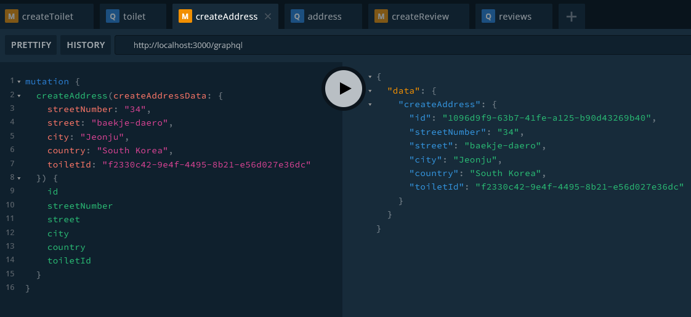
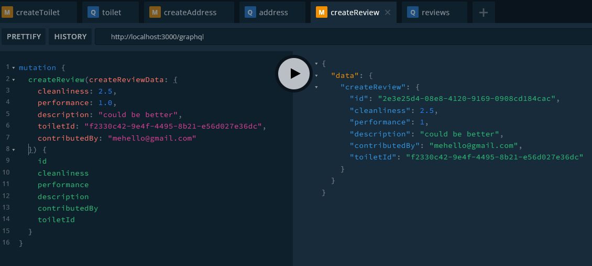
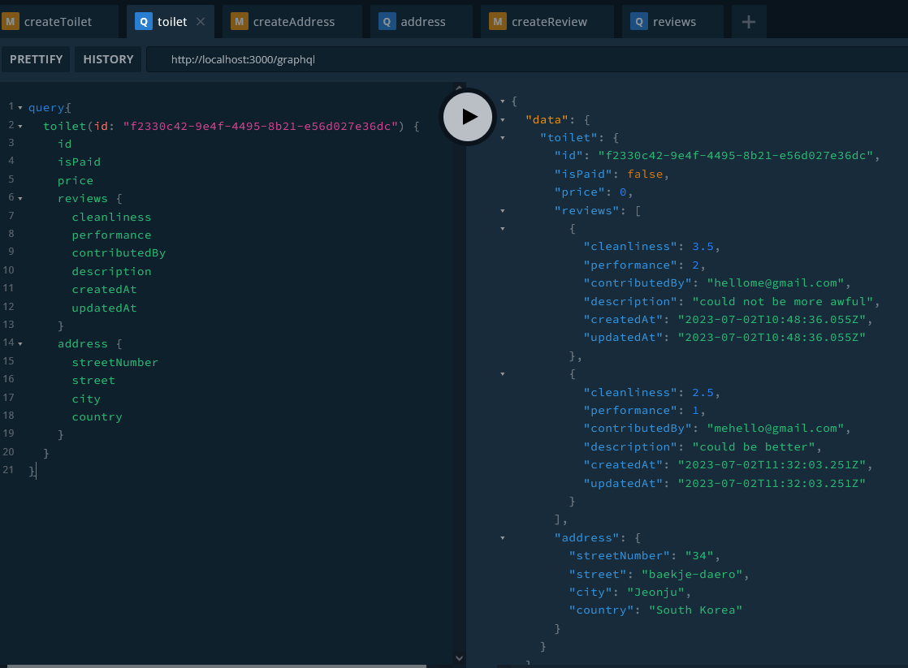

_[graphql-prisma-postgresql](https://github.com/shkim04/find-your-wc/tree/graphql-prisma-postgresql) 브랜치에서 코드를 확인하실 수 있습니다._

[지난 글](https://shkim04.github.io/%ED%94%84%EB%A1%9C%EC%A0%9D%ED%8A%B8-find-your-wc/)에 언급된 비즈니스 로직을 개발하기 위해 데이터 모델을 정의해야 합니다. **Prisma**가 직관적이며 타입-안정성을 보장하기 때문에 데이터 모델을 정의하는 목적으로 사용될 것입니다. 모델을 정의하고 나면 사용하고자 하는 데이터베이스에 모델을 등록할 것입니다. 그런 다음 클라이언트와 데이터베이스 사이의 요청과 응답을 처리하는 **GraphQL** 서버를 둘 것입니다.

## Prisma

먼저 아래의 명령어를 사용하여 Prisma schema 파일을 만듭니다.

```
npm install prisma
npx prisma init

```

필자는 아래와 같이 데이터 모델을 정의했습니다. 데이터베이스에 **Toilet**, **Address**, **Review**이라는 테이블을 두었습니다. 여기서 **Toilet**이 **Address**, **Review**와 각각 관계를 형성하고 있습니다.

```js
model Toilet {
  id      String   @id @default(uuid())
  address Address?
  reviews Review[]
  isPaid  Boolean
  price   Int
}

model Address {
  id           String  @id @default(uuid())
  streetNumber String
  street       String
  city         String
  country      String
  toiletId     String  @unique
  toilet       Toilet? @relation(fields: [toiletId], references: [id])
}

model Review {
  id            String   @id @default(uuid())
  cleanliness   Float
  performance   Float
  description   String?  @db.VarChar(1024)
  contributedBy String   @unique
  toiletId      String
  toilet        Toilet?  @relation(fields: [toiletId], references: [id])
  createdAt     DateTime @default(now())
  updatedAt     DateTime @updatedAt
}
```

## PostgrSQL 등록

개발 목적으로 **Docker**를 사용하여 로컬 컴퓨터에 **PostgreSQL** 데이터베이스를 설치합니다. 로컬 개발 환경이지만 배포 환경처럼 환경변수를 이용해 데이터베이스를 동작시키려고 합니다.

설치를 위해 `.env` 파일에 다음 변수를 추가합니다.

```js
POSTGRES_HOST='localhost'
POSTGRES_PORT=5432
POSTGRES_USERNAME='your-user-name'
POSTGRES_PASSWORD='your-password'
POSTGRES_NAME='your-postgres-name'
```

`docker-compose.yml`에 다음 코드를 추가합니다.

```
services:
  postgres:
    image: postgres
    restart: always
    env_file:
      - .env
    environment:
      - POSTGRES_USERNAME=${POSTGRES_USERNAME}
      - POSTGRES_PASSWORD=${POSTGRES_PASSWORD}
      - POSTGRES_NAME=${POSTGRES_NAME}
      - POSTGRES_PORT=${POSTGRES_PORT}
      - POSTGRES_HOST=${POSTGRES_HOST}
    volumes:
      - postgres:/var/lib/postgresql/data
    ports:
      - '5432:5432'
volumes:
  postgres:
```

다음 명령어로 PostgreSQL을 실행시킵니다.

```
docker-compose up -d
```

Docker Desktop이나 VScode extension로 데이터베이스 컨테이너가 잘 실행되는지 확인을 할 수 있습니다.

이제 PostgreSQL에 데이터 모델을 등록합니다.

```
npx prisma migrate dev --name [whatever-you-want]
```

등록이 끝나면 다음 명령어로 모든 테이블들이 생성되었는지 확인합니다.
```
docker exec -it [your-container-name psql] -U [your-user-name] [your-postgres-name]
// And then, run the following query
\dt
```

Prisma schema 파일에 정의한 모든 테이블이 나타날 것입니다.

## GraphQL

**GraphQL**은 API를 위한 쿼리 언어입니다. REST API와는 달리 필요하지 않은 데이터까지 불러올 필요가 없습니다. 다시 말해 필요에 따라 응답으로 받고 싶은 필드 등을 선택적으로 정할 수 있습니다.

편리하게도 NestJS에는 `@nestjs/graphql` 모듈이 내장되어 있습니다. 해당 패키지와 다른 필요 패키지들을 설치합니다.

```
npm i @nestjs/graphql @nestjs/apollo @apollo/server
```

화장실 데이터에 관한 요청/응답을 처리할 모듈이 필요합니다. `src` 폴더 하위에 `toilet` 폴더 안에 다음과 같은 파일들을 생성합니다.

```
src
└── toilets
    ├── dto
    │   ├── args
    │   │   ├── get-toilet.args.ts
    │   │   └── get-toilets.args.ts
    │   └── input
    │       ├── create-toilet.input.ts
    │       ├── delete-toilet.input.ts
    │       └── update-toilet.input.ts
    ├── models
    │   └── toilets.ts
    ├── toilets.module.ts
    ├── toilets.repository.ts
    ├── toilets.resolver.ts
    └── toilets.service.ts
```

각각의 파일에 모든 코드를 설명하기보다는 몇몇 중요 파일들의 역할에 중점을 두겠습니다.

- **DTO**는 Data Transfer Object의 약자입니다. `dto` 폴더 안에 GraqhQL 서버가 클라이언트로부터 어떤 데이터 필드와 타입을 받고 싶은지 정합니다.
- `model` 폴더에는 GraphQL을 통해 어떤 필드와 타입을 처리할 것인지 Toilet 모델을 통해 정합니다. 
- `resolver` 파일에 query, mutation, subscription 등의 GraphQL 작업을 담당하는 controller 층을 정의합니다.
- `repository` 파일에 데이터베이스와 CRUD 작업을 처리하는 repository 층을 정의합니다.
- `service` 파일에 장시간 작업을 queue 추가하는 등의 서비스들을 제공하는 service 층을 정의합니다.

> Note: I took the code first approach - _The opposite is the schema first approach_. For the code first approach, we should annotate classes with proper decorators provided by `@nestjs/graphql`.

> 알림: 필자는 code first 접근법을 사용했습니다 - _반대 개념으로는 schema first가 있습니다_. code first 접근법을 사용하려면 `@nestjs/graphql`에서 제공하는 데코레이터들을 정의된 클래스들에 적절하게 달아줘야 합니다.

`toilet` 모듈과 같이 address, review 모듈도 생성합니다.

여기서 필자가 애를 먹었던 부분은 데이터베이스의 각 테이블들이 가지는 관계들을 해결하는 법이었습니다. Toilet 테이블이 Address와 Review 테이블과 관계를 형성하고 있다는 것을 기억하실 겁니다. GraphQL이 이 관계들을 처리하도록 필자는 `toilet` resolver 파일에 다음과 같이 했습니다.

```js
//..
@Resolver(() => Toilet)
export class ToiletsResolver {
  constructor(
    private readonly toiletService: ToiletsService,
    private readonly addressService: AddressService,
    private readonly reviewsService: ReviewsService,
  ) {}
  //.. check out my git repo for the whole code

  @ResolveField('address', () => Address)
  async getAddressByToiletId(@Parent() toilet: Toilet): Promise<Address> {
    return this.addressService.getAddress({ toiletId: toilet.id });
  }

  @ResolveField('reviews', () => [Review])
  async getAllReviewsByToiletId(@Parent() toilet: Toilet): Promise<Review[]> {
    return this.reviewsService.getReviews({ toiletId: toilet.id });
  }
}
```
Address/Review 서비스들을 불러왔고 `ResolveField` 데코레이터를 가진 메소드을 생성하여 문제를 해결했습니다.

이제 간단한 앱 동작을 확인하기 위해 GraphQL로 테스트 요청을 해보겠습니다.

## 테스트 요청

#### Create Toilet

#### Create Address

#### Create Review

#### Get Toilet


## 정리
NestJS는 잘 짜여진 구조를 갖추고 있으며 한 서비스를 모듈화하는데 아주 용이합니다. 이러한 이유로 이후에 이 NestJS 앱을 분할된 마이크로 서비스들로 만드는 것을 고려하고 있습니다. 

_[graphql-prisma-postgresql](https://github.com/shkim04/find-your-wc/tree/graphql-prisma-postgresql) 브랜치에서 코드를 확인하실 수 있습니다._

_**읽어 주셔서 감사합니다. To be continued!**_

### 참조
- https://docs.nestjs.com/graphql/quick-start
- https://www.tomray.dev/nestjs-prisma
- https://dev.to/bitovi/creating-a-graphql-server-with-nestjs-3ap0
