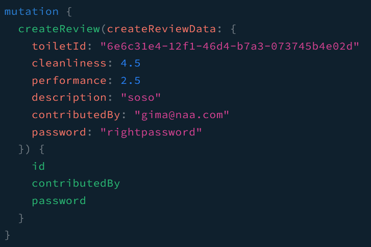
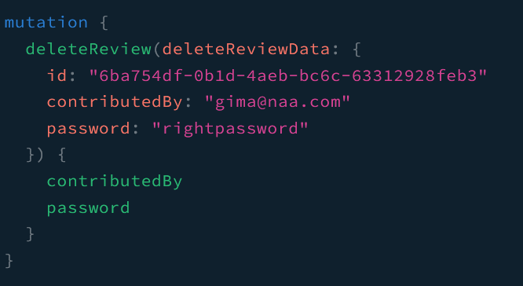
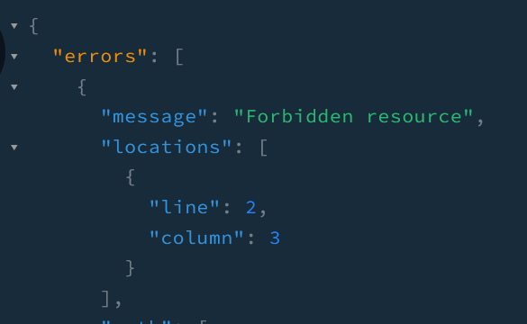

_You can see the whole code on the [nestjs-guards](https://github.com/shkim04/find-your-wc/tree/nestjs-guards) branch._

In the last article, we have the core Graphql set, which can do CRUD for Toilet, Address and Review. With this application, we want to collect some information about toilets from random people. But, we should not allow a random person to delete a review that is not written by the person. To achieve this goal, we will implement **Guards** on `review` resolver.

## Modify Review Schema
Since we did not have password field in `Review` model, we will add the field and then, migrate to our database again by entering `npx prisma migrate dev --create-only`.

```js
model Review {
    ...
    contributedBy String   @unique
    password      String
    toiletId      String
    ...
}
```

## Modify Review DTO
We should make a contributor create a reivew with a password so that we can identify who is trying to delete the review.
```js
// create-review.input.ts
@InputType()
export class CreateReviewInput {
  ...

  @Field()
  toiletId?: string;

  @Field()
  @IsNotEmpty()
  @IsEmail()
  contributedBy: string;

  @Field()
  @IsNotEmpty()
  password: string;
}
```

Add password field in the delete-review input type as shown below.
```js
// delete-review.input.ts
@InputType()
export class DeleteReviewInput {
  @Field()
  @IsNotEmpty()
  id: string;

  @Field()
  @IsNotEmpty()
  contributedBy: string;

  @Field()
  @IsNotEmpty()
  password: string;
}
```

## Write Guards
We now will create a folder named `guards` under `src` folder. Inside of the folder, we will have a file named `review.guard.ts`. By using **Guards**, we can take the context of the incoming request and then, by using it, determine whether it is allowed to be handled by **Router Handler** or not. Simply put, it is where authorization/authentication happens.

```js
@Injectable()
export class ReviewAuthGuard implements CanActivate {
  constructor(@Inject(ReviewsService) private reviewsService: ReviewsService) {}

  async canActivate(context: GqlExecutionContext): Promise<boolean> {
    const ctx = GqlExecutionContext.create(context);
    const { deleteReviewData } = ctx.getArgs();
    const { id, contributedBy, password } = deleteReviewData;

    const reviewInfo = await this.reviewsService.getReview({ id: id });
    if (
      reviewInfo.contributedBy === contributedBy &&
      reviewInfo.password === password
    ) {
      return true;
    }

    return false;
  }
}
```

> Notice: Since we are using Graphql instead of REST, we should import **GqlExecutionContext**.

The guard gets the arguemnt which contains the delete review input and compares the email and password to the corresponding ones from the review which is retrieved by `reviewService` injected. If they are matched, it will allow the request to go to **Router handler**.

## UseGuards Decorator
At last, to make the guard work, we should pass `ReviewAuthGuard` in `UseGuards` decorator and put it on the top of the target method in `review` resolver.

```js
@Mutation(() => Review)
@UseGuards(ReviewAuthGuard)
async deleteReview(
  @Args('deleteReviewData') deleteReviewData: DeleteReviewInput,
): Promise<Review> {
  return this.reviewService.deleteReview(deleteReviewData);
}
```

## Test

### Create a review

### Delete a review with right password

### Reponse when deleting a review with wrong password


## Thoughts
It is a cool thing to use **Guards** to authenticate a user because it has a single responsibility and can be used all over the whole application. But, as you can see, I had the simplest process for the authentication. In the next article, I will elaborate the process by making use of `bcrypt` to hash passwords.

_You can see the whole code on the [nestjs-guards](https://github.com/shkim04/find-your-wc/tree/nestjs-guards) branch._

_**THANKS FOR READING. SEE YOU NEXT TIME!**_

### References
- https://docs.nestjs.com/graphql/other-features
- https://docs.nestjs.com/guards
