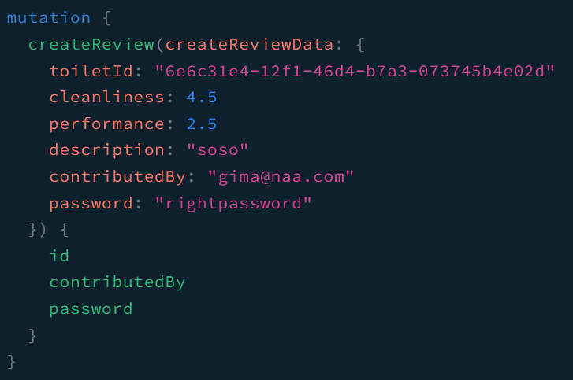
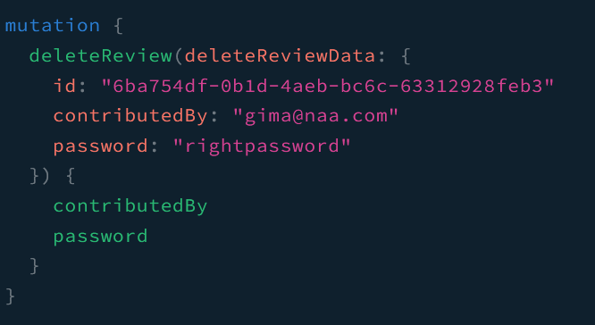
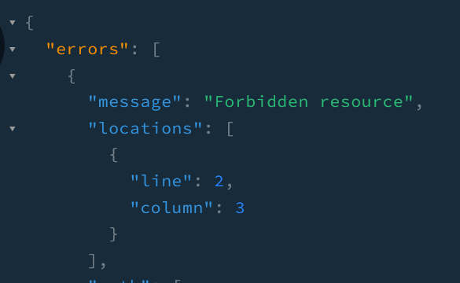

지난 글에서 Toilet, Address와 Review에 대해 CRUD 작업을 하는 Graphql 서버를 구성했습니다. 이 어플리케이션으로 여러 사람으로부터 화장실에 대한 정보를 얻으려고 합니다. 하지만 임의의 사용자가 자신이 작성하지 않을 리뷰를 지우는 것을 허용하지 않아야 합니다. 이를 위해 `review` Resolver에 **Guard**를 적용할 것입니다.

## Review Schema 수정
`Review` 모델에 password 필드가 없었기 때문에 이 필드를 추가하고 `npx prisma migrate dev --create-only`라는 명령어를 통해 데이터베이스에 재등록을 시킵니다.

```js
model Review {
    ...
    contributedBy String   @unique
    password      String
    toiletId      String
    ...
}
```

## Review DTO 수정
리뷰를 남기는 사용자가 리뷰를 작성할 때 비밀번호와 함께 생성되도록 하여 해당 리뷰를 지우려고 할 때 누군지 확인할 수 있게 합니다.
```js
// create-review.input.ts
@InputType()
export class CreateReviewInput {
  ...

  @Field()
  toiletId?: string;

  @Field()
  @IsNotEmpty()
  @IsEmail()
  contributedBy: string;

  @Field()
  @IsNotEmpty()
  password: string;
}
```

다음과 같이 delete-review input에도 password 필드를 추가합니다.
```js
// delete-review.input.ts
@InputType()
export class DeleteReviewInput {
  @Field()
  @IsNotEmpty()
  id: string;

  @Field()
  @IsNotEmpty()
  contributedBy: string;

  @Field()
  @IsNotEmpty()
  password: string;
}
```

## Guard 작성
`src`폴더 하위에 `guards`라는 폴더를 생성하고 해당 폴더 하위에 `review.guard.ts`라는 파일을 만듭니다. **Guard**를 사용하면 요청 객체에서 정보를 얻어 이를 사용해 **라우터 핸들러**에서 처리해도 될지 말지를 결정할 수 있습니다. 간단하게 말해 authorization/authention이 이루어지는 곳이라고 봐도 되겠습니다. 

```js
@Injectable()
export class ReviewAuthGuard implements CanActivate {
  constructor(@Inject(ReviewsService) private reviewsService: ReviewsService) {}

  async canActivate(context: GqlExecutionContext): Promise<boolean> {
    const ctx = GqlExecutionContext.create(context);
    const { deleteReviewData } = ctx.getArgs();
    const { id, contributedBy, password } = deleteReviewData;

    const reviewInfo = await this.reviewsService.getReview({ id: id });
    if (
      reviewInfo.contributedBy === contributedBy &&
      reviewInfo.password === password
    ) {
      return true;
    }

    return false;
  }
}
```

> 주의: REST 대신 Graphql를 사용하므로 **GqlExecutionContext**를 import해야 합니다.

이 가드는 delete review input이 담긴 인자(argument)를 얻고 이 안에 담긴 이메일과 비밀번호를 `reviewService`로 불러온 리뷰 정보에 담긴 이메일과 비밀번호와 비교합니다. 이 정보들이 일치한다면 해당 요청이 **라우터 핸들러**로 가게 됩니다.

## UseGuards 데코레이터
마지막으로 이 가드를 사용하려면 `review` Resolver에 있는 대상 메소드 위에 `UseGuards` 데코레이터를 위치시키고 `ReviewAuthGuard`를 인자로 전달해야 합니다. 

```js
@Mutation(() => Review)
@UseGuards(ReviewAuthGuard)
async deleteReview(
  @Args('deleteReviewData') deleteReviewData: DeleteReviewInput,
): Promise<Review> {
  return this.reviewService.deleteReview(deleteReviewData);
}
```

## 테스트

### 리뷰 생성

### 일치하는 비밀번호로 리뷰 지우기

### 일치하지 않는 비밀번호로 리뷰 응답


## 정리
**Guard**를 사용하여 사용자를 인증하면 그 인증 기능을 집중시켜 어플리케이션 전체에 사용할 수 있다는 것이 큰 매력입니다. 하지만 보시다시피 필자는 인증을 아주 단순하게 처리했습니다. 다음 글에서는 `passport`와 `bcrypt`를 사용하여 이 과정을 심화시켜 보겠습니다.

_**읽어 주셔서 감사합니다. To be continued!**_

### 참조
- https://docs.nestjs.com/graphql/other-features
- https://docs.nestjs.com/guards