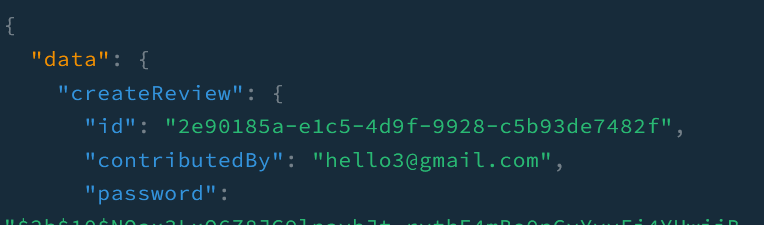

I have implemented **Guard** and have it put on the delete method in `review` resolver so that no one can delete a review without being authenticated. However, it was too simple to be a proper strategy for authentication. We should improve the process for the sake of security. To do it, we will use `passport` and `bcrypt`.

## Install dependencies
First, install all the relevant dependencies for `passport` and `bcrypt`.

```
npm install --save @nestjs/passport passport passport-local
npm install --save-dev @types/passport-local

npm install bcrypt
npm install -D @types/bcrypt
```

As you can see, I used **local** for `passport` strategy. As I have looked briefly at the community so far, it seems like using both **local** and **jwt** for the strategy is a great practice for they could be complimentary to each other. I will look more into it later but, since all we have to do is to compare an input password to a password associated with a review in our database, we can just use **local** for now. I may take a further step on this if needed in the future.

## Auth service
We will create `auth` service that has methods `validateContributor`.

```js
@Injectable()
export class AuthService {
  constructor(private reviewsService: ReviewsService) {}

  async validateContributor(reviewData) {
    const review = await this.reviewsService.getReview({
      contributedBy: reviewData.contributedBy,
    });
    const isMatch = await this.comparePassword(
      reviewData.password,
      review.password,
    );
    if (!isMatch) {
      return null;
    }
    return review;
  }

  // ...

  async comparePassword(password, hash) {
    const isMatch = await bcrypt.compare(password, hash);
    return isMatch;
  }
}
```
This will read the delete review input and check if there is a review that matches the input and compare passwords. We will use this method for `passport` strategy.

## LocalStrategy
We will create `LocalStrategy`.

```js
@Injectable()
export class LocalStrategy extends PassportStrategy(Strategy) {
  constructor(private authService: AuthService) {
    super({ usernameField: 'contributedBy' });
  }

  async validate(contributedBy, password) {
    const review = await this.authService.validateContributor({
      contributedBy,
      password,
    });

    if (!review) {
      throw new UnauthorizedException();
    }
    return review;
  }
}
```

By default, local strategy reads `username`, `password` from request body. So, I needed to replace `username` with `contributedBy` by passing it in `super`.

`validate` method will take `contributedBy` and `password` from body object and will authenticate the user. If authenticated, it will allow the request to be handled by **Router handler**.

## Graphql Guards
We will create `GqlAuthGuard`.

```js
@Injectable()
export class GqlAuthGuard extends AuthGuard('local') {
  getRequest(context: GqlExecutionContext): any {
    const ctx = GqlExecutionContext.create(context);
    const { req } = ctx.getContext();
    const { deleteReviewData } = ctx.getArgs();
    req.body = deleteReviewData;

    return req;
  }
}
```

`@nestjs/passport` provides us with a build-in **Guard**. But, since we are using **Graphql**, we will  create our own Guard extended from the build-in Guard, **AuthGuard** and then, modify the context and body object of requests as shown above.

Finally, we can put the **GqlAuthGuard** on the delete method in `review` resolver.

```js
@Mutation(() => Review)
@UseGuards(GqlAuthGuard)
async deleteReview(
  @Args('deleteReviewData') deleteReviewData: DeleteReviewInput,
): Promise<Review> {
  return this.reviewService.deleteReview(deleteReviewData);
}
```

## Test

### Create a review
I created a review with a password saying `rightpassword`. It was hashed by using `bcrypt` and saved in database.



### Delete a review with wrong password
Notice that it throws `Unauthorized`.


### Delete a review with right password


_**THANKS FOR READING. SEE YOU NEXT TIME!**_

### References
- https://docs.nestjs.com/recipes/passport
