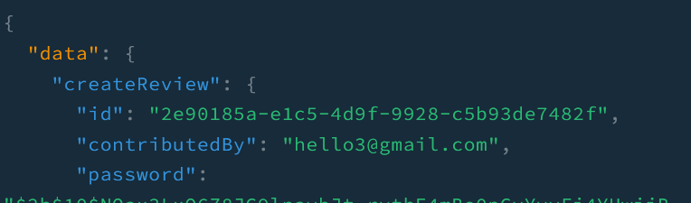
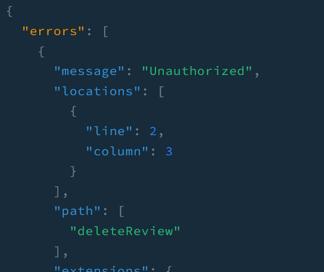
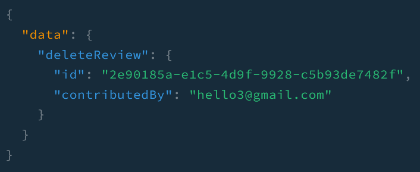

_[nestjs-auth](https://github.com/shkim04/find-your-wc/tree/nestjs-auth) 브랜치에서 전체 코드를 확인하실 수 있습니다._

인증이 안된 사용자가 리뷰를 삭제하지 못하도록 `review` resolver에 있는 delete 메소드에 **Guard**를 적용했습니다. 그러나 인증이 지나치게 간단하여 적절하지 못한 방법입니다. 보안을 위해 인증 과정을 개선할 필요가 있습니다. 이를 위해 `passport`와 `bcrypt`를 사용할 것입니다.

## 디펜던시 설치
우선, `passport`와 `bcrypt`에 필요한 디펜던시를 설치합니다.

```
npm install --save @nestjs/passport passport passport-local
npm install --save-dev @types/passport-local

npm install bcrypt
npm install -D @types/bcrypt
```

보시다시피 필자는 `passport` 전략으로 **local**을 선택했습니다. 커뮤니티를 간략하게 살펴본 결과 **local** 전략과 **jwt** 전략이 서로를 보완해주기 때문에 둘을 혼용하는 것이 효과적인 것으로 보입니다. 이후에 더 살펴보겠지만 현재는 입력 비밀번호와 이 입력에 상응하는 리뷰에 저장된 비밀번호와 일치하는 것만 처리할 것이기 때문에 **local**만 사용해도 충분하다고 생각합니다. 필요시 이 과정을 더 심화시킬 예정입니다.

## Auth 서비스
`validateContributor` 메소드를 가진 `auth` 서비스를 생성합니다.

```js
@Injectable()
export class AuthService {
  constructor(private reviewsService: ReviewsService) {}

  async validateContributor(reviewData) {
    const review = await this.reviewsService.getReview({
      contributedBy: reviewData.contributedBy,
    });
    const isMatch = await this.comparePassword(
      reviewData.password,
      review.password,
    );
    if (!isMatch) {
      return null;
    }
    return review;
  }

  // ...

  async comparePassword(password, hash) {
    const isMatch = await bcrypt.compare(password, hash);
    return isMatch;
  }
}
```

이 서비스는 delete review 입력을 읽고 이 입력에 맞는 리뷰가 있는지 확인하고 비밀번호를 비교합니다. 이 메소드를 `passport` 전략에서 사용할 것입니다.

## LocalStrategy
`LocalStrategy`를 생성합니다.

```js
@Injectable()
export class LocalStrategy extends PassportStrategy(Strategy) {
  constructor(private authService: AuthService) {
    super({ usernameField: 'contributedBy' });
  }

  async validate(contributedBy, password) {
    const review = await this.authService.validateContributor({
      contributedBy,
      password,
    });

    if (!review) {
      throw new UnauthorizedException();
    }
    return review;
  }
}
```

기본값으로 local 전략은 요청 body로부터 `username`과 `password`를 읽습니다. 이 때문에 필자는 `super`에 `contributedBy`를 전달하여 `username` 필드를 대체했습니다. 

`validate` 메소드가 body 객체로부터 `contributedBy`와 `password`를 얻어 해당 사용자를 인증합니다. 인증이 되었다면 **라우터 핸들러**가 처리할 수 있게 전달합니다.

## Graphql Guards
`GqlAuthGuard`를 생성합니다.

```js
@Injectable()
export class GqlAuthGuard extends AuthGuard('local') {
  getRequest(context: GqlExecutionContext): any {
    const ctx = GqlExecutionContext.create(context);
    const { req } = ctx.getContext();
    const { deleteReviewData } = ctx.getArgs();
    req.body = deleteReviewData;

    return req;
  }
}
```

`@nestjs/passport`는 내장 **Guard**를 제공합니다. 하지만 **Graphql**를 사용하기 때문에 내장 Guard인 **AuthGuard**를 확장시킨 Guard를 생성한 다음에 context와 body 객체를 수정해야 합니다.

마지막으로 `review` resolver에 있는 delete 메소드 위에 **GqlAuthGuard**를 넣어줍니다.

```js
@Mutation(() => Review)
@UseGuards(GqlAuthGuard)
async deleteReview(
  @Args('deleteReviewData') deleteReviewData: DeleteReviewInput,
): Promise<Review> {
  return this.reviewService.deleteReview(deleteReviewData);
}
```

## 테스트

### 리뷰 생성
필자는 `rightpassword`라는 비밀번호로 리뷰를 생성했습니다. 비밀번호는 `bcrypt`를 사용하여 hash로 데이터베이스에 저장되었습니다.



### 잘못된 비밀번호로 삭제 요청
`Unauthorized` 에러를 냅니다.



### 정상 비밀번호로 삭제 요청


_[nestjs-auth](https://github.com/shkim04/find-your-wc/tree/nestjs-auth) 브랜치에서 전체 코드를 확인하실 수 있습니다._

_**읽어 주셔서 감사합니다. To be continued!**_

### 참조
- https://docs.nestjs.com/recipes/passport