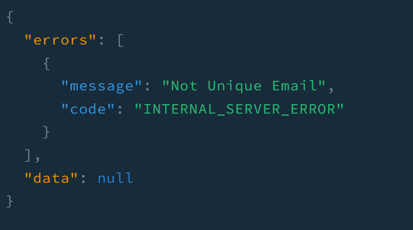

It is crucial to know what is going on when an exception occurs within our application. NestJS comes along with a built-in exception layer where you can handle exceptions. Since we have used Prisma, we will create `prisma exception-filter` to properly handle exceptions thrown by Prisma.

## Create exception fitler

We will create `prisma-exception.filter.ts` under `excpetion-filters` folder. And write the follwing code:

```js
@Catch(Prisma.PrismaClientKnownRequestError)
export class PrismaClientExceptionFilter implements GqlExceptionFilter {
  catch(exception: Prisma.PrismaClientKnownRequestError): any {
    switch (exception.code) {
      case 'P2002': {
        throw new ConflictException('Not Unique Email');
      }
      case 'P2003': {
        throw new UnprocessableEntityException('Entity Not Exist');
      }
      case 'P2025': {
        throw new NotFoundException('Cannot find');
      }
      default:
        break;
    }

    return exception;
  }
}
```

This exception filter will catch prism client request error as passed in `catch` decorator. It will throw execptions with suitable messages, which are corresponding to each of prisma error codes. 

Unlike REST API, we do not use `response` object and custom it to send clients back. Instead, we have thrown http exceptions so that `GraphQLModule` will pick these up and send them back to clients.

Finally, we will make this filter global in `main.ts` - _you can just make it method-scoped or class-scoped_.

```js
async function bootstrap() {
  //..

  app.useGlobalFilters(new PrismaClientExceptionFilter());
  await app.listen(parseInt(port) || 3000);
}
```

## Format error for clients

To let clients know what went wrong nicely, we can format the error information before sending back.

In `GraphQLModule`, we will format erros by adding `formatError` property which is a function returning a formatted error.

```js
GraphQLModule.forRootAsync<ApolloDriverConfig>({
  // ...
  useFactory: (config: ConfigService) => {
    return {
      // ...
      formatError: (error) => {
        const originalError = error.extensions
          ?.originalError as OriginalError;

        if (!originalError) {
          return {
            message: error.message,
            code: error.extensions?.code,
          };
        }

        return {
          message: originalError.message,
          code: error.extensions?.code,
        };
      },
    };
  },
  // ...
}),
```

For the sake of being concise, I wanted to send back an object containing only well-described message and apollo server error code. 

Notice that there is `originalError` property that I have tried to access. This is an object representing data about the exception thrown by an exception filter, which is here prisma exception filter. 

## Compare with and without formatting

### Without formatted error and exception filter


Clients will receive these bunch of information they might not need. Also, the message does not even look neat and intuitive.

### With formmated error thrown by prisma exception filter


Look at the suitable message with neatly formatted error.

_**THANKS FOR READING. SEE YOU NEXT TIME!**_

### References
- https://docs.nestjs.com/graphql/other-features
- https://stackoverflow.com/questions/61045881/why-arent-nestjs-graphql-validation-errors-placed-in-the-error-message-field
