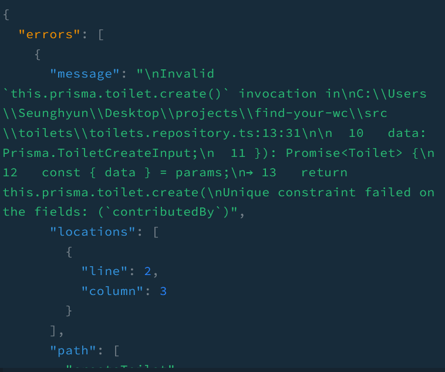

어플리케이션에 예외가 일어난 경우 어떤 예외가 발생했는지 아는 것이 중요합니다. NestJS는 이 예외들을 처리해주는 예외 층(layer)이 내장되어 있습니다. Prisma를 사용하고 있기 때문에 Prisma로부터 발생하는 예외를 적절하게 처리하기 위해 `prisma exception-filter`를 생성해보겠습니다.

## 예외 필터 생성

`excpetion-filters` 폴더 하위에 `prisma-exception.filter.ts`를 생성합니다. 그리고 다음 코드를 작성합니다.

```js
@Catch(Prisma.PrismaClientKnownRequestError)
export class PrismaClientExceptionFilter implements GqlExceptionFilter {
  catch(exception: Prisma.PrismaClientKnownRequestError): any {
    switch (exception.code) {
      case 'P2002': {
        throw new ConflictException('Not Unique Email');
      }
      case 'P2003': {
        throw new UnprocessableEntityException('Entity Not Exist');
      }
      case 'P2025': {
        throw new NotFoundException('Cannot find');
      }
      default:
        break;
    }

    return exception;
  }
}
```

이 예외 필터는 `catch` 데코레이터에 전달된 prisma 클라이언트 요청 에러를 잡습니다. 각 prisma 에러 코드에 맞는 알맞는 메시지와 함께 예외를 발생시킬 것입니다.

REST API와는 달리 `response` 객체를 사용하여 커스텀하고 클라이언트로 전송하지 않습니다. 대신에 http 예외를 발생시켜 `GraphQLModule`이 이 예외를 클라이언트에 보내주게 됩니다.

마지막으로 `main.ts`에서 이 필터를 전역으로 사용할 수 있게 만듭니다 - _메소드 혹은 클래스에 국한하여 사용할 수도 있습니다_.

```js
async function bootstrap() {
  //..

  app.useGlobalFilters(new PrismaClientExceptionFilter());
  await app.listen(parseInt(port) || 3000);
}
```

## 클라이언트를 위한 에러 포맷

클라이언트에 무엇이 잘못했는지 잘 전달하기 위해 응답을 보내기 전에 에러를 커스텀할 수 있습니다.

`GraphQLModule` 하위에 포맷이 된 에러를 반환하는 `formatError` 함수를 사용하면 가능합니다.

```js
GraphQLModule.forRootAsync<ApolloDriverConfig>({
  // ...
  useFactory: (config: ConfigService) => {
    return {
      // ...
      formatError: (error) => {
        const originalError = error.extensions
          ?.originalError as OriginalError;

        if (!originalError) {
          return {
            message: error.message,
            code: error.extensions?.code,
          };
        }

        return {
          message: originalError.message,
          code: error.extensions?.code,
        };
      },
    };
  },
  // ...
}),
```

간결하고 명확함을 위해 필자는 알맞은 메시지 apollo 서버 에러 코드만을 담은 객체를 전송하고자 합니다.

`originalError`라는 필드를 확인할 수 있습니다. 이 필드는 prisma 예외 필터에서 발생한 예외들에 대한 데이터를 담고 있습니다.

## 비교

### 예외 필터와 포맷 에러가 없는 경우


클라이언트는 필요 이상의 정보를 받을 것이고 메시지는 간결하지도 직관적이지도 않습니다.

### 예외 필터와 포맷 에러가 있는 경우


잘 포맷된 에러와 함께 알맞은 메시지가 전달되는 것을 볼 수 있습니다.

_**읽어 주셔서 감사합니다. To be continued!**_

### 참조
- https://docs.nestjs.com/graphql/other-features
- https://stackoverflow.com/questions/61045881/why-arent-nestjs-graphql-validation-errors-placed-in-the-error-message-field