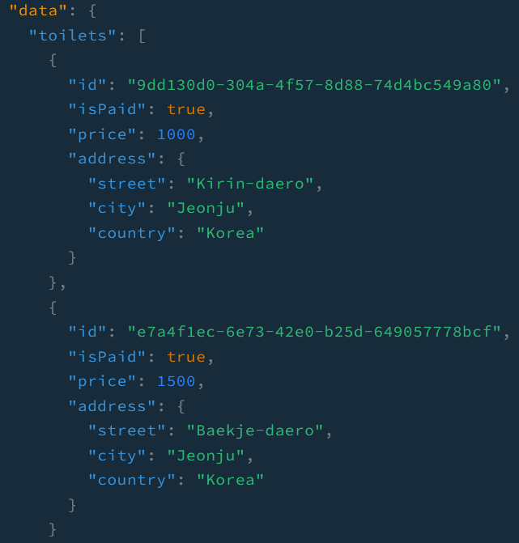
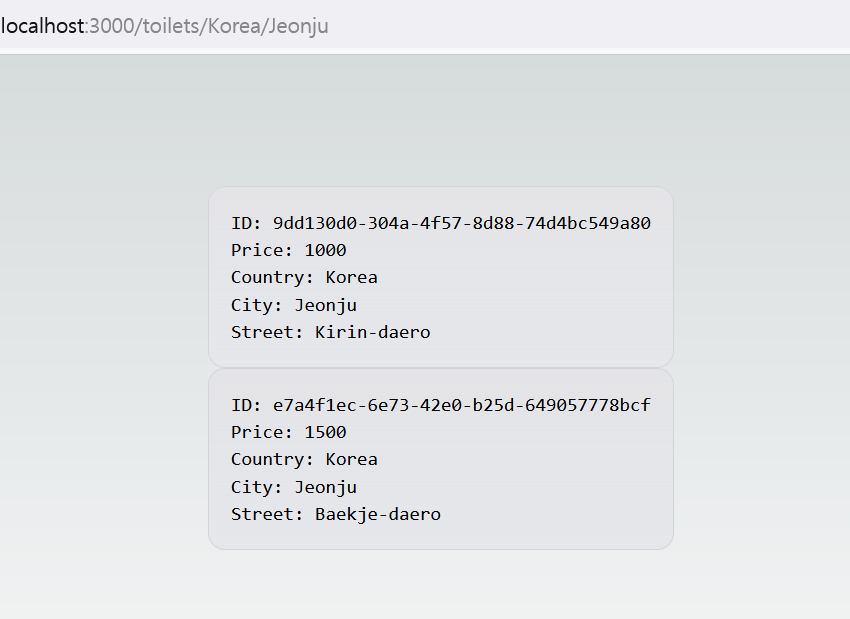

Now that I have Nestjs-graphql backend to do CRUD operation for toilets information, I will create a simple Nextjs application that interacts with the information. Let's dive into it.

## Create Nextjs app

```bash
npx create-next-app
```

Once you enter the command as shown above, the prompts will show up: 

```
What is your project named? my-app
Would you like to use TypeScript? No / Yes
Would you like to use ESLint? No / Yes
Would you like to use Tailwind CSS? No / Yes
Would you like to use `src/` directory? No / Yes
Would you like to use App Router? (recommended) No / Yes
Would you like to customize the default import alias? No / Yes
What import alias would you like configured? @/*
```

We will choose `Yes` for every prompt because they seem to make development easier.

## Create dynamic routes

I would like to have pages that shows dynamically a list of toilets information by country, city and street. According to the official documentation, dynamci routes of App Router can be achieved by a folder name wrapped around the square brackets like `[country]` or `[city]`. Country, city and street are dependent on one another so, the route would look like `[country]/[city]/[street]`.

To accomplish the goal, we will create a folder named `toilets` which will become a route represented as `/toilets`. And then, `[country]` will be placed under `toilets` folder. By the same token, `[city]` and `[street]` will be placed under `[country]` and `[city]` respectively.

```
src/app
└── toilets
    ├── [country]
    │   ├── [city]
    │   │   ├── [street]
    │   │   │   └── page.tsx
    │   │   └── page.tsx
    │   └── page.tsx
    └── page.tsx
```

## Add test toilets

To see if Nestjs-graphql server still works well, we will add test toilets using _playground_. And then, these test toilets information will be used in the Nextjs application.



## Display test toilets by city

Let's retrieve the toilets in **Jeonju**. In order to do it, we should make a query request. With App Router, we can do by simply using **fetch**. Write the code below in `page.tsx` under `[city]` folder:

```js
async function getData(city: string) {
  const res = await fetch('http://localhost:4000/graphql', {
    method: 'POST',
    body: JSON.stringify({
      query: `{ toilets(city: "${city}") {
        id
        price
        isPaid
        address {
          street
          city
          country
        }
      }}`,
    }),
    headers: {
      'Content-Type': 'application/json',
    },
    next: { revalidate: 10 },
  });

  if (!res.ok) {
    throw new Error('Failed to fetch toilet data in a city');
  }
  const dataObj = await res.json();
  return dataObj.data;
}

export default async function City({ params }: { params: { city: string } }) {
  const { toilets } = await getData(params.city);
  return (
    <main className='flex min-h-screen flex-col items-center justify-between p-24'>
      <div className='z-10 max-w-5xl flex-col w-full items-center justify-between font-mono text-sm lg:flex'>
        {toilets.map((toilet: any, index: number) => {
          return (
            <p
              key={index}
              className='flex flex-col w-full justify-center border-b border-gray-300 bg-gradient-to-b from-zinc-200 pb-6 pt-8 backdrop-blur-2xl dark:border-neutral-800 dark:bg-zinc-800/30 dark:from-inherit lg:static lg:w-auto  lg:rounded-xl lg:border lg:bg-gray-200 lg:p-4 lg:dark:bg-zinc-800/30'
            >
              <span className='w-full'>ID: {toilet.id}</span>
              <br />
              <span className='w-full'>Price: {toilet.price}</span>
              <br />
              <span className='w-full'>Country: {toilet.address.country}</span>
              <br />
              <span className='w-full'>City: {toilet.address.city}</span>
              <br />
              <span className='w-full'>Street: {toilet.address.street}</span>
            </p>
          );
        })}
      </div>
    </main>
  );
}
```

The parameter, which contains a city name, will be passed to the **City** component, when a use hits the url that looks like _https://your-website.com/toilets/a-country-name/a-city-name_. The city name will go and form a complete query in `getData` function. Once the component gets the toilets information that match the query sent, These toilets information will show up on the browser like:



For now, I have just focused on creating simple dynamic routes and making a graphql request. Not only will I improve the frontend with Typescript and Tailwind, but also have more details on the backend when there is a room for improvement interacting with the frontend.

_**THANKS FOR READING. SEE YOU NEXT TIME!**_

### References
- https://nextjs.org/docs/app/building-your-application/routing/defining-routes
- https://nextjs.org/docs/app/building-your-application/data-fetching/fetching-caching-and-revalidating
