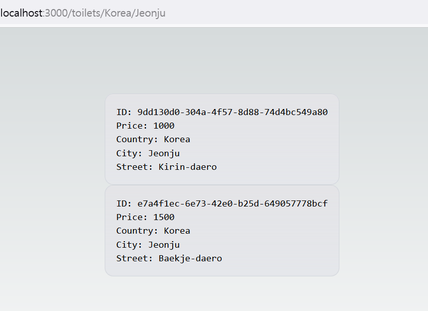

화장실 정보를 CRUD 작업을 할 수 있는 Nestjs-graphql 백엔드 어플리케이션이 있으니 이 정보들을 다루고 보여주는 Nextjs 어플리케이션을 만들려고 합니다.

## Nextjs app 생성하기
```bash
npx create-next-app
```

위 명령어를 실행하면 설치에 관련한 질문들을 볼 수 있습니다.

```
What is your project named? my-app
Would you like to use TypeScript? No / Yes
Would you like to use ESLint? No / Yes
Would you like to use Tailwind CSS? No / Yes
Would you like to use `src/` directory? No / Yes
Would you like to use App Router? (recommended) No / Yes
Would you like to customize the default import alias? No / Yes
What import alias would you like configured? @/*
```

개발을 용이하게 만들어 줄 것으로 보이기 때문에 모든 질문에 `Yes`를 선택합니다.

## 동적 라우트 생성하기

필자는 국가, 도시 그리고 거리 이름에 따른 화장실 정보 목록들을 동적으로 보여주는 페이지를 만들려고 합니다. 공식 문서에 따르면 App Router의 동적 라우트는 `[country]`,`[city]` 같이 대괄호로 감싼 폴더 이름을 통해 얻을 수 있다고 합니다. 국가, 나라 그리고 거리는 서로 연관이 있기 때문에 라우트는 `[country]/[city]/[street]`과 같은 형태가 될 것입니다.

이를 구현하기 위해 `/toilets`로 표현되는 라우트가 될 `toilets`이라는 폴더를 생성합니다. 그리고 나서 `[country]` 폴더를 생성합니다. 같은 방식으로 `[city]`와 `[street]`를 순서대로 `[country]`와 `[city]` 하위에 생성합니다.

```
src/app
└── toilets
    ├── [country]
    │   ├── [city]
    │   │   ├── [street]
    │   │   │   └── page.tsx
    │   │   └── page.tsx
    │   └── page.tsx
    └── page.tsx
```

## 테스트 화장실 추가하기

Nestjs-graphql 서버가 잘 동작하는지 확인하기 위해 _playground_ 를 통해 테스트 화장실을 추가해보겠습니다. 그리고 나서 이 화장실 정보들이 Nextjs 어플리케이션에서 사용될 것입니다.


## 도시에 따른 화장실 정보 보여주기

**Jeonju**에 있는 화장실 정보를 요청해보겠습니다. 그러기 위해서는 쿼리 요청을 해야 합니다. App Router를 사용할 때는 **fetch**를 사용하면 간단하게 요청을 할 수 있습니다. 다음의 코드를 `[city]` 폴더 하위에 있는 `page.tsx` 파일에 적습니다.

```js
async function getData(city: string) {
  const res = await fetch('http://localhost:4000/graphql', {
    method: 'POST',
    body: JSON.stringify({
      query: `{ toilets(city: "${city}") {
        id
        price
        isPaid
        address {
          street
          city
          country
        }
      }}`,
    }),
    headers: {
      'Content-Type': 'application/json',
    },
    next: { revalidate: 10 },
  });

  if (!res.ok) {
    throw new Error('Failed to fetch toilet data in a city');
  }
  const dataObj = await res.json();
  return dataObj.data;
}

export default async function City({ params }: { params: { city: string } }) {
  const { toilets } = await getData(params.city);
  return (
    <main className='flex min-h-screen flex-col items-center justify-between p-24'>
      <div className='z-10 max-w-5xl flex-col w-full items-center justify-between font-mono text-sm lg:flex'>
        {toilets.map((toilet: any, index: number) => {
          return (
            <p
              key={index}
              className='flex flex-col w-full justify-center border-b border-gray-300 bg-gradient-to-b from-zinc-200 pb-6 pt-8 backdrop-blur-2xl dark:border-neutral-800 dark:bg-zinc-800/30 dark:from-inherit lg:static lg:w-auto  lg:rounded-xl lg:border lg:bg-gray-200 lg:p-4 lg:dark:bg-zinc-800/30'
            >
              <span className='w-full'>ID: {toilet.id}</span>
              <br />
              <span className='w-full'>Price: {toilet.price}</span>
              <br />
              <span className='w-full'>Country: {toilet.address.country}</span>
              <br />
              <span className='w-full'>City: {toilet.address.city}</span>
              <br />
              <span className='w-full'>Street: {toilet.address.street}</span>
            </p>
          );
        })}
      </div>
    </main>
  );
}
```

도시 이름을 갖고 있는 파라미터는 _https://your-website.com/toilets/a-country-name/a-city-name_ 과 같은 형식의 url에 사용자가 접근했을 때 **City** 컴포넌트로 전달이 됩니다. 해당 도시 이름은 `getData` 함수에 전달되어 쿼리를 형성하게 됩니다. 컴포넌트가 전달된 쿼리에 맞는 화장실 정보를 얻게 되면 이 화장실 정보들이 다음과 같이 브라우저에 보이게 될 것입니다.



지금은 간단한 동적 라우트 생성과 graphql 요청을 해보는 데에만 신경을 썼습니다. 앞으로 Typescript와 Tailwind로 프론트엔드를 향상시킬 뿐만 아니라 이 프론트엔드와 유기적으로 동작할 백엔드에서도 더 많은 세부 기능들을 개발할 것입니다.

_**읽어 주셔서 감사합니다. To be continued!**_

### 참조
- https://nextjs.org/docs/app/building-your-application/routing/defining-routes
- https://nextjs.org/docs/app/building-your-application/data-fetching/fetching-caching-and-revalidating