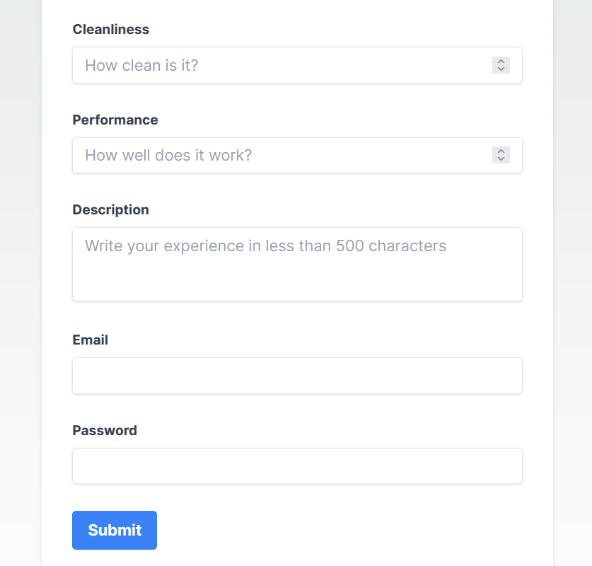
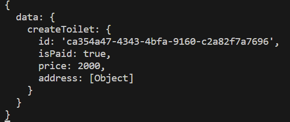

The web application has pages that dynamically show toilets information by a country, city and street. However, users should be able to register a toilet by giving us an address and review about the toilet in the first place. So, we will create a route named `/contribute` that write a form that contains toilet information and make graphql mutation query using it.

## Create contribute component

We can have `/contribute` route by creating a folder named `contribute` as shown below.

```
src/app
├── contribute
│   └── page.tsx
└── toilets
    ├── [country]
    │   ├── [city]
    │   │   ├── [street]
    │   │   │   └── page.tsx
    │   │   └── page.tsx
    │   └── page.tsx
    └── page.tsx
```

Write the following code in `page.tsx` under `contribute` folder.

```js
'use client';
import { useState, useRef } from 'react';
import create from './action';

export default function Contribute() {
  const [paid, setPaid] = useState('');
  const priceRef = useRef<HTMLInputElement>(null);
  const streetNumberRef = useRef<HTMLInputElement>(null);
  const streetRef = useRef<HTMLInputElement>(null);
  const cityRef = useRef<HTMLInputElement>(null);
  const countryRef = useRef<HTMLInputElement>(null);
  const emailRef = useRef<HTMLInputElement>(null);
  const passwordRef = useRef<HTMLInputElement>(null);
  const cleanlinessRef = useRef<HTMLInputElement>(null);
  const performanceRef = useRef<HTMLInputElement>(null);
  const descriptionRef = useRef<HTMLTextAreaElement>(null);

  return (
    <main className='flex min-h-screen flex-col items-center justify-between p-24'>
      <form
        className='w-1/2 bg-white shadow-md rounded px-8 pt-6 pb-8 mb-4'
        action={create}
      >
        <div className='mb-4'>
          <label className='block text-gray-700 text-sm font-bold mb-2'>
            Paid or not
          </label>
          <div className='flex items-center mb-4'>
            <input
              className='w-4 h-4 text-blue-600 bg-gray-100 border-gray-300 rounded focus:ring-blue-500 dark:focus:ring-blue-600 dark:ring-offset-gray-800 focus:ring-2 dark:bg-gray-700 dark:border-gray-600'
              checked={paid === 'Yes'}
              type='radio'
              name='paid'
              value='Yes'
              onChange={(e) => setPaid(e.target.value)}
            />
            <label
              htmlFor='Yes'
              className='ml-2 text-sm font-medium text-gray-900 dark:text-gray-300'
            >
              Yes
            </label>
          </div>
          <div className='flex items-center mb-4'>
            <input
              className='w-4 h-4 text-blue-600 bg-gray-100 border-gray-300 rounded focus:ring-blue-500 dark:focus:ring-blue-600 dark:ring-offset-gray-800 focus:ring-2 dark:bg-gray-700 dark:border-gray-600'
              checked={paid === 'No'}
              type='radio'
              name='paid'
              value='No'
              onChange={(e) => setPaid(e.target.value)}
            />
            <label
              htmlFor='No'
              className='ml-2 text-sm font-medium text-gray-900 dark:text-gray-300'
            >
              No
            </label>
          </div>
        </div>
        <div className='mb-4'>
          <label className='block text-gray-700 text-sm font-bold mb-2'>
            Price
          </label>
          <input
            className='shadow appearance-none border rounded w-full py-2 px-3 text-gray-700 mb-3 leading-tight focus:outline-none focus:shadow-outline'
            type='text'
            name='price'
            placeholder='How much is it?'
            ref={priceRef}
          />
        </div>
        <div className='mb-4'>
          <label className='block text-gray-700 text-sm font-bold mb-2'>
            Street no.
          </label>
          <input
            className='shadow appearance-none border rounded w-full py-2 px-3 text-gray-700 mb-3 leading-tight focus:outline-none focus:shadow-outline'
            type='text'
            name='streetNumber'
            ref={streetNumberRef}
          />
        </div>
        <div className='mb-4'>
          <label className='block text-gray-700 text-sm font-bold mb-2'>
            Street
          </label>
          <input
            className='shadow appearance-none border rounded w-full py-2 px-3 text-gray-700 mb-3 leading-tight focus:outline-none focus:shadow-outline'
            type='text'
            name='street'
            ref={streetRef}
          />
        </div>
        <div className='mb-4'>
          <label className='block text-gray-700 text-sm font-bold mb-2'>
            City
          </label>
          <input
            className='shadow appearance-none border rounded w-full py-2 px-3 text-gray-700 mb-3 leading-tight focus:outline-none focus:shadow-outline'
            type='text'
            name='city'
            ref={cityRef}
          />
        </div>
        <div className='mb-4'>
          <label className='block text-gray-700 text-sm font-bold mb-2'>
            Country
          </label>
          <input
            className='shadow appearance-none border rounded w-full py-2 px-3 text-gray-700 mb-3 leading-tight focus:outline-none focus:shadow-outline'
            type='text'
            name='country'
            ref={countryRef}
          />
        </div>
        <div className='mb-4'>
          <label className='block text-gray-700 text-sm font-bold mb-2'>
            Cleanliness
          </label>
          <input
            className='shadow appearance-none border rounded w-full py-2 px-3 text-gray-700 mb-3 leading-tight focus:outline-none focus:shadow-outline'
            type='number'
            step={0.1}
            name='cleanliness'
            placeholder='How clean is it?'
            ref={cleanlinessRef}
          />
        </div>
        <div className='mb-4'>
          <label className='block text-gray-700 text-sm font-bold mb-2'>
            Performance
          </label>
          <input
            className='shadow appearance-none border rounded w-full py-2 px-3 text-gray-700 mb-3 leading-tight focus:outline-none focus:shadow-outline'
            type='number'
            step={0.1}
            name='performance'
            placeholder='How well does it work?'
            ref={performanceRef}
          />
        </div>
        <div className='mb-4'>
          <label className='block text-gray-700 text-sm font-bold mb-2'>
            Description
          </label>
          <textarea
            className='resize-none shadow appearance-none border rounded w-full py-2 px-3 text-gray-700 mb-3 leading-tight focus:outline-none focus:shadow-outline'
            rows={2}
            name='description'
            placeholder='Write your experience in less than 500 characters'
            maxLength={500}
            ref={descriptionRef}
          />
        </div>
        <div className='mb-4'>
          <label className='block text-gray-700 text-sm font-bold mb-2'>
            Email
          </label>
          <input
            className='shadow appearance-none border rounded w-full py-2 px-3 text-gray-700 mb-3 leading-tight focus:outline-none focus:shadow-outline'
            type='email'
            name='email'
            ref={emailRef}
          />
        </div>
        <div className='mb-4'>
          <label className='block text-gray-700 text-sm font-bold mb-2'>
            Password
          </label>
          <input
            className='shadow appearance-none border rounded w-full py-2 px-3 text-gray-700 mb-3 leading-tight focus:outline-none focus:shadow-outline'
            type='password'
            name='password'
            ref={passwordRef}
          />
        </div>
        <div className='flex items-center justify-between'>
          <button
            className='bg-blue-500 hover:bg-blue-700 text-white font-bold py-2 px-4 rounded focus:outline-none focus:shadow-outline'
            type='submit'
          >
            Submit
          </button>
        </div>
      </form>
    </main>
  );
}
```

When you run the application in development mode and hit `http://localhost:4000/contribute` in a browser, you will see like:



## Make graphql mutation query

In the component we have just created, you can see a form that invokes `create` function when clicking **Submit** button. This function is where the data we have got from the form is handled so we will make a graphql query.

To do it, we will create a file named `action.ts` under `contribute` folder.

```
src/app
└── contribute
    ├── action.ts
    └── page.tsx
```

Write the following code in `action.ts` file.

```js
'use server';
import { redirect } from 'next/navigation';

export default async function create(formData: FormData) {
  const isPaid = formData.get('paid') === 'Yes' ? true : false;
  const price = parseInt(formData.get('price') as string);
  const streetNumber = formData.get('streetNumber');
  const street = formData.get('street');
  const city = formData.get('city');
  const country = formData.get('country');
  const email = formData.get('email');
  const password = formData.get('password');
  const cleanliness = parseFloat(formData.get('cleanliness') as string);
  const performance = parseFloat(formData.get('performance') as string);
  const description = formData.get('description');

  const apiUrl = 'http://localhost:4000/graphql';
  const response = await fetch(apiUrl, {
    method: 'POST',
    headers: { 'Content-Type': 'application/json' },
    body: JSON.stringify({
      query: `mutation { createToilet(createToiletData: {
          isPaid: ${isPaid}
          price: ${price}
          address: {
            streetNumber: "${streetNumber}"
            street: "${street}"
            city: "${city}"
            country: "${country}"
          }
          reviews: {
            contributedBy: "${email}"
            password: "${password}"
            cleanliness: ${cleanliness}
            performance: ${performance}
            description: "${description}"
          }
        }) {
          id
          isPaid
          price
          address {
            street
            city
            country
          }
        }
      }`,
    }),
  });

  const data = await response.json();
  console.log(data);
  redirect('/');
}
```

Let me briefly explain what is going on here. This `create` function will get the form data from `Contribute` component and use it to make a graphql mutation query. The mutation query is included in `body` field as shown above. When the query is sent to the server, it will await its response and console-log it. Finally, it will redirect to the root route.

In order to register a toilet now, we make sure to run the backend server that listen on a port we set up which is `4000` here.

When we go to `/contribute`, fill every field in the form and click **Submit** button, we should be going to see a log in the terminal like



In addition to logging, we can also check if the toilet has been created by using `/toilets` route. Feel free to do it.

_**THANKS FOR READING. SEE YOU NEXT TIME!**_

### References
- https://nextjs.org/docs/pages/building-your-application/data-fetching/forms-and-mutations
