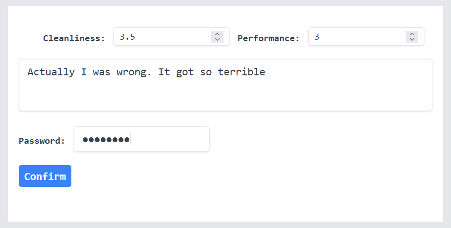
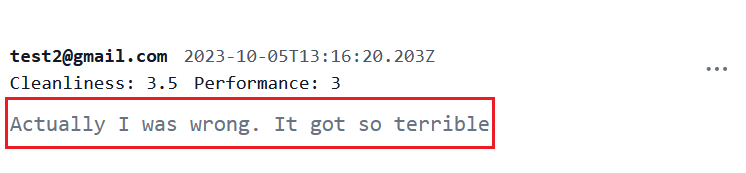

가격, 주소와 리뷰를 가지고 화장실 정보를 등록했으니 이 화장실 정보를 수정할 수 있도록 기능을 추가할 필요가 있어보입니다. 특히 화장실 리뷰를 남긴 사람이 리뷰를 수정할 수 있게 만들어 주는 것입니다. 이 특정 화장실 정보가 담긴 page에 수정을 할 수 있는 기능을 추가해야 합니다. 이 page를 만드는 법에 대해 알아보겠습니다!

> 이전 글들을 읽지 않고 현재 글부터 읽는 분들을 위해 Nestjs 백엔드 서버가 어느 정도 개발되어 이 프론트엔드 개발 작업과 연계되어 있다는 것을 알려드립니다. 이 백엔드 코드는 [여기](https://github.com/shkim04/find-your-wc)에서 확인할 수 있습니다.

## Toilet 페이지

국가, 도시와 거리 이름을 사용하여 동적인 라우트를 얻기 위해 App router를 사용했습니다. 이와 같은 방식으로 `[streetNumber]` 폴더를 추가하여 주소와 일치하는 특정 화장실 정보를 보여주고 이는 아래와 같이 나타날 것입니다.


다음은 관련 코드입니다:

```js
// ...
import Review from './reviewCard';

async function getToilet(address: AddressData): Promise<
  | {
      toilet: ToiletData;
    }
  | undefined
> {
  try {
    const { country, city, street, streetNumber } = address;
    const res = await fetch('http://localhost:4000/graphql', {
      method: 'POST',
      body: JSON.stringify({
        query: `{ toilet(
          country: "${country}", 
          city: "${city}", 
          street: "${street}", 
          streetNumber: "${streetNumber}"
        ) {
          id
          price
          isPaid
          reviews {
            id
            contributedBy
            cleanliness
            performance
            description
            createdAt
          }
        }}`,
      }),
      headers: {
        'Content-Type': 'application/json',
      },
      next: { revalidate: 10 },
    });

    if (!res.ok) {
      throw new Error('Failed to fetch toilet data in StreetNumber');
    }

    const dataObj = await res.json();
    return dataObj.data;
  } catch (err) {
    console.log('Error getToilet func in StreetNumber', err);
  }
}

export default async function StreetNumber({
  params,
}: {
  params: AddressData;
}) {
  const result = await getToilet(params);
  if (!result) return <div>There is no toilet registered on this address.</div>;
  const toilet = result!.toilet;
  return (
    <main className='flex min-h-screen flex-col items-center justify-between p-24'>
      <div className='z-10 max-w-5xl flex-col w-full items-center justify-between font-mono text-sm lg:flex'>
        {/* ..more code on the repository written 
        at the bottom of this article.*/}  
        <section className='w-3/5 bg-white dark:bg-gray-900 py-8 lg:py-16 antialiased'>
          <div className='max-w-2xl mx-auto px-4'>
            <div className='flex justify-between items-center mb-6'>
              <h2 className='text-lg lg:text-2xl font-bold text-gray-900 dark:text-white'>
                Reviews
              </h2>
            </div>
            {toilet.reviews.map((review: ReviewData, index: number) => {
              return <Review key={index} review={review} />;
            })}
          </div>
        </section>
      </div>
    </main>
  );
}
```

데이터베이스에 저장된 주소로 형성된 라우트 **toilets/Korea/Jeonju/Baekje-daero/32**를 입력하면 이 컴포넌트는 파라미터로 `Korea`, `Jeonju`, `Baekje-daero`와 `32`를 얻게 됩니다. 그런 다음에 백엔드 서버에 요청을 보내고 이 주소에 맞는 화장실 정보를 불러옵니다. 마지막으로 컴포넌트는 리뷰 등의 정보가 포함된 이 화장실 정보를 화면에서 보여줍니다.

## Review card 컴포넌트

화장실은 리뷰 정보가 있고 이 리뷰는 하나 혹은 그 이상일 것입니다. 이 리뷰를 컴포넌트로 따로 만들어 부모 컴포넌트에서 import하는 것은 여러모로 좋은 접근이기 때문에 리뷰 Card 컴포넌트를 만들 것입니다.

여기 관련 코드입니다:

```js
'use client';
// more code on the repository written at the bottom of this article.

export default function ReviewCard({ review }: { review: any }) {
  const [isOpenDropdown, setIsOpenDropdown] = useState(false);
  const [willEdit, setWillEdit] = useState(false);
  const [willRemove, setWillRemove] = useState(false);

  useEffect(() => {
    setWillEdit(false);
    setWillRemove(false);
  }, [review]);

  function toggleDropdown() {
    setIsOpenDropdown((prev) => !prev);
  }

  return (
    <article className='p-6 text-base bg-white rounded-lg dark:bg-gray-900'>
      {willEdit && (
        <>
          <button
            className='z-20 fixed top-0 right-0 bottom-0 left-0 w-full h-full bg-gray-200'
            onClick={() => setWillEdit(false)}
          />
          <UpdateReview review={review} />
        </>
      )}
      {willRemove && (
        <>
          <button
            className='z-20 fixed top-0 right-0 bottom-0 left-0 w-full h-full bg-gray-200'
            onClick={() => setWillRemove(false)}
          />
          <DeleteReview review={review} />
        </>
      )}
      <footer className='flex justify-between items-center mb-2'>
        {/* ..more code on the repository written 
        at the bottom of this article.*/}  
          {isOpenDropdown && (
            <>
              <button
                className='fixed top-0 right-0 bottom-0 left-0 w-full h-full'
                onClick={() => setIsOpenDropdown(false)}
              />
              <div
                id='dropdownComment1'
                className='z-10 w-36 bg-white rounded divide-y divide-gray-100 shadow dark:bg-gray-700 dark:divide-gray-600 absolute right-0 mt-2'
                data-popper-placement='bottom'
              >
                <ul
                  className='py-1 text-sm text-gray-700 dark:text-gray-200'
                  aria-labelledby='dropdownMenuIconHorizontalButton'
                >
                  <li className='block hover:bg-gray-100 dark:hover:bg-gray-600 dark:hover:text-white'>
                    <button
                      className='w-full py-2 px-4 text-start'
                      onClick={() => {
                        setWillEdit(true);
                        setIsOpenDropdown(false);
                      }}
                    >
                      Edit
                    </button>
                  </li>
                  <li className='block hover:bg-gray-100 dark:hover:bg-gray-600 dark:hover:text-white'>
                    <button
                      className='w-full py-2 px-4 text-start'
                      onClick={() => {
                        setWillRemove(true);
                        setIsOpenDropdown(false);
                      }}
                    >
                      Remove
                    </button>
                  </li>
                </ul>
              </div>
            </>
          )}
        </div>
      </footer>
      <p className='text-gray-500 dark:text-gray-400'>{review.description}</p>
    </article>
  );
}
```

> 코드 상위에 `use client;` 있다는 것을 주목하셔야 합니다. 여기에 이것을 두지 않으면 Nextjs는 자동적으로 해당 스크립트를 서버 스크립트로 인식할 것이고 이는 **useState**, **useEffect** 혹은 **useRef**같은 Client API를 사용할 수 없다는 것을 의미합니다.

## Update review 컴포넌트

리뷰를 수정하기 위해서 이전 글에서 화장실을 등록할 때 했던 접근 방법인 **Server action**을 똑같이 적용할 것입니다. 부모 컴포넌트로부터 전달받은 리뷰를 prop으로 취하는 `UpdateReview` 컴포넌트가 있으며 이 컴포넌트가 백엔드 서버에 요청을 할 것입니다.

여기 관련 코드입니다:

```js
'use client';

import { useRef } from 'react';
import { experimental_useFormStatus as useFormStatus } from 'react-dom';

import { updateReview } from './action';

function UpdateButton() {
  const { pending } = useFormStatus();

  return (
    <div className='flex items-center justify-between'>
      <button
        className='bg-blue-500 hover:bg-blue-700 text-white font-bold py-1 px-2 rounded focus:outline-none focus:shadow-outline'
        type='submit'
        aria-disabled={pending}
      >
        Confirm
      </button>
    </div>
  );
}

export default function UpdateReview({ review }: { review: any }) {
  const passwordRef = useRef<HTMLInputElement>(null);
  const cleanlinessRef = useRef<HTMLInputElement>(null);
  const performanceRef = useRef<HTMLInputElement>(null);
  const descriptionRef = useRef<HTMLTextAreaElement>(null);

  return (
    <form
      className='z-30 w-1/2 h-auto fixed inset-x-1/4 inset-y-1/4 mx-auto bg-white px-4 py-8'
      action={updateReview}
    >
      <div className='flex justify-between items-center mb-2'>
      {/* ..more code on the repository written 
      at the bottom of this article.*/}  
      <div className='flex items-center my-2'>
        <label className='text-gray-700 text-sm font-bold mb-2 mr-3'>
          Password:{' '}
        </label>
        <input
          className='shadow appearance-none border rounded py-2 px-3 text-gray-700 mb-3 leading-tight focus:outline-none focus:shadow-outline'
          type='password'
          name='password'
          ref={passwordRef}
          required
        />
      </div>
      <UpdateButton />
    </form>
  );
}
```

리뷰 수정을 완료한 후 **Confirm** 버튼을 누르면 `action.ts`에 정의된 `updateReview` 함수를 동작시킬 것입니다. 이 함수가 업데이트 관련 요청이 만들어지는 곳입니다. 이 함수는 요청의 응답에 따라 다른 로그를 콘솔에 출력할 것입니다.

컴포넌트가 렌더링을 하게 되면 다음과 같습니다:


백엔드 서버를 개발할 때 한 리뷰에 대하여 인증을 받은 사람만이 그 리뷰를 수정할 수 있게 만들었습니다. `password`가 있는 이유입니다. 

## 테스트

테스트를 진행하기 전에 데이터베이스에 업데이트할 수 있는 리뷰를 가진 화장실 정보가 있어야 합니다. 백엔드 서버의 graphql 플레이그라운드로 간단하게 몇개의 화장실을 등록할 수 있으니 참고하시길 바랍니다.

### 리뷰 수정



### 결과



이 글에서는 컴포넌트에 _tailwind_ 를 어떻게 적용했는지 자세하게 설명하지도 않았으며 UI도 완벽하게 적용하지 않았습니다. 중심 기능을 구현하는데 초점을 맞췄기 때문입니다. 시간이 지남에 따라 개선해 나갈 예정입니다.

전체 프론트엔드 코드는 [여기](https://github.com/shkim04/find-your-wc-frontend)에서 확인할 수 있습니다.

_**읽어 주셔서 감사합니다. To be continued!**_

### 참조
- https://nextjs.org/docs/pages/building-your-application/data-fetching/forms-and-mutations
