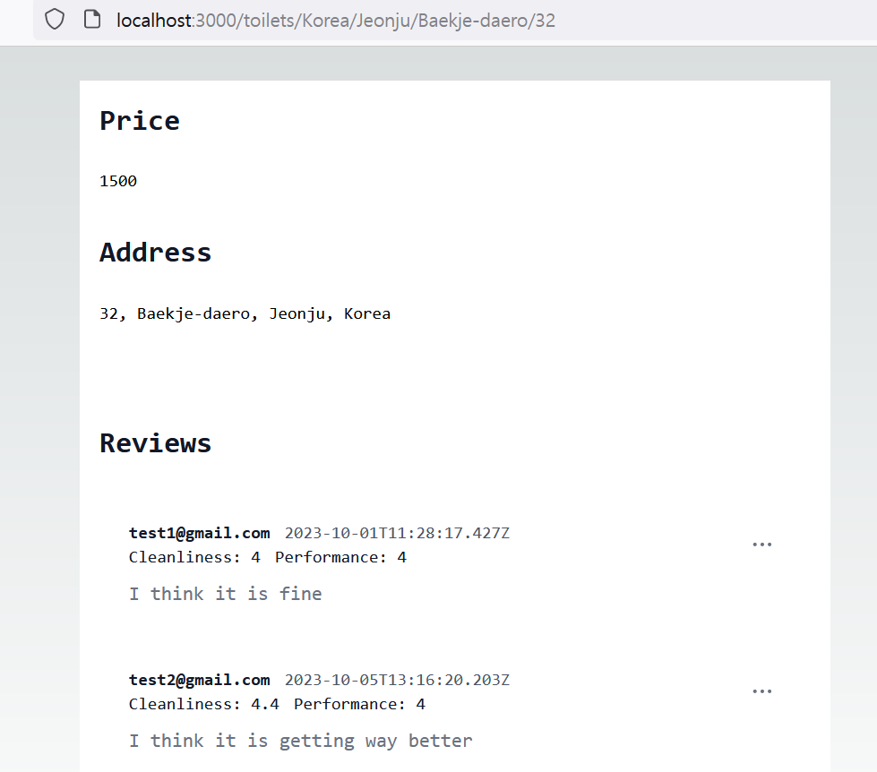
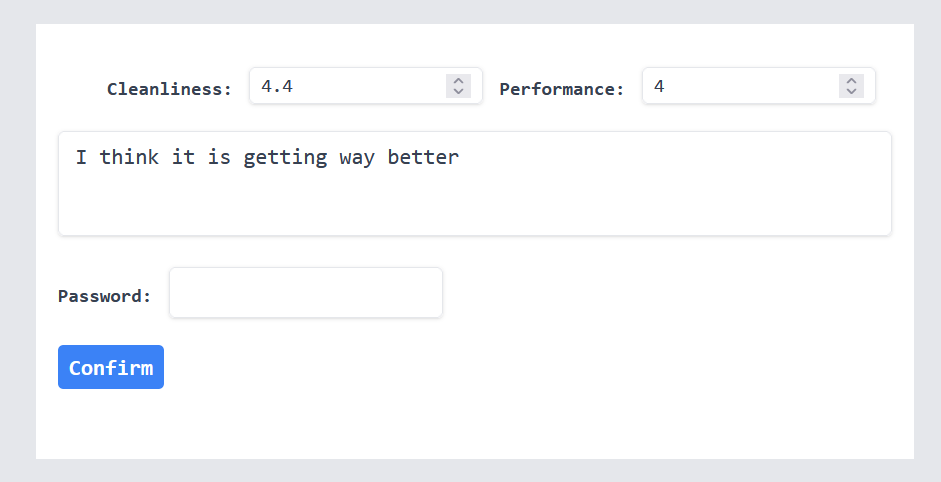
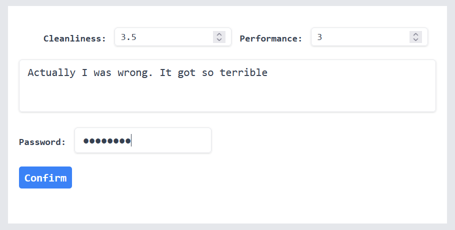
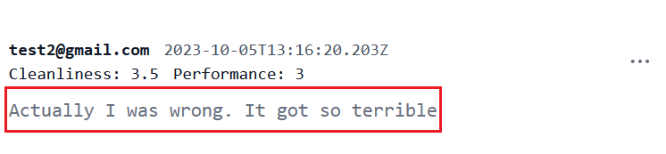

Since we have been able to register a toilet by submitting its price, address and review, it is fair to say that we should be able to update the toilet, especially its reivew when a reviewer wants to update the review. A page where one specific toilet show up with its information is where the update should happen. Let's build the very page!

> For those who might read this article without reading the previous articles, I should mention the backend has been developed and interacted with this frontend work. You can find the backend code [here](https://github.com/shkim04/find-your-wc)

## Toilet page

We have used App router to get dynamic routes using names of country, city and street so far. By the same token, adding `[streetNumber]`, a specific toilet data matching the address will show up and it will look like:



Here is the code:

```js
// ...
import Review from './reviewCard';

async function getToilet(address: AddressData): Promise<
  | {
      toilet: ToiletData;
    }
  | undefined
> {
  try {
    const { country, city, street, streetNumber } = address;
    const res = await fetch('http://localhost:4000/graphql', {
      method: 'POST',
      body: JSON.stringify({
        query: `{ toilet(
          country: "${country}", 
          city: "${city}", 
          street: "${street}", 
          streetNumber: "${streetNumber}"
        ) {
          id
          price
          isPaid
          reviews {
            id
            contributedBy
            cleanliness
            performance
            description
            createdAt
          }
        }}`,
      }),
      headers: {
        'Content-Type': 'application/json',
      },
      next: { revalidate: 10 },
    });

    if (!res.ok) {
      throw new Error('Failed to fetch toilet data in StreetNumber');
    }

    const dataObj = await res.json();
    return dataObj.data;
  } catch (err) {
    console.log('Error getToilet func in StreetNumber', err);
  }
}

export default async function StreetNumber({
  params,
}: {
  params: AddressData;
}) {
  const result = await getToilet(params);
  if (!result) return <div>There is no toilet registered on this address.</div>;
  const toilet = result!.toilet;
  return (
    <main className='flex min-h-screen flex-col items-center justify-between p-24'>
      <div className='z-10 max-w-5xl flex-col w-full items-center justify-between font-mono text-sm lg:flex'>
        {/* ..more code on the repository written 
        at the bottom of this article.*/}  
        <section className='w-3/5 bg-white dark:bg-gray-900 py-8 lg:py-16 antialiased'>
          <div className='max-w-2xl mx-auto px-4'>
            <div className='flex justify-between items-center mb-6'>
              <h2 className='text-lg lg:text-2xl font-bold text-gray-900 dark:text-white'>
                Reviews
              </h2>
            </div>
            {toilet.reviews.map((review: ReviewData, index: number) => {
              return <Review key={index} review={review} />;
            })}
          </div>
        </section>
      </div>
    </main>
  );
}
```

As we enter **toilets/Korea/Jeonju/Baekje-daero/32** which has been formed with an address stored in the database, this component will get `Korea`, `Jeonju`, `Baekje-daero`, and `32` as its parameter. And then it will make a request to our backend server so that it will get a toilet data corresponding the address. Finally, the component will show the toilet data which includes its reviews.

## Review card component

The toilet has its reviews and it can be more than just one review. For various reaons, it is a good practice to create a component for the reviews and import it on its parent component to display them so we will do it.

Here is the code:

```js
'use client';
// more code on the repository written at the bottom of this article.

export default function ReviewCard({ review }: { review: any }) {
  const [isOpenDropdown, setIsOpenDropdown] = useState(false);
  const [willEdit, setWillEdit] = useState(false);
  const [willRemove, setWillRemove] = useState(false);

  useEffect(() => {
    setWillEdit(false);
    setWillRemove(false);
  }, [review]);

  function toggleDropdown() {
    setIsOpenDropdown((prev) => !prev);
  }

  return (
    <article className='p-6 text-base bg-white rounded-lg dark:bg-gray-900'>
      {willEdit && (
        <>
          <button
            className='z-20 fixed top-0 right-0 bottom-0 left-0 w-full h-full bg-gray-200'
            onClick={() => setWillEdit(false)}
          />
          <UpdateReview review={review} />
        </>
      )}
      {willRemove && (
        <>
          <button
            className='z-20 fixed top-0 right-0 bottom-0 left-0 w-full h-full bg-gray-200'
            onClick={() => setWillRemove(false)}
          />
          <DeleteReview review={review} />
        </>
      )}
      <footer className='flex justify-between items-center mb-2'>
        {/* ..more code on the repository written 
        at the bottom of this article.*/}  
          {isOpenDropdown && (
            <>
              <button
                className='fixed top-0 right-0 bottom-0 left-0 w-full h-full'
                onClick={() => setIsOpenDropdown(false)}
              />
              <div
                id='dropdownComment1'
                className='z-10 w-36 bg-white rounded divide-y divide-gray-100 shadow dark:bg-gray-700 dark:divide-gray-600 absolute right-0 mt-2'
                data-popper-placement='bottom'
              >
                <ul
                  className='py-1 text-sm text-gray-700 dark:text-gray-200'
                  aria-labelledby='dropdownMenuIconHorizontalButton'
                >
                  <li className='block hover:bg-gray-100 dark:hover:bg-gray-600 dark:hover:text-white'>
                    <button
                      className='w-full py-2 px-4 text-start'
                      onClick={() => {
                        setWillEdit(true);
                        setIsOpenDropdown(false);
                      }}
                    >
                      Edit
                    </button>
                  </li>
                  <li className='block hover:bg-gray-100 dark:hover:bg-gray-600 dark:hover:text-white'>
                    <button
                      className='w-full py-2 px-4 text-start'
                      onClick={() => {
                        setWillRemove(true);
                        setIsOpenDropdown(false);
                      }}
                    >
                      Remove
                    </button>
                  </li>
                </ul>
              </div>
            </>
          )}
        </div>
      </footer>
      <p className='text-gray-500 dark:text-gray-400'>{review.description}</p>
    </article>
  );
}
```

> Notice that there is `use client;` on the top of the code. If you do not put it up there, Nextjs will automatically take the script as a server script which means you cannot use any of client APIs such as **useState**, **useEffect** or **useRef**.

## Update review component

To update a review, we will take the same approach as we did to register a toilet in the previous article, which is **Server action**. We will have `UpdateReview` component that will take current review as a prop and then, make a update request to our backend server.

Here is the code:

```js
'use client';

import { useRef } from 'react';
import { experimental_useFormStatus as useFormStatus } from 'react-dom';

import { updateReview } from './action';

function UpdateButton() {
  const { pending } = useFormStatus();

  return (
    <div className='flex items-center justify-between'>
      <button
        className='bg-blue-500 hover:bg-blue-700 text-white font-bold py-1 px-2 rounded focus:outline-none focus:shadow-outline'
        type='submit'
        aria-disabled={pending}
      >
        Confirm
      </button>
    </div>
  );
}

export default function UpdateReview({ review }: { review: any }) {
  const passwordRef = useRef<HTMLInputElement>(null);
  const cleanlinessRef = useRef<HTMLInputElement>(null);
  const performanceRef = useRef<HTMLInputElement>(null);
  const descriptionRef = useRef<HTMLTextAreaElement>(null);

  return (
    <form
      className='z-30 w-1/2 h-auto fixed inset-x-1/4 inset-y-1/4 mx-auto bg-white px-4 py-8'
      action={updateReview}
    >
      <div className='flex justify-between items-center mb-2'>
      {/* ..more code on the repository written 
      at the bottom of this article.*/}  
      <div className='flex items-center my-2'>
        <label className='text-gray-700 text-sm font-bold mb-2 mr-3'>
          Password:{' '}
        </label>
        <input
          className='shadow appearance-none border rounded py-2 px-3 text-gray-700 mb-3 leading-tight focus:outline-none focus:shadow-outline'
          type='password'
          name='password'
          ref={passwordRef}
          required
        />
      </div>
      <UpdateButton />
    </form>
  );
}
```

When a user click **Confirm** button after editing his review, it will trigger an action function `updateReview` that is defined in `action.ts`. That is where the update request is made. The fuction will console log a result depending on its response.

Here is what the component will render like:



In our backend server, we have made sure that only authenticated person is allowed to edit his or her review. That is why `password` comes in.

## Test

Before testing the senario, maks sure that we have a toilet that has one or more reviews to be updated on the database. You can simply create a few toilets using the graphql playground of our backend server.

### Update a review



### Result



In this article, neither I did go into the detail of how I implemented _tailwind_ on the components, nor was its UI properly improved. It is because I just wanted to focus on enabling some core features first. I will make it look better as times goes by.

You can find the frontend code on [here](https://github.com/shkim04/find-your-wc-frontend)

_**THANKS FOR READING. SEE YOU NEXT TIME!**_

### References
- https://nextjs.org/docs/pages/building-your-application/data-fetching/forms-and-mutations
