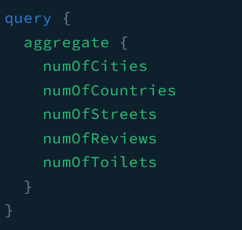
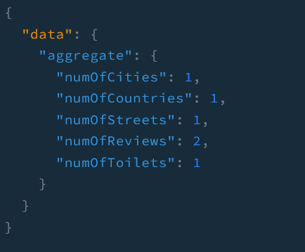

In our nextjs application, I would like to show some aggregated data such as the number of toilets, reviews, countries, etc stored in the database. In order to do this, we should add some feature to the backend server.

> For those who might read this article without reading the previous articles, You can find the whole backend code [here](https://github.com/shkim04/find-your-wc)

## Data Type

We will define the data types we would like bring into the nextjs application. Here is what it looks like in the backend:

```js
import { Field, Int, ObjectType } from '@nestjs/graphql';

@ObjectType()
export class TotalAggregate {
  @Field(() => Int)
  numOfReviews: number;

  @Field(() => Int)
  numOfToilets: number;

  @Field(() => Int)
  numOfCountries: number;

  @Field(() => Int)
  numOfCities: number;

  @Field(() => Int)
  numOfStreets: number;
}
```

We will write this code in a file and place it under the `model` folder.

## Add the feature in the repository layer

We will create a method called **totalAggregate** that gets all the relavant aggregated data using prisma API. Here is the code:

```js
@Injectable()
export class ToiletsRepository {
  constructor(private prisma: PrismaService) {}
  // you can see the entire code on the repository mentioned above

  async totalAggregate(): Promise<TotalAggregate> {
    const [
      toiletCount,
      reviewCount,
      countryGroupBy,
      cityGroupBy,
      streetGroupBy,
    ] = await Promise.all([
      this.prisma.toilet.count({ select: { _all: true } }),
      this.prisma.review.count({ select: { _all: true } }),
      this.prisma.address.groupBy({
        by: ['country'],
        _count: { _all: true },
      }),
      this.prisma.address.groupBy({
        by: ['city'],
        _count: { _all: true },
      }),
      this.prisma.address.groupBy({
        by: ['street'],
        _count: { _all: true },
      }),
    ]);

    return {
      numOfToilets: toiletCount._all,
      numOfReviews: reviewCount._all,
      numOfCountries: countryGroupBy.length,
      numOfCities: cityGroupBy.length,
      numOfStreets: streetGroupBy.length,
    };
  }
}
```

Notice that I have used `Promise.All` to make the API calls concurrent. It is because I was not able to come up with any better solution than making a few of requests to get all those numbers. However, I do not think it involves a heavy computations so it seems good to go with this approach.

## Add methods in the service layer and resolver layer

### Service layer

```js
@Injectable()
export class ToiletsService {
  constructor(
    private repository: ToiletsRepository,
    @Inject(CACHE_MANAGER) private cacheService: Cache,
  ) {}

  // ...
  async totalAggregate(): Promise<TotalAggregate> {
    return await this.repository.totalAggregate();
  }
}
```

### Resolver layer

```js
@Resolver(() => Toilet)
export class ToiletsResolver {
  constructor(
    private readonly toiletService: ToiletsService,
    private readonly addressService: AddressService,
    private readonly reviewsService: ReviewsService,
  ) {}
  // ...

  @Query(() => TotalAggregate, { name: 'aggregate' })
  async getAggregate(): Promise<TotalAggregate> {
    return this.toiletService.totalAggregate();
  }
  // ...
}
```

Maybe, we can implement caching on the service layer and give it suitable expiration time soon.

## Test

### Query



### Result



_**THANKS FOR READING. SEE YOU NEXT TIME!**_

### References
- https://www.prisma.io/docs/concepts/components/prisma-client/aggregation-grouping-summarizing
