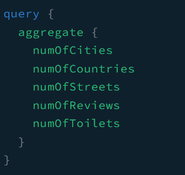
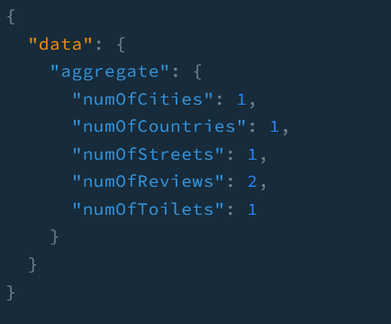

필자는 개발하고 있는 Nextjs 어플리케이션에 화장실, 리뷰, 국가 등등의 개수같은 집계 데이터를 보여주고자 합니다. 이를 위해 백엔드 서버에 기능이 추가되어야 합니다.

> 이전 글을 읽지 않고 이 글을 읽으신 분들은 [여기](https://github.com/shkim04/find-your-wc)에서 백엔드의 전체 코드를 확인하실 수 있습니다.

## 데이터 타입

nextjs 어플리케이션에 불러올 데이터의 타입을 정의할 것입니다. 다음과 같이 코드를 작성합니다.

```js
import { Field, Int, ObjectType } from '@nestjs/graphql';

@ObjectType()
export class TotalAggregate {
  @Field(() => Int)
  numOfReviews: number;

  @Field(() => Int)
  numOfToilets: number;

  @Field(() => Int)
  numOfCountries: number;

  @Field(() => Int)
  numOfCities: number;

  @Field(() => Int)
  numOfStreets: number;
}
```

`model` 폴더 하위에 파일을 생성하여 이 코드를 작성합니다.

## 리파지토리 단에 기능 추가하기

prisma API를 이용하여 모든 주요 집계 데이터를 불러오는 **totalAggregate**라는 메소드를 생성합니다. 다음과 같이 코드를 작성합니다.

```js
@Injectable()
export class ToiletsRepository {
  constructor(private prisma: PrismaService) {}
  // you can see the entire code on the repository mentioned above

  async totalAggregate(): Promise<TotalAggregate> {
    const [
      toiletCount,
      reviewCount,
      countryGroupBy,
      cityGroupBy,
      streetGroupBy,
    ] = await Promise.all([
      this.prisma.toilet.count({ select: { _all: true } }),
      this.prisma.review.count({ select: { _all: true } }),
      this.prisma.address.groupBy({
        by: ['country'],
        _count: { _all: true },
      }),
      this.prisma.address.groupBy({
        by: ['city'],
        _count: { _all: true },
      }),
      this.prisma.address.groupBy({
        by: ['street'],
        _count: { _all: true },
      }),
    ]);

    return {
      numOfToilets: toiletCount._all,
      numOfReviews: reviewCount._all,
      numOfCountries: countryGroupBy.length,
      numOfCities: cityGroupBy.length,
      numOfStreets: streetGroupBy.length,
    };
  }
}
```

API 호출을 병렬로 처리하기 위해 `Promise.All`를 사용했습니다. 우선 해당 숫자들을 얻기 위해 여러 번의 호출보다 더 나은 해결책을 찾지 못했던 것이 이유입니다. 그러나 이 메소드가 많은 연산을 요구하지 않을 것이기에 이 접근법으로 가도 괜찮을 것으로 판단했습니다.

## 서비스/리졸버 단에 메소드 추가하기

### 서비스

```js
@Injectable()
export class ToiletsService {
  constructor(
    private repository: ToiletsRepository,
    @Inject(CACHE_MANAGER) private cacheService: Cache,
  ) {}

  // ...
  async totalAggregate(): Promise<TotalAggregate> {
    return await this.repository.totalAggregate();
  }
}
```

### 리졸버

```js
@Resolver(() => Toilet)
export class ToiletsResolver {
  constructor(
    private readonly toiletService: ToiletsService,
    private readonly addressService: AddressService,
    private readonly reviewsService: ReviewsService,
  ) {}
  // ...

  @Query(() => TotalAggregate, { name: 'aggregate' })
  async getAggregate(): Promise<TotalAggregate> {
    return this.toiletService.totalAggregate();
  }
  // ...
}
```

이후에 서비스 단에 캐싱을 적용하고 적절한 유효 시간을 줄 생각입니다.

## 테스트

### 쿼리



### 결과



_**읽어 주셔서 감사합니다. To be continued!**_

### 참조
- https://www.prisma.io/docs/concepts/components/prisma-client/aggregation-grouping-summarizing
