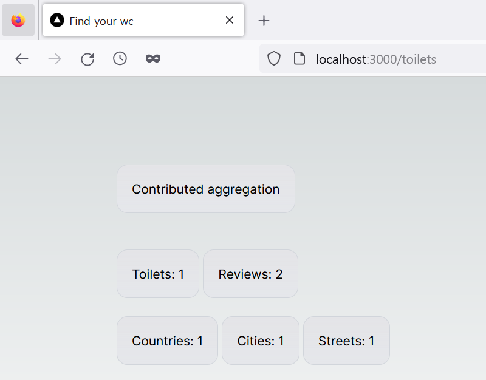

백엔드에서 필자가 원하는 수를 집계하는 메소드를 추가했기 때문에 이제 Nextjs 어플리케이션에 이 숫자들을 가져와서 보여줄 차례입니다.

> 이전 글을 읽지 않고 이 글을 읽으신 분들은 [여기](https://github.com/shkim04/find-your-wc)에서 백엔드의 전체 코드를 확인하실 수 있습니다.

## Toilets 라우트

**toilets** 페이지를 보여주는 컴포넌트에 직접 server action을 사용할 것입니다. 여기 아래와 같이 코드가 있습니다.

```js
interface ResponseData {
  aggregate: AggregateData;
}

interface AggregateData {
  numOfToilets: number;
  numOfReviews: number;
  numOfCountries: number;
  numOfCities: number;
  numOfStreets: number;
}

async function getAggregatedData() {
  try {
    const response = await fetch(`${process.env.API_URL}/graphql`, {
      method: 'POST',
      headers: { 'Content-Type': 'application/json' },
      body: JSON.stringify({
        query: `{ aggregate {
          numOfToilets
          numOfReviews
          numOfCountries
          numOfCities
          numOfStreets
        }}`,
      }),
    });
    const jsonData = await response.json();
    return jsonData.data;
  } catch (err) {
    console.log(err);
  }
}

export default async function Toilets() {
  const data: ResponseData = await getAggregatedData();
  return (
    <main className='flex min-h-screen flex-col items-center p-24'>
      <div className='z-10 max-w-5xl w-full items-center text-sm lg:flex mb-10'>
        <p className='w-full justify-center border-b border-gray-300 bg-gradient-to-b from-zinc-200 pb-6 pt-8 backdrop-blur-2xl dark:border-neutral-800 dark:bg-zinc-800/30 dark:from-inherit lg:static lg:w-auto  lg:rounded-xl lg:border lg:bg-gray-200 lg:p-4 lg:dark:bg-zinc-800/30'>
          Contributed aggregation
        </p>
      </div>
      <div className='z-10 max-w-5xl w-full items-center text-sm lg:flex mb-5'>
        <p className='w-full mr-1 justify-center border-b border-gray-300 bg-gradient-to-b from-zinc-200 pb-6 pt-8 backdrop-blur-2xl dark:border-neutral-800 dark:bg-zinc-800/30 dark:from-inherit lg:static lg:w-auto  lg:rounded-xl lg:border lg:bg-gray-200 lg:p-4 lg:dark:bg-zinc-800/30'>
          Toilets: {data.aggregate.numOfToilets}
        </p>
        <p className='w-full mr-1 justify-center border-b border-gray-300 bg-gradient-to-b from-zinc-200 pb-6 pt-8 backdrop-blur-2xl dark:border-neutral-800 dark:bg-zinc-800/30 dark:from-inherit lg:static lg:w-auto  lg:rounded-xl lg:border lg:bg-gray-200 lg:p-4 lg:dark:bg-zinc-800/30'>
          Reviews: {data.aggregate.numOfReviews}
        </p>
      </div>
      <div className='z-10 max-w-5xl w-full items-center text-sm lg:flex'>
        <p className='w-full mr-1 justify-center border-b border-gray-300 bg-gradient-to-b from-zinc-200 pb-6 pt-8 backdrop-blur-2xl dark:border-neutral-800 dark:bg-zinc-800/30 dark:from-inherit lg:static lg:w-auto  lg:rounded-xl lg:border lg:bg-gray-200 lg:p-4 lg:dark:bg-zinc-800/30'>
          Countries: {data.aggregate.numOfCountries}
        </p>
        <p className='w-full mr-1 justify-center border-b border-gray-300 bg-gradient-to-b from-zinc-200 pb-6 pt-8 backdrop-blur-2xl dark:border-neutral-800 dark:bg-zinc-800/30 dark:from-inherit lg:static lg:w-auto  lg:rounded-xl lg:border lg:bg-gray-200 lg:p-4 lg:dark:bg-zinc-800/30'>
          Cities: {data.aggregate.numOfCities}
        </p>
        <p className='w-full mr-1 justify-center border-b border-gray-300 bg-gradient-to-b from-zinc-200 pb-6 pt-8 backdrop-blur-2xl dark:border-neutral-800 dark:bg-zinc-800/30 dark:from-inherit lg:static lg:w-auto  lg:rounded-xl lg:border lg:bg-gray-200 lg:p-4 lg:dark:bg-zinc-800/30'>
          Streets: {data.aggregate.numOfStreets}
        </p>
      </div>
    </main>
  );
}
```

> **getAggregatedData** 함수에 쿼리가 만들어질 때 입력 객체가 없다는 것에 주의를 기울일 필요가 있습니다. 이것이 입력 객체가 없을 때 graphql 쿼리를 만드는 방법입니다.

## 테스트

`http://localhost:3000/toilets`를 주소창에 입력하여 기대한 바와 같이 동작이 되는지 확인합니다.



필요한 숫자들이 확인이 됐습니다!

_**읽어 주셔서 감사합니다. To be continued!**_
