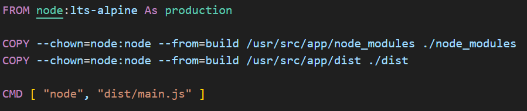

프로젝트를 시작할 때 평소와 같이 패키지 매니저로 **npm**을 선택했습니다. 그런데 **pnpm**이 어떨지 궁금하여 **pnpm**으로 바꾸고 이 프로젝트에 적용해보았습니다 - _pnpm은 npm과 다르기 때문에 빌드 체계에 문제를 야기할 수 있습니다. 프로덕션 단계에서 변경을 원할 때는 반드시 적절한 테스트를 거쳐야 할 것입니다._ 

**npm**으로 작성되었던 **Docker** 스크립트를 바꿔야 했습니다. 적용한 Dockerfile에 대해 설명해보려고 합니다.

> 이전 글을 읽지 않고 이 글을 읽으신 분들은 [여기](https://github.com/shkim04/find-your-wc)에서 백엔드의 전체 코드를 확인하실 수 있습니다.

## Development 단계

`RUN curl -f https://get.pnpm.io/v6.16.js | node - add --global pnpm`을 입력하여 `pnpm`를 설치합니다.

패키지를 가져올 때 **install** 대신에 **fetch**이 사용되는 것을 볼 수 있고 이 명령어는 오직 `pnpm-lock.yaml`만 필요합니다 - _`pnpm fetch`이 `npm`을 사용하여 스크립트를 작성할 떄 `npm ci`와 동일한 역할을 한다고 판단됩니다._ 

**pnpm** 공식 문서에 따르면 `pnpm fetch`와 `pnpm install --offline`를 사용하면 많은 시간을 아낄 수 있다고 나옵니다.

마지막으로 어플리케이션에서 **Prisma**를 사용하기 때문에 prisma 클라이언트를 생성하기 위해 `RUN pnpm exec prisma generate`를 추가해야 합니다.

## Build 단계

이제 development 단계에서 생성한 `node_modules` 폴더를 복사할 수 있습니다. 그리고 어플리케이션 구동할 떄 필요한 정보가 담긴 **.env** 파일도 복사했습니다.

마지막으로 빌드를 마친 후 패키지를 설치할 때 `--prod` 플래그를 사용하면 배포에 필요한 패키지만 설치가 됩니다.

## Production 단계

production 단계에서는 간단하게 build 단계에서 생성한 `node_modules`과 `dist` 폴더를 복사합니다.

이미지를 생성하기 위해 명령어 `docker build -t [image-name-you-want-give] -f Dockerfile .`를 입력하게 되면 해당 이미지가 생성이 될 것이고 빠르고 저용량으로 만들어지는 것을 확인할 수 있습니다 - _multi-stage 빌드를 적용하지 않고 이미지를 생성해보면 알 수 있습니다._

_**읽어 주셔서 감사합니다. To be continued!**_

### 참조
- https://pnpm.io/cli/fetch
