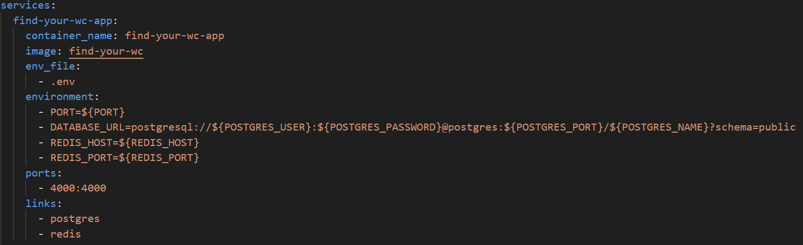

Now that I have to deploy the application with **Docker**, it is necessary to link other services run with Docker containers to the application.

> For those who might read this article without reading the previous articles, You can find the whole backend code [here](https://github.com/shkim04/find-your-wc)

## Link Docker services

Since one docker container has its own environment, which means it has its own network, the services are not connected to one another, **find_your_wc**, **postgres**, **redis** here.

The application **find_your_wc** use the other two services in its system, which means it should be connected to those services. We can achieve this by putting `links` flag under `find_your_wc` service in `docker-compose.yml` file. 

**postgres** and **redis** services can be accessed by the name in the application. For example, we have saved the database url in `.env` file using `localhost` as a host name in development. To connect it from the application run on a docker container, we can now override it with **postgres** which is the host name of the service defined in `docker-compose.yml` - _Notice that this is seen under **environment** section_. By the same token, we can change redis host name to **redis** for the cache module.

> You might have to migrate **Prisma** to the database by entering `[package-manger] prisma migrate dev [proper-migration-name]` first while the service is running. This does not have to be done on the docker container shell. It can be done on your project folder on your local machine.

_**THANKS FOR READING. SEE YOU NEXT TIME!**_

### References
- https://docs.docker.com/compose/networking/
- https://www.tomray.dev/nestjs-docker-compose-postgres