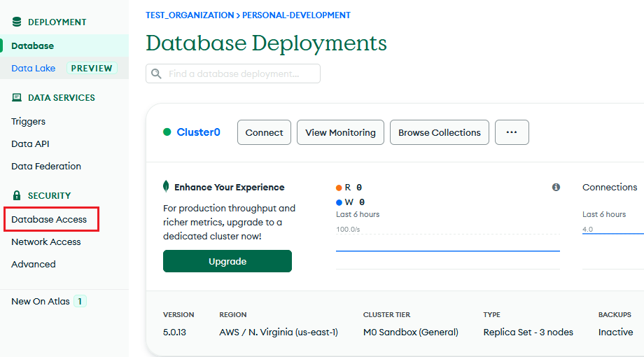
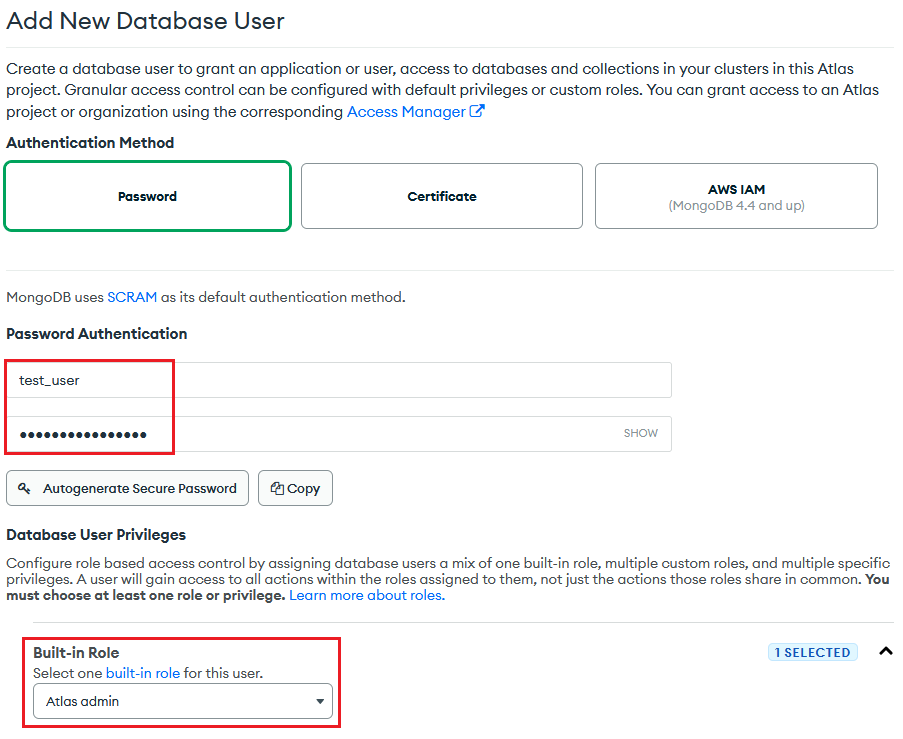
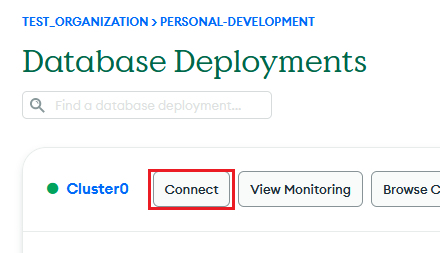
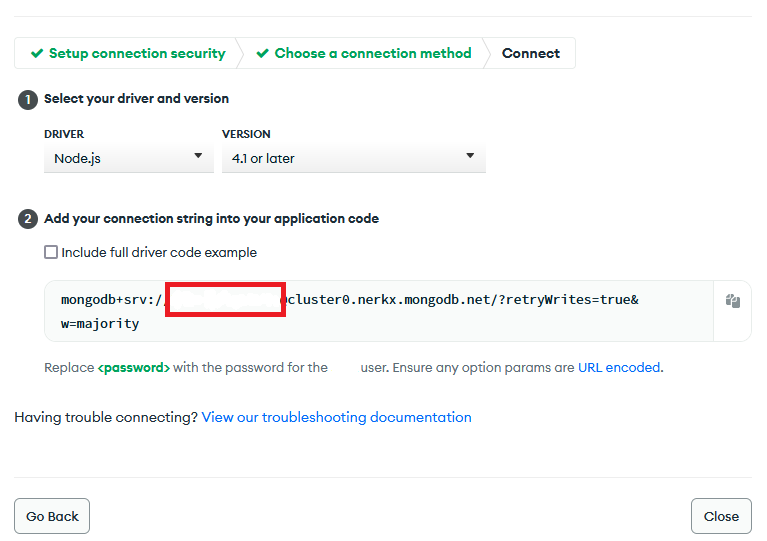
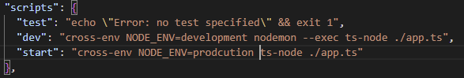
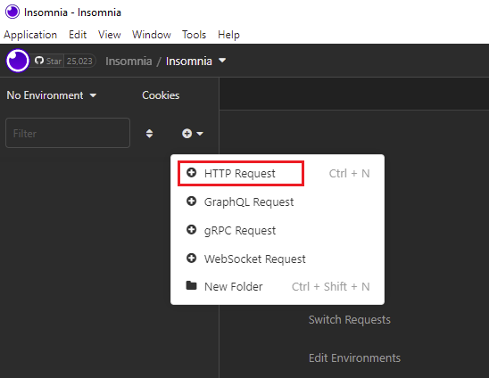
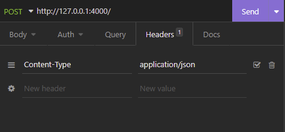
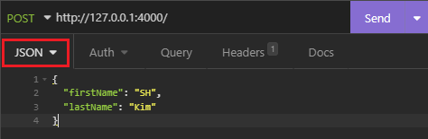
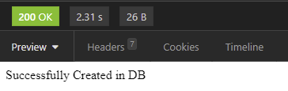
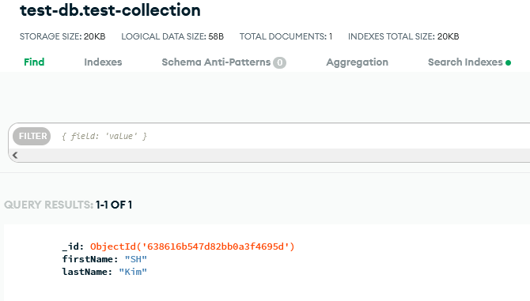

REST API는 마치 음식점의 메뉴와 같다. 손님이 메뉴를 보면 그 음식점이 어떤 음식들을 요리하는지 알 수 있는 것처럼 개발자가 한 소프트웨어 상품의 API 문서를 보면 무슨 기능을 제공하는지 알 수 있다. API 문서에는 흔히 요청 url이 적혀 있고 각 url에 대한 설명을 찾아볼 수 있다. 이 중 한 url에 요청을 보내면 그에 대한 응답을 받는 것이다. 개발자는 이 응답을 받아 가공 후 자신의 앱에 사용하면 된다. 이제 API를 만들어 보자.

## 필수
- Node.js + Typescript
- MongoDB
- Insomnia

## MongoDB 데이터베이스
먼저 MongoDB 설정부터 시작하겠다. MongoDB는 NoSQL 데이터베이스로 아주 많이 사용되는 데이터베이스 중 하나이다. 흔히 CRUD라고 말하는 create, retrieve, update, delete 요청을 적용하는 것이 아주 용이하다.

MongoDB 사용을 위해서 계정을 만들어야 한다. google이나 github 계정과 연동해서 쉽게 만들 수 있다. 계정을 생성해도 먼저 돈을 지불하지 않으며 추후에 큰 규모의 데이터를 처리할 때 처리량에 따라 지불하면 된다.

계정을 생성하고 로그인을 하면 다음과 같은 대시보드가 나온다:



개발하려고 하는 앱이 데이터베이스에 접근하게 하려면 데이터베이스 사용자를 생성하고 역할을 주어야 한다. 

좌측 사이드바에 있는 **Database Access** 누르고 넘어간 페이지의 우측에 보이는 **ADD NEW DATABASE USER** 클릭한다.



사용자 이름과 비밀번호를 입력한다. 데이터베이스에 연결할 때 이 두 정보가 필요하니 꼭 기억해두어야 한다. 

다음 해당 사용자에 **Atlas admin** 역할을 부여한다. 만약 단순히 읽기 역할만 주고 싶거나 읽기/쓰기 역할만 주고 싶을 때는 그에 맞게 권한을 부여하면 된다.

다시 대시보드로 페이지를 이동하고 _connect_ 를 클릭하면 개발할 API에 사용될 URI를 얻어야 한다.



다음과 같은 버튼을 클릭한다.




위에 보이는 URI가 API에 사용될 예정이다 - _Node.js API를 개발하는 것이기 때문에 driver 옵션은 넘어가도 된다_. 이 전 단계에서 생성한 사용자 이름과 비밀번호를 위 사진 속 빨간색 빈 칸에 _[your username:your password]_ 형태로 넣어야 한다. 필자와 함께 API를 개발하는 것이니 예시는 넘어가도 된다.

## 프로젝트 폴더 생성
새로운 프로젝트 폴더를 생성하고 터미널을 열어 아래와 같이 명령어를 입력한다. 해당 명령어를 입력하면 pacakge.json 파일이 생기는데 앱에 필요한 정보나 dependency들을 담고 있는 역할을 한다. 그리고 app.ts 파일을 만든다.


```
cd [project folder directory]
npm init -y
```

## Dependencies 설치

```js
npm install -g typescript
npm install express ts-node dotenv nodemon mongodb
npm install --save-dev cross-env @types/node @types/express
```
> **Express** _Node.js 웹 어플리케이션 프레임워크이며 가볍고 다양한 기능을 제공하며 특히 웹과 모바일 어플리케이션에 최적화되어 있다. Express가 API의 핵심 기능을 제공한다고 생각하면 된다._
> 
> **Dotenv** _.env 파일에 선언한 환경 변수들을 process.env라는 객체를 통해 접근할 수 있게 도와주는 라이브러리이다._
> 
> **Nodemon** _Node.js를 기반으로 하는 어플리케이션을 개발할 때 자주 쓰이며 코드를 수정할 시 자동으로 감지하여 어플리케이션을 재시작시켜준다. 배포에는 활용이 되지 않는다._
> 
> **Typescript** _Javascript에 추가적인 문법이 적용되어 에디터에서 재빠르게 에러를 찾아낼 수 있도록 도와준다._
> 
> **Ts-node** _Typescript가 적용된 스크립트가 실행되도록 Javascript로 변환해주는 역할을 한다._
> 
> **MongoDB** _Node.js 용 [MongoDB](https://www.mongodb.com/) 드라이버이다._

## Typescript 설정
앞서 설명했듯이 Typescript는 타입 확인을 엄격하게 적용하여 에디터에서 쉽게 에러를 찾을 수 있도록 도와준다. 

프로젝트 폴더 하위에 tsconfig.json이라는 파일을 만들고 아래 코드를 입력한다. 

개발자의 원하는대로 **compilerOptions** 을 바꿔주면서 사용하면 된다. 이 설정에 관해서 자세한 설명은 생략하오니 더 많은 정보를 원한다면 [공식 웹사이트](https://www.typescriptlang.org/docs/handbook/tsconfig-json.html) 확인해주길 바란다.

```js
{
    "buildOnSave": false,
    "compileOnSave": false,
    "compilerOptions": {
        "charset": "utf8",
        "module": "commonjs",
        "target": "es2018",
        "lib": [
            "es2018",
            "dom"
        ],
        "noImplicitAny": true,
        "removeComments": true,
        "strictNullChecks": true,
        // "noImplicitThis": true,
        "noImplicitThis": false,
        "alwaysStrict": true,
        "preserveConstEnums": true,
        "sourceMap": true,
        // "esModuleInterop": true,
        "esModuleInterop": true,
        "noImplicitReturns": true,
        "allowJs": true
    },
    "include": [
        "src"
    ],
    "exclude": ["node_modules", "reference_deprecated", "dist", "scripts"],
    "typeRoots": [
        "node_modules/@types"
    ]
}
```

## package.json


package.json 안에 script 필드 하위에 명령어 두개를 추가해보자. 복잡한 명령어를 key 이름에 저장한 후 간단하게 `npm run [key name]` 입력하는 방식으로 해당 명령어를 실행할 수 있다.

`npm run dev`를 터미널에 입력하고 엔터를 누르면 실제로 `cross-env NODE-ENV=development nodemon --exec ts-node ./app.ts` 가 실행된다. 개발모드로 실행되고 nodemon이 코드 수정이 있을 시 자동으로 재시작한다. **start**는 배포 시 사용된다.

## Express 서버
```js
import express, { Request, Response, NextFunction } from 'express';

const app = express();

app.use(express.urlencoded({ extended: true }));
app.use(express.json());
// to parse json of body object

// get route -> path '/'
app.get("/", (req: Request, res: Response): void => {
    res.send("Here is the response");
});

app.listen(4000, () => {
    console.log("Server is running on 4000");
})
```
위 코드를 app.ts 파일에 입력한 뒤 `npm run dev`를 터미널에 입력하여 서버를 시작한다. 터미널에 다음과 같이 로그가 뜬다:

_the server is listening to the port 4000_.

각각의 라우트는 API를 사용하는 사람이 요청을 보낼 때 쓰이는 url이라고 보면 된다. 위의 코드에는 get 라우트 있는데 경로가 '/'이며 콜백 함수를 파라미터로 가지고 있다. 이 라우트에 요청을 보내게 되면 _**Here is the response**_ 라는 응답을 받게 된다. 브라우저를 열고 주소 창에 http://localhost:4000를 입력해보자 - _로컬 환경에서 개발하기 때문에 localhost에 접근할 수 있다_.

콜백함수는 주로 2가지 객체를 인자 값으로 받는데 Request와 Response 객체이다. 

Request 객체는 API 사용자가로부터 서버가 받는 정보들의 집합이라고 생각하면 된다. API 개발자는 이 Request 객체가 어떤 필드 값을 가지고 있어야 하는지 목적과 방향에 맞게 사용할 수 있다. 사용자로부터 API 키 값을 필수적으로 받아야 하는 상황이 예가 될 수 있다. 

Response 객체는 API 사용자가 해당 API 라우트로부터 받는 정보이다. API 서버의 목적과 개발 방향에 따라 그 정보가 달라질 것이다.

## 환경 변수
환경 변수는 보통 영어는 대문자로 쓰는 것이 일반적이다.

프로젝트 폴더 하위에 **development.env**와 **production.env** 파일을 만들고 아래와 같이 변수 이름들을 적어 준다.

MongoDB로부터 얻은 uri를 **MONGODB_URI**로 설정한다.

```js
PORT=4000

MONGO_URI=[your mongodb uri]
MONGO_DB=test-db // just name whatever you want for development
MONGO_COLLECTION=test-collection // just name whatever you want for development
```

## 환경 변수 지정
```js
const dotenv = require('dotenv');
let envFound = dotenv.config({ path: `${process.env.NODE_ENV}.env` });

if(!envFound) throw new Error('Could not find any .env file.');

let config = {
  port: parseInt(process.env.PORT!, 10),
  mongodb: {
    uri: process.env.MONGO_URI,
    db: process.env.MONGO_DB,
    collection: process.env.MONGO_COLLECTION,
  }
};

export default config;
```

어플리케이션을 개발할 때 배포 전에 무수히 많은 테스트를 거치는 것이 일반적이다. 이 때문에 개발 설정과 배포 설정을 나누는 것은 굉장히 중요하다. 

cross-env는 환경에 따른 설정을 다르게 적용할 수 있게 도와주는 라이브러리인데 `cross-env NODE_ENV=production` 처럼 입력할 명령어 앞에 두어 어떤 환경인지 명시해 준다. 이 덕분에 다른 .env 파일을 환경에 맞게 설정해주기 때문에 같은 코드를 두번 작성할 필요가 없다.

config.ts 하위에 파일을 만든 뒤 dotenv를 import한다. 이 dotenv가 **[process.env.NODE_ENV].env** 파일에 담긴 정보를 읽어 오는 역할을 한다. 이 때 NODE_ENV는 명령어에서 명시해 줬던 development 혹은 production이 되겠다.

위 코드 안에 모든 환경 변수 앞에 process.env가 붙어 있다. Node.js에 전역에서 접근할 수 있는 객체이기 때문에 어플리케이션 전체에서 사용될 수 있다.

## 어플리케이션에 MongoDB 연결 
```js
import config from './config';
const { MongoClient } = require('mongodb');

const connectMongoDB: () => Promise<any> = () => {
  return new Promise((resolve, reject) => {
    MongoClient.connect(
      config.mongodb.uri,
      {
        useUnifiedTopology: true,
        useNewUrlParser: true,
      },
      (err: Error, client: object) => {
        if(err) {
          reject(err);
          return;
        }
    
        resolve(client);
      }
    );
  });
};

export default connectMongoDB;
```
프로젝트 폴더 하위에 파일 db.ts를 만든 뒤, MongoClient를 import한다. 그리고 파일 config.ts 만든 뒤 _config.mongodb.uri_ 을 인자 값으로 입력한다. 이 uri는 MongoDB 설정할 때 얻은 uri이다.

마지막으로 MongoDB를 비동기적으로 연결하도록 promise를 반환 값으로 받게 한다. 이제 API에 테스트 요청을 위해 코드를 수정해보자.

## 테스트 사용자 DB 등록
```js
import express, { Request, Response, NextFunction } from "express";
import config from "./config";
import connectMongoDB from "./db";

const app = express();

app.use(express.urlencoded({ extended: true }));
app.use(express.json());

app.get("/", (req: Request, res: Response): void => {
    res.send("Here is the response");
});

app.post("/", async (req: Request, res: Response): Promise<void> => {
  try {
    const firstName = req.body.firstName;
    const lastName = req.body.lastName;

    const client = await connectMongoDB();
    const db = await client.db(config.mongodb.db);
    const collection = await db.collection(config.mongodb.collection);

    await collection.insertOne(
       {
        firstName: firstName,
        lastName: lastName
       }
    );
  
    res.status(200).send("Successfully Created in DB");
  }
  catch(err) {
    res.status(500).send("Error Occured in Server");
    console.log("<POST> '/' error occured", err);
  }
});

app.listen(config.port, () => {
  console.log("Server is running on", config.port);
});
```
post 라우트를 추가한다. 이 라우트는 API 사용자로부터 성과 이름을 받고 이를 데이터베이스에 넣는 기능이 목적이다. Request 객체의 body라는 필드에 사용자가 입력한 성과 이름이 저장이 된다.

MongoDB promise가 resolve한 값을 connect라는 변수를 선언하여 저장한다 - _config.ts에 저장한 데이터베이스와 콜렉션 이름이 여기 쓰인다_ - 요청에서 받은 성과 이름을 **insertOne** 이라는 함수로 데이터베이스에 입력하게 된다.

에러 없이 코드가 실행된다면 post 라우트가 status 코드 200과 함께 _**Successfully Created in DB**_ 라는 정보를 사용자에게 보낸다.

## Insomnia 요청 테스트



Insomnia는 오픈 소스 API 클라이언트인데 쉽게 말해서 API를 개발할 때 기능을 확인하는 데 유용한 도구이다. Insomnia를 통해 지금까지 개발한 API의 post 라우트에 요청을 해보자. Insomnia를 다운로드 받았다면 실행한 뒤 위 그림처럼 HTTP Request를 누른다.



헤더 안에 Content-Type을 application/json으로 설정하여 body 객체에 접근하게 한다.



타입을 JSON으로 두고 firstname, lastname이라는 필드를 가진 객체 형식으로 입력한 뒤 Send 버튼을 누른다.



MongoDB에 정보가 입력되었다면 다음과 같이 나타난다:




## 결론
API 서버는 보통 개발자 자신 혹은 회사의 목적에 따라 더욱 커지거나 복잡해진다. 크고 복잡한 API 서버를 개발하는 실력을 키우려면 직접 더 많은 크고 작은 프로젝트들을 개발해보는 방법이 가장 도움이 될 가능성이 높다. 예를 들면, 더 많은 라우트를 추가하거나 더 많은 타입 정의들을 써보거나 다른 데이터베이스를 써보는 것이라고 생각한다. 이 간단한 API로부터 더 멋진 API를 개발하기를 바라면서 마무리하겠다.

해당 글에서 사용된 코드는 개인 github [레파지토리](https://github.com/shkim04/express_typescript_simple_api)에 있으니 필요하시면 확인해 주세요!

_**읽어 주셔서 감사합니다. To be continued!**_

_이 글은 [Medium](https://medium.com/@shkim04/node-js-how-to-create-a-simple-rest-api-with-express-mongodb-and-typescript-54b1d801d073)에도 업로드 되었습니다._
_놀러 오세요!_