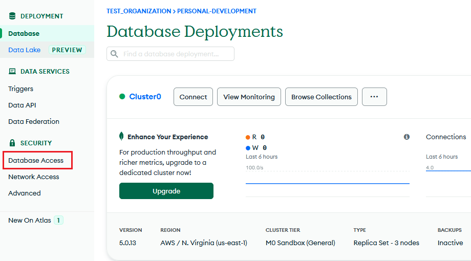
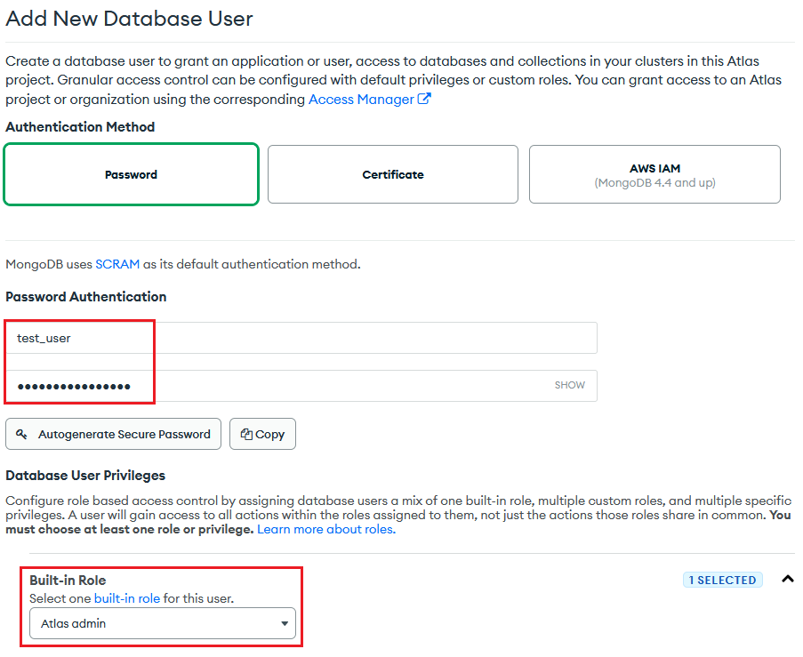
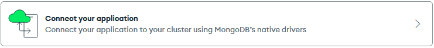
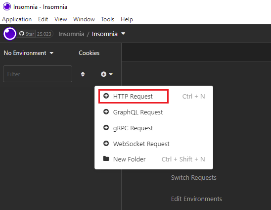
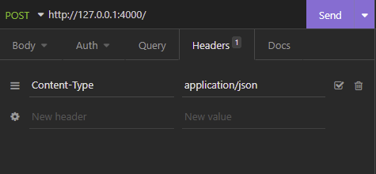
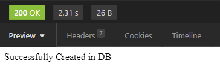
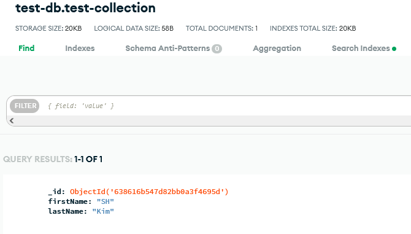

I usually think of REST API as a menu book of a restaurant. When customers look at the menu book, they are able to know what foods the restaurant serves. Similarly, when developers look at a REST API document, they are able to know what kind of features the company, which provides the REST API, serves. In an API document, you can see a list of URLs and descriptions of each URL. If you make a request to one of those URLs, you will get a response from it. Then, you can modify the response as you want for your application.

## Prerequisite
- Node.js + Typescript
- MongoDB
- Insomnia

## Create MongoDB Database
Let’s go into how to set up MongoDB. MongoDB is a NoSQL database which is one of the most widely used databases in the world and it is so easy to implement CRUD operation which is for create, retrieve, update and delete. 

You will need to create an account or sign up with your google or github account. You don’t have to pay first. It means you can try it for free and as your application handles lots of data coming in and out, you may have to pay for it as you go.

Once you created the account and sign in, you can see the dashboard that looks like:



It is necessary to create a database user and give it a role so that you can have an access to the database from an application. Click _**Database Access**_ in the left side bar to do it and then, click **ADD NEW DATABASE USER** in the right side of the page.



Enter a username and password. You will need to remember the username and password to use them to connect to the database. Next, select _Atlas admin_ for the role. You can give another role to the user if you allow the user to write and read or just read.

Now, go back to the dashboard. Click _connect_ so you will get URI to connect our Node.js API server to the database.


Click the one below when prompt.




This is the URI that we want to have - _You do not have to care about driver option because we will build a Node.js API_. Make sure you put _[your username:your password]_ you created in the previous step in the red blank. You do not have to check include full driver code example because I will cover that in this post. Let’s move on.

## Create A Project Folder And Initialize A Node.js API server
Create a new project folder and go to the directory. After that, open the terminal and enter the command as shown below. It will create a package.json in which you manage the information and dependencies of the application. Then, create app.ts file under the project folder.


```
cd [project folder directory]
npm init -y
```

## Install Dependencies For Development

```js
npm install -g typescript
npm install express ts-node dotenv nodemon mongodb
npm install --save-dev cross-env @types/node @types/express
```
> **Express** _is a minimal and flexible Node.js web application framework that provides a robust set of features for web and mobile applications. So, Express is the core of the API we will be creating._
> 
> **Dotenv** _is a zero-dependency module that loads environment variables from a .env file into process.env. We will talk more about Dotenv later in this post._
> 
> **Nodemon** _is a tool that helps develop Node.js based applications by automatically restarting the node application when file changes in the directory are detected. Nodemon is meant to be for development, not for production. It is very useful because you do not have to kill and restart the application while developing it._
> 
> **Typescript** _adds additional syntax to JavaScript to support **a tighter integration with your editor**. Catch errors early in your editor._
> 
> **Ts-node** _is a TypeScript execution engine. You can’t execute Typescript. It needs to transpile to Javascript. Ts-node enables us to transform the ts.file to js. file and execute the js.file at once._
> 
> **MongoDB** _is the official [MongoDB](https://www.mongodb.com/) driver for Node.js._

## Configure Typescript
Since typescript support to a strong type checking, potential errors can be easily caught in your editor. To apply it, create tsconfig.json under the project directory and configure typescript. Then, copy and paste the codes shown below. You can change a few of fields under _compilerOptions_ depending on your needs. I won’t go into the detail of the options so, check the official [website](https://www.typescriptlang.org/docs/handbook/tsconfig-json.html) if you want to know more about it.

```js
{
    "buildOnSave": false,
    "compileOnSave": false,
    "compilerOptions": {
        "charset": "utf8",
        "module": "commonjs",
        "target": "es2018",
        "lib": [
            "es2018",
            "dom"
        ],
        "noImplicitAny": true,
        "removeComments": true,
        "strictNullChecks": true,
        // "noImplicitThis": true,
        "noImplicitThis": false,
        "alwaysStrict": true,
        "preserveConstEnums": true,
        "sourceMap": true,
        // "esModuleInterop": true,
        "esModuleInterop": true,
        "noImplicitReturns": true,
        "allowJs": true
    },
    "include": [
        "src"
    ],
    "exclude": ["node_modules", "reference_deprecated", "dist", "scripts"],
    "typeRoots": [
        "node_modules/@types"
    ]
}
```

## Modify Scripts in package.json


Let’s add two commands under scripts in package.json. You can assign a complicated command to one of those keys and then, simply run the command by entering _npm run [key name]_.

You can run the application by entering “npm run dev” which actually executes _cross-env NODE-ENV=development nodemon --exec ts-node ./app.ts_. When file changes occur, the application will be restarted automatically thanks to nodemon. The script, “start” is for when you run the application in production.

## Start Express Server
```js
import express, { Request, Response, NextFunction } from 'express';

const app = express();

app.use(express.urlencoded({ extended: true }));
app.use(express.json());
// to parse json of body object

// get route -> path '/'
app.get("/", (req: Request, res: Response): void => {
    res.send("Here is the response");
});

app.listen(4000, () => {
    console.log("Server is running on 4000");
})
```
After copying and pasting the code in app.ts, enter npm run dev as mentioned above to start the server. You can see the terminal saying:

_the server is listening to the port 4000_.

Each of the routes represents a URL that API users make a request to. Here, you will have a get route and then, pass '/' as its path and a call back function. What happens in the route is that when the API users make a request to the URL of this API, they will get a response showing “Here is the response”. Open a browser and enter http://localhost:4000 to see the response - Since we develop in our own local computer, we can have an access to the API with localhost_.

The call back function takes mainly 2 objects as its arguments. They are Request and Response object. 

Request object is like a set of information that the server receives from API users. API developers can make a certain rule about how the request object looks for the API. For example, it could have a few of data required to be sent to the API such as API key. 

Response object is what the API users will get from the API route. It can be a set of data such as users or billing depending on what the purpose of the API and the route is.

## Set Environment Variables
It is conventional to write environment variables in capital letters.

Create development.env and production.env files under the project directory. In both files, write the variable names as shown below.

Then, assign the mongodb uri that we have gotten in the section above to **MONGODB_URI**.

```js
PORT=4000

MONGO_URI=[your mongodb uri]
MONGO_DB=test-db // just name whatever you want for development
MONGO_COLLECTION=test-collection // just name whatever you want for development
```

## Set Up Configuration By Environments
```js
const dotenv = require('dotenv');
let envFound = dotenv.config({ path: `${process.env.NODE_ENV}.env` });

if(!envFound) throw new Error('Could not find any .env file.');

let config = {
  port: parseInt(process.env.PORT!, 10),
  mongodb: {
    uri: process.env.MONGO_URI,
    db: process.env.MONGO_DB,
    collection: process.env.MONGO_COLLECTION,
  }
};

export default config;
```

When you develop an application, it is required to test the application so many times before the production. Therefore, you need to set up an environment for testing as well as an environment for production. 

cross-env allows you to set the environment by putting “cross-env NODE_ENV=production” in front of the command to run the application. Then, it can access to a different .env files that you have created so you can create the same code that has two or more different environments.

Create a file named config.ts under the project directory and import dotenv to enable us to access to **[process.env.NODE_ENV].env** file. If you set development to NODE_ENV in the command, Dotenv will read variables from development.env here.

Notice that process.env is preceded by the environment variables. You can access to the object globally in Node.js. In other words, you can use it throughout a whole application.

## Access MongoDB From The Application
```js
import config from './config';
const { MongoClient } = require('mongodb');

const connectMongoDB: () => Promise<any> = () => {
  return new Promise((resolve, reject) => {
    MongoClient.connect(
      config.mongodb.uri,
      {
        useUnifiedTopology: true,
        useNewUrlParser: true,
      },
      (err: Error, client: object) => {
        if(err) {
          reject(err);
          return;
        }
    
        resolve(client);
      }
    );
  });
};

export default connectMongoDB;
```
Create a file named db.ts under the project directory. Then, import MongoClient and also config object from config.ts and pass _config.mongodb.uri_ you have assigned to connect the application to MongoDB database. 

Finally, wrap it in the promise so you can connect the application to MongoDB asynchronously through the whole application. Then, we will edit the code to make a test request to the API.

## Create A Test User in MongoDB
```js
import express, { Request, Response, NextFunction } from "express";
import config from "./config";
import connectMongoDB from "./db";

const app = express();

app.use(express.urlencoded({ extended: true }));
app.use(express.json());

app.get("/", (req: Request, res: Response): void => {
    res.send("Here is the response");
});

app.post("/", async (req: Request, res: Response): Promise<void> => {
  try {
    const firstName = req.body.firstName;
    const lastName = req.body.lastName;

    const client = await connectMongoDB();
    const db = await client.db(config.mongodb.db);
    const collection = await db.collection(config.mongodb.collection);

    await collection.insertOne(
       {
        firstName: firstName,
        lastName: lastName
       }
    );
  
    res.status(200).send("Successfully Created in DB");
  }
  catch(err) {
    res.status(500).send("Error Occured in Server");
    console.log("<POST> '/' error occured", err);
  }
});

app.listen(config.port, () => {
  console.log("Server is running on", config.port);
});
```
Add a post route that will receive a first name and a last name from the API users and will insert the information to the database. These data can be accessed by the property of request object called body. 

Assign what the MongoDB promise resolves to a variable named connection — Notice that the database name and collection name you set in config.ts are passed — and we will insert the first name and last name by the method called _insertOne_. 

If there is no error that is caught, the post route will send the status code which is 200 and the string saying “Successfully Created in DB” to the API users.

## Make A Post Request With Insomnia



Insomnia is open source API client. You can test your API and design it with Insomnia. We will make a post request to the post route of the API we just have created the above. Once you downloaded Insomnia, click the plus button to create a HTTP Request as shown above.



Set content-type to application/json in the headers to send the data to the API server so, you can send some data stored in body object to the API server.


After setting the data type to JSON and write the object that has first name and last name, enter Send on the right and check out the response as shown below.



Check out to see if there is a document created in your MongoDB. It should look like:



You have just created a new user in your database!

## Conclusion
API server can become bigger and more complicated depending on the purpose of the API you develop. To have a better coding skill to create and handle it, I think that you should develop various projects by yourself. For example, it could be achieved as you add some more routes, define more types for variables with Typescript or try another database. I hope you can make this simple API a better version of it by yourself!

_**THANKS FOR READING. SEE YOU NEXT TIME!**_

_This is originally posted on my [Medium](https://medium.com/@shkim04/node-js-how-to-create-a-simple-rest-api-with-express-mongodb-and-typescript-54b1d801d073)._
_Let's connect!_