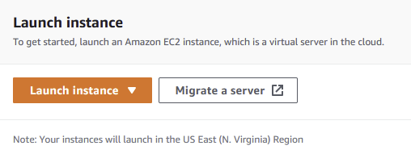
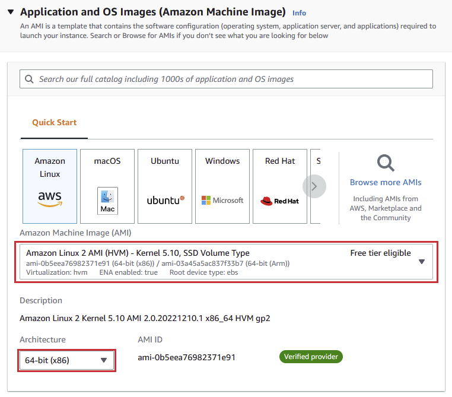
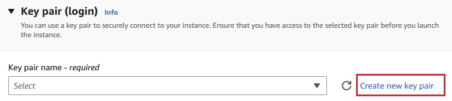
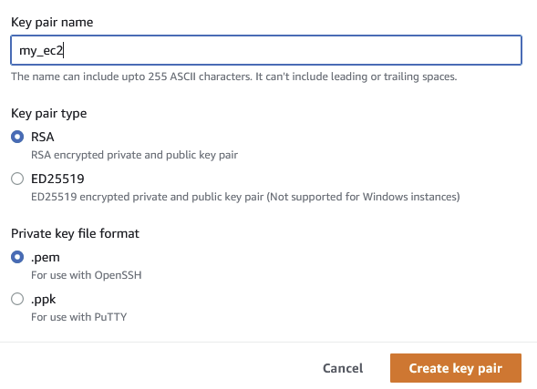
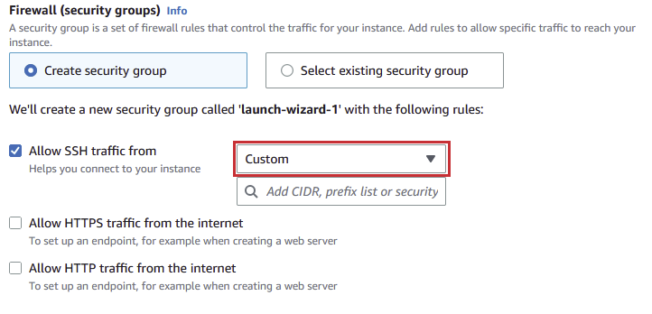
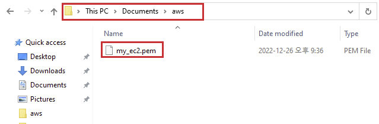
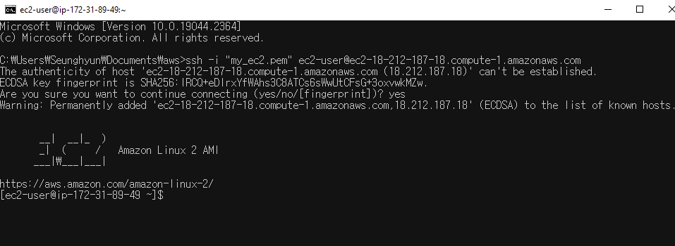

클라우드 서비스는 인터넷을 통해 사용자나 회사에게 온디맨드 형식으로 제공되는 서비스다. 개발자는 흔히 API 같은 서버를 이 클라우드 서비스를 통해 배포할 일이 많다.

직접 컴퓨터를 설치하고 배포하는 대신에 클라우드 서비스를 통해 어플리케이션을 동작시키는 것이다. 가장 잘 알려진 클라우드 중 하나인 AWS를 알아보고 EC2에 Node를 설치하는 법도 알아보자.

## 필수
- AWS 계정 — _계정 생성은 검색하면 된다_
- 리눅스에 대한 약간의 배경지식

## EC2 인스턴스
로그인을 하면 EC2 대시보드 중간에 **인스턴스 생성**을 볼 수 있다. **인스턴스 생성** 버튼을 누른다.



다음 페이지에서 인스턴스에 이름을 준다 - _이름은 인스턴스를 잘 표현할 수 있게 지어준다_. 이름 영역 아래 Amazon Linux를 선택한다. 이 가상의 컴퓨터의 OS를 리눅스로 설정해준 것이다. 테스트 용으로 만드는 것이기 때문에 무료 티어로 선택한다. 무료 티어이기 때문에 성능이 좋지 않다는 것을 감안해야 한다. 이 [무료 티어](https://aws.amazon.com/ec2/pricing/?loc=ft#Free_tier)가 다 끝나면 아마존에서 자동적으로 결제가 진행되니 주의하기 바란다.



## 키페어와 방화벽
키페어를 생성한다. 이 키페어는 사용자의 로컬 컴퓨터에서 SSH를 활용하여 EC2에 접속할 때 꼭 필요한 것이니 실수라도 지우지 않도록 명심한다.



어떤 EC2에 연결되는지 잘 알 수 있도록 키페어의 이름을 적어준다. 다음 유형과 파일 포맷은 각각의 default값인 RSA와 .pem를 선택한다 키페어 생성을 클릭하면 파일이 드라이브로 다운로드된다.



보안상 IP 주소를 제한할 때가 있는 허용 IP를 명시하여 인스턴스 보안을 강화할 수 있다.



완료되면 화면의 우측에 **요약**이라는 컴포넌트가 나온다. 내용에 문제가 없다면 클릭하여 인스턴스 생성을 마무리한다. 다시 대시보드로 페이지를 이동하면 인스턴스가 생성 대기중이라는 걸 확인할 수 있다. 상태가 **생성**이 될 때까지 기다리면 된다.


## SSH로 연결
인스턴스에 연결하는 방법은 여럿이다. 대시보드에서 직접 웹브라우저로 연결할 수 있으나 SSH를 통해 연결하는 것이 속도가 더 빠르고 다루기 쉬워서 좋다. 아래 명령어를 복사한다.


그리고 윈도우를 사용하면 .pem 키가 저장된 폴더로 이동한다. 검색창을 누르고 **cmd**를 입력하면 터미널이 열리게 된다 - _터미널을 열고 명령어를 통해 .pem 키가 저장된 폴더로 이동해도 된다_. 



복사했던 명령어를 붙여 넣고 **yes**를 입력하면 인스턴스와 연결된다.



## Node 설치
Node 버전 관리 도구인 nvm을 설치한다. 공식 [레파지토리](https://github.com/nvm-sh/nvm)에서 나오는 스크립트 대로 진행하면 쉽게 설치할 수 있다.

```
curl -o- https://raw.githubusercontent.com/nvm-sh/nvm/v0.34.0/install.sh | bash
# then, execute the shell script
. ~/.nvm/nvm.sh
```

완료되면 다음 명령어를 입력한다.

```
nvm install 16
```

다음 명령어를 입력하여 각각 버전을 확인한다. 이제 EC2 인스턴스에서 node.js를 실행할 수 있다.

```
node -v
npm -v
```

## 결론
AWs EC2를 생성하고 Node를 설치해보았다. 앞서 말했듯이 node.js 어플리케이션, API 서버 등을 실행할 수 있다. 간단한 node.js API를 배포하여 동작이 잘 되는지 확인해보는 게 어떨지 추천해본다. 혹시 API가 무엇인지 아직 잘 모르는 독자들은 [이전 글](https://shkim04.github.io/express-mongodb-typescript로-restapi-개발하기/)을 확인하길 바란다.

_**읽어 주셔서 감사합니다. To be continued!**_

_이 글은 [Medium](https://medium.com/@shkim04/server-how-to-set-up-aws-ec2-6986f659de60)에도 업로드 되었습니다._
_놀러 오세요!_