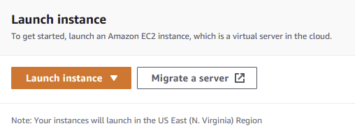
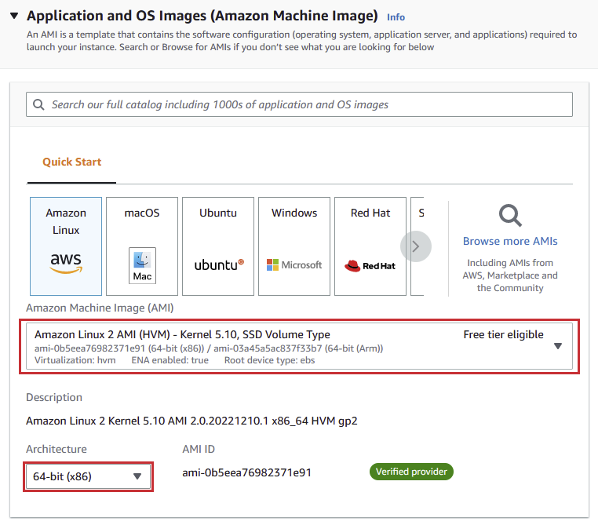
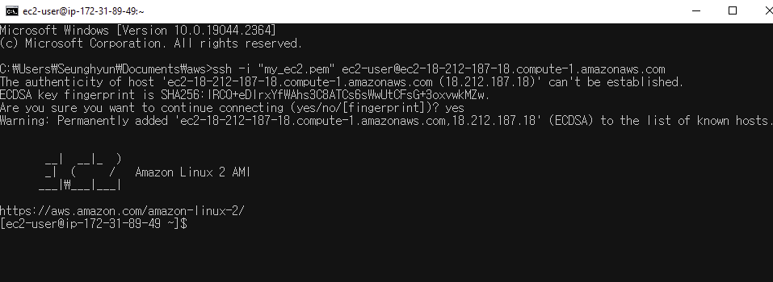

Cloud service is a service delivered on demand to companies or users through the internet. To developers, cloud service is specifically used to process what is done in a server side, such as an API server. 

Instead of setting up a server computer with a physical hardware, you can just run applications by utilizing the cloud service. We will look into AWS which is the most popular cloud service in the world. We will specifically go over how to begin with EC2 and download node.js.

## Prerequisite
- AWS account — _you can google how to create one_
- Shallow knowledge about Linux

## Choose EC2 Instance
Once signed in, you can see **Launch instance** in the middle of EC2 dashboard. Let’s click **Launch instance**.



In the next page, name the instance - _name it in the way it will be self-explanatory_. Below the name section, we choose Amazon Linux here, which means you will launch a virtual server whose OS is Amazon Linux. Since this is meant to be testing, we select free tier for AMI which is the default. It will presumably not be very fast. 

You should know Amazon will charge you costs incurred when the amount of resource spent passes a certain criteria — 750 hours per month for 12 months with the AWS [Free Tier](https://aws.amazon.com/ec2/pricing/?loc=ft#Free_tier).



## Key-Pair And Firewall
We create key-pair which is _**so important that you must not delete it by any accident**_. Otherwise, there is no way to connect the instance you created with the key-pair via SSH.


Name the key-pair so well-explained that you can remember what the instance is. We will choose the default, RSA for type and .pem for the file format here. Click create key pair and it will be downloaded into the drive of your computer.


Sometimes, developers do not allow traffics from some IP addresses for the security. By specifying which IP address is allowed or not, you can secure the instance from possible attacks.


When finished, the section called **Summary** on the right side of the screen will show what you have chosen. If not anything wrong, click and finish launching instance. If you come back to the dashboard, you can see the instance pending. Wait till it will say **created**.


## Connect Instance Via SSH
There are a few ways to connect the instance you've just created. For example, you can connect it on the web browser from the dashboard. But we will connect it via SSH because it is faster than the direct connection on the web browser and easier to handle the instance through the terminal of your local computer. Copy the command below.


Then, If you use Windows, open the folder that has the .pem key you have created when launching the instance, click the search bar and enter **cmd** then it will prompt to show the terminal - _you can just open the terminal first and change the path to the folder that has the .pem key_.


Paste the command you copied from the dashboard and enter **yes** to continue connecting. Now, the instance is ready to be handled on the terminal.



## Download Node
We will download nvm which stands for Node Version Manager to eventually download Node on the instance. You can download it in a second by using the script provided from the official [repository](https://github.com/nvm-sh/nvm).

```
curl -o- https://raw.githubusercontent.com/nvm-sh/nvm/v0.34.0/install.sh | bash
# then, execute the shell script
. ~/.nvm/nvm.sh
```

When it is done, enter the following command

```
nvm install 16
```

If not anything wrong, you can see each versions after entering the following commands. Now, you can run node.js applications on the EC2 instance!

```
node -v
npm -v
```

## Conclusion
We have set up Node on EC2 instance so far. As I mentioned, you can run node.js applications which could be an API server. Try to deploy your simple Node API server and see if it works well or not. If you have no idea what API is, check out [my previous post](https://shkim04.github.io/en/restapi-with-express-mongodb-typescript/).

_**THANKS FOR READING. SEE YOU NEXT TIME!**_

_This is originally posted on my [Medium](https://medium.com/@shkim04/server-how-to-set-up-aws-ec2-6986f659de60)._
_Let's connect!_