**Google Sheet** is very handy due to its incredible flexibility and easy access no matter where you are because it works on browsers. It is also easy to access your Google Sheet from any of your applications via **Google Sheet API**. You can write something to your google sheet via the API or can let the API read data from your google sheet so you can manipulate it for any purpose. 

Before you start using Google Sheet API, you have to create a virtual user to use every google API on your behalf. Let’s take a look at it first.

## Prerequisite
- google cloud account — _you can google how to create one. registering a billing account is required_
- google sheet - _easy to create one with your google account_
- Node

## Create Service Account
If you have already sign up google cloud account, go to **Google Cloud IAM and admin**. Service account is the virtual user I mentioned in the beginning. Click **Service accounts** in the red box shown below, under the side bar on the left.

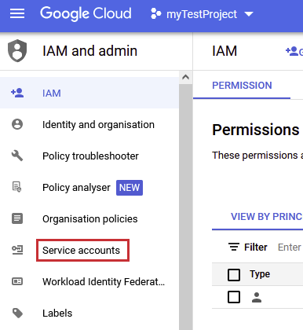

Then, click create service account in the red box shown below.

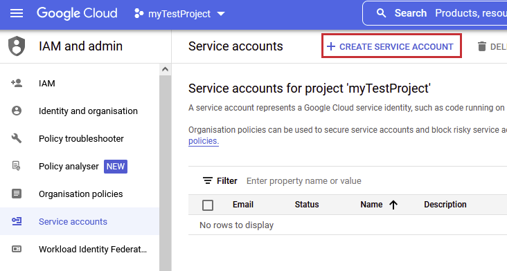

Name it properly so that you can remember what it will do.

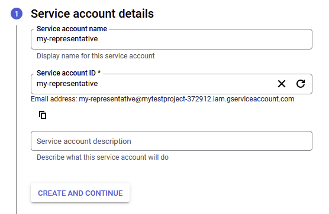

For the sake of convenience, we will give **Owner role** to the service account that we have just created. But, you have to know that the service account should be given different roles depending on the purpose of the usage.

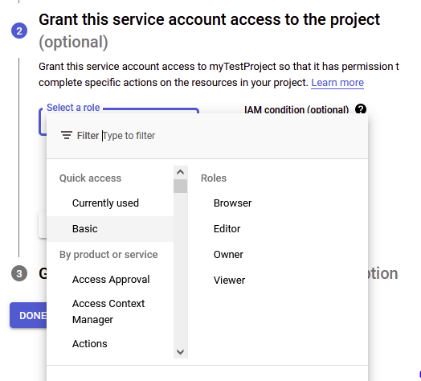

Once created, go to the service account detail as below.

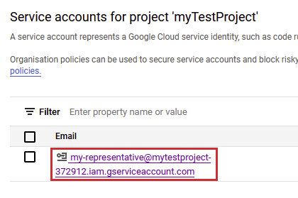

In order to connect the API from applications, we should create **key** which will be downloaded into the drive of your computer directly as a `json` format after naming the key.


It will look like:

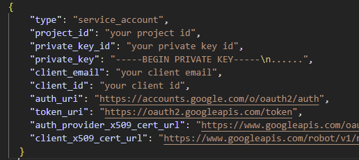

Keep in mind that there are two important values here in the `json` in order to connect google products on your behalf. One is **client email** and the other is **private key**.

## Enable Google Sheet API
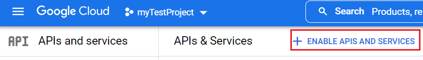

We will have to enable Google Sheet API in order to use it. **Go to API and services** under your project and click **ENABLE APIS AND SERVICES**, then enter _google sheet api_ in the searching bar and enable it.

## Set Up a Test Google Sheet
Go to _google sheets_ and create a blank sheet for testing purpose. There is one thing you must do to have an application access your google sheet. It is to authorize the service account you have just created to use your google sheet. In order to do it, click **Share** on the right.

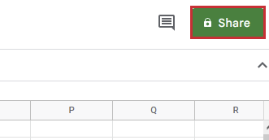

When the pop-up screen as shown below shows up, copy and paste your **client email** in the `json` file you have just created in the previous section.

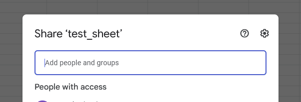

Another important thing you should remember for connection is the id of the google sheet you want to handle. You can find the id from the url of the google sheet and It looks like:

```
https://docs.google.com/spreadsheets/d/[your-sheet-id]/edit#gid=0
```

Let's add some simple data which look like the picture below to the sheet. Now, we are good to go to the next step.

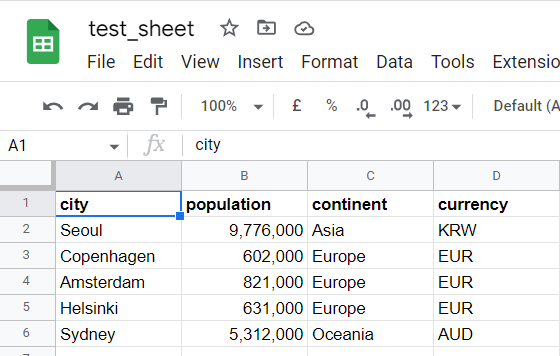

## Connect Node.js Application To Google Sheet
For those who have not had any Node.js application, follow the steps described below to create a basic one.
1. Create a project folder and open it with the text editor you have
2. Enter `npm init -y` in the terminal
3. Create a file called `app.js` - _although you can name whatever you want_

Now, we will download a library to bring google sheet API into the project.

```js
npm install --save googleapis
```

Then, we will write the following code in app.js:

```js
const { google } = require('googleapis');

const clientEmail = 'your service account client email';
const privateKey = 'your service account private key';
const googleSheetId = 'your google sheet id';
const googleSheetPage = 'your google sheet page name';

// authenticate the service account
const googleAuth = new google.auth.JWT(
    clientEmail,
    null,
    privateKey.replace(/\\n/g, '\n'),
    'https://www.googleapis.com/auth/spreadsheets'
);
```

Recall that there are a few of important things to add into the code to connect to your google sheet. They are **client email, private key** in the json key file, **google sheet id**, and **the exact name of the sheet**. The exact name of the sheet can be named as you want and you can find this on the bottom of the screen. Fill each information with the corresponding variables in the code above.

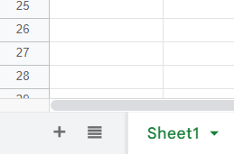

## Read Data From Sheet

```js
async function readSheet() {
  try {
    // google sheet instance
    const sheetInstance = await google.sheets({ version: 'v4', auth: googleAuth});
    // read data in the range in a sheet
    const infoObjectFromSheet = await sheetInstance.spreadsheets.values.get({
        auth: googleAuth,
        spreadsheetId: googleSheetId,
        range: `${googleSheetPage}!A2:D6`
    });
    
    const valuesFromSheet = infoObjectFromSheet.data.values;
    console.log(valuesFromSheet);
  }
  catch(err) {
    console.log("readSheet func() error", err);  
  }
}

readSheet();
```

In the function, **readSheet**, we will use **get** method to bring an object that contains data from the spreadsheet connected to the application. Notice that its range is set to **A2:D6** which covers the rows and columns of the data we have added to the spreadsheet - _To exclude the header row, it is from the second row_. 

Open the terminal and enter `node app.js`. You will see the log in the terminal that looks like:

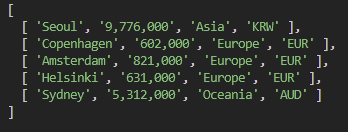

## Clear Data In Sheet

```js
async function clearSheet() {
  try {
    // google sheet instance
    const sheetInstance = await google.sheets({ version: 'v4', auth: googleAuth});
    // clear data in the range
    await sheetInstance.spreadsheets.values.clear({
        auth: googleAuth,
        spreadsheetId: googleSheetId,
        range: `${googleSheetPage}!A2:D6`,
    });
  }
  catch(err) {
    console.log("clearSheet func() error", err);  
  }
}

clearSheet();
```

We will try to clear the rows and columns of the data by using **clear** method. When you run the application, then, you will see the rows and columns are empty in the range specified.

## Update Data To Sheet

```js
async function updateSheet() {
  try {
    // google sheet instance
    const sheetInstance = await google.sheets({ version: 'v4', auth: googleAuth});

    const updateToGsheet = [
      [ 'Seoul', '9,776,000', 'Asia', 'KRW' ],
      [ 'Copenhagen', '602,000', 'Europe', 'EUR' ],
      [ 'Amsterdam', '821,000', 'Europe', 'EUR' ],
      [ 'Helsinki', '631,000', 'Europe', 'EUR' ],
      [ 'Sydney', '5,312,000', 'Oceania', 'AUD' ]
    ];
    
    // update data in the range
    await sheetInstance.spreadsheets.values.update({
        auth: googleAuth,
        spreadsheetId: googleSheetId,
        range: `${googleSheetPage}!A2:D6`,
        valueInputOption: 'RAW',
        resource: {
          values: updateToGsheet,
        },
    });
  }
  catch(err) {
    console.log("updateSheet func() error", err);  
  }
}

updateSheet();
```

Finally, we will update the values of rows and columns in the range specified by using **update** method. Values must be in an array of arrays and make sure the range is set as desired. The first element of the variable, **updateToGsheet**, which is an array will be written **from A2 to D2**, second element **from A3 to D3** and others in such way.

Run the application and check the google sheet to see if the values are updated in the range specified - _If there are values in the range, the new values will be overwritten on the old values_.

## Conclusion
We have just learned how to connect Node.js application to Google Sheet. Now you can read, write and delete data in the google sheet. Last but not least, it is your job to elaborate this basic model to the next level so that you can fully grasp Google Sheet API.

_**THANKS FOR READING. SEE YOU NEXT TIME!**_

_This is originally posted on my [Medium](https://medium.com/@shkim04/beginner-guide-on-google-sheet-api-for-node-js-4c0b533b071a)._
_Let's connect!_