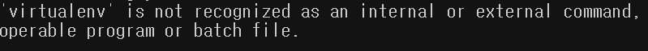
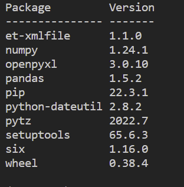

When developing an app with Python, you do not have to think too much about what version of Python you use and what versions of packages you use if you work on a small project. But, in complex software development projects such as an API, you will work with multiple files and packages. These packages are dependent on Python version you are using. Knowing this is crucial because it can cause problems when you have more than one Python project.

Here is an example: 

You have worked on **my-first-python-project** from the scratch on your local machine. You have downloaded all the packages required for the project globally. Now, you are assigned to **your-first-assigned-python-project** at work. Your own project are set up on Python 3.6.0 version while the project you are assigned to are set up on Python 3.10.0. Also, Both projects require a package named **pandas**. Its versions in both projects are 1.2.0 and 1.5.2 respectively. 

Since you downloaded packages globally, when you download the package pandas for the project you are assigned to, pandas 1.5.2 will be overridden. When you switch to your own project, errors would occur and the application would not be able to run.

This is why we have to isolate a Python development environment to a particular project. In order to achieve this, we set up a virtual environment. For better understanding, if you create two different virtual environments on your machine, each of the virtual environments can have different Python versions, packages and libraries on the same machine. Here are the two big benefits:

- A project locked in a virtual environment will not be interrupted by the global environment on your machine or other virtual environment
- You can share your application with others without any problem related to version conflicts

Now, I will walk you through how to set up a virtual environment on Windows - _How to set up a virtual environment on Linux or MacOS is also easy to do so feel free to search for it_.

## Prerequisite
- Python — whatever version it is, although recommended to download a stable one

## Install Virtualenv
```
pip install virtualenv
```

Open the terminal and enter the command as shown above. It will install virtualenv package on your machine, which should be globally available. Once finished, check out if it is installed properly by entering this:

```
virtualenv --version
```

You will see the message showing what version of the package it is. And it will look like:


Or if you see the message as shown below, you should add the path of the executable file of the package, virtualenv.exe, to the system environment variables.



Here is the instruction to do it:
1. Find the path of the executable path - _It will be likely to be C:\Users\[your user name]\AppData\Roaming\Python\Python[your python version]\Scripts folder_
2. Press Window key, type environment and click Edit the system environment variables
3. Click **Environment Variables**
4. Double click **Path** or click it and then Edit


5. Add the path of the executable of **virtualenv** package to it

## Create And Activate a Virtual Environment
Create a folder named **test_python** - _if you have already had any folder for testing, feel free to use the folder_. We will create a virtual environment inside the folder.
```
cd /path/to/test_python
// create command
virtualenv [your virtual environment name]
```

You will notice the new folder named **[your virtual environment name]** has been created inside **test_python** folder. The name of the virtual environment can be anything you want. Now, you will need to activate it before you actually use it in your project. Enter the command below - _make sure that the directory is still the path to **test_python** folder in the terminal_.

```
.\[your virtual environment name]\Scripts\activate
```

## Check Out If Virtual Environment Works
To check out if the virtual environment works well as expected, we will install one package and see the list of packages installed.
```
pip install pandas
pip list
```

Once installed, it should look like:



After deactivating the virtual environment, we will see the list of packages installed globally on your machine and then, we can confirm that the virtual environment is actually isolated by itself.

```
deactivate
```

You won't see a package named **pandas**, that we have created on the virtual environment, on the global package list if anything did not go wrong.

## Conclusion
We have just learned how to set up a Python virtual environment. It gives us great flexibility to manage any Python project on our own machines. Do not worry about problems that would occur if applications grow out. We can simply create a virtual environment and we know how to do it.

_**THANKS FOR READING. SEE YOU NEXT TIME!**_

_This is originally posted on my [Medium](https://medium.com/@shkim04/python-how-to-set-up-a-virtual-environment-on-windows-3d4858e44a74)._
_Let's connect!_