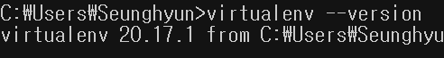
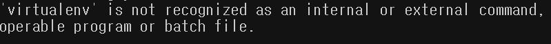
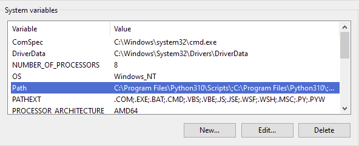
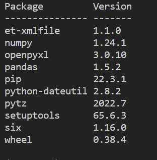

Python으로 어플리케이션을 개발할 때, 그 프로젝트의 규모가 작다면 Python 버전 혹은 패키지의 버전에 대해 크게 신경 쓸 일이 없다. 하지만 API 서버같이 복잡한 어플리케이션을 개발하는 경우라면 프로젝트에 많은 파일과 패키지가 사용될 것이다. 이 패키지들은 Python 버전에 영향을 받는다. 하나 이상의 Python 프로젝트들이 컴퓨터에 존재할 때 문제를 일으킬 가능성이 높다.

다음과 같은 예가 있다: 

개인 컴퓨터에서 **my-first-python-project**를 진행하고 있고 이 프로젝트에 필요한 패키지들을 전역적으로 설치했다고 가정하자. 그리고 회사에서 처음으로 맡은 **your-first-assigned-python-project** 를 맡았다고 하자. 개인 Python 프로젝트는 Python 3.6.0 버전으로 개발되고 있고 회사 프로젝트는 3.10.0으로 개발되고 있다. 각각의 프로젝트에 똑같이 사용되는 패키지 **pandas**의 버전이 각각 1.2.0과 1.5.2이다.

개인 프로젝트를 위해 필요한 패키지를 전역적으로 설치했기 때문에 회사 프로젝트에 필요한 패키지를 설치하게 되면 pandas 1.5.2가 덮어 씌어진다. 이 때문에 다시 개인 프로젝트를 진행할 때 버전이 충돌하여 어플리케이션이 실행이 되지 않을 수 있는 것이다.

이와 같은 이유로 특정 프로젝트에 하나의 Python 환경을 일대일로 대응시키는 것이 필요한데 가상 환경을 설치하면 가능하다. 가상 환경은 한 컴퓨터에 여러 개를 설치할 수 있고 각각의 환경을 개별 프로젝트에 종속시킬 수 있다. 이 때문에 각각 개별 프로젝트에 다른 패키지나 라이브러리 버전을 설치할 수 있다. 가상 환경의 이점을 정리하면 다음과 같다:

- 컴퓨터의 전역 환경 혹은 다른 가상 환경으로부터 영향을 전혀 받지 않는다
- 다른 개발자와 버전 충돌 없이 어플리케이션을 공유할 수 있다

이제 Window에 Python 가상 환경을 설치하는 법을 알아보자 - _Linux 혹은 MacOS에 설치하는 것도 어렵지 않으니 검색해보길 바란다_.

## 필수 
- Python — _버전은 상관없으나 LTS 버전으로 설치하길 권한다_

## Virtualenv 설치
```
pip install virtualenv
```

터미널을 열어 위의 명령어를 입력한다. **virtualenv**라는 패키지를 전역적으로 설치한다. 완료가 되면 설치가 잘 되었는지 다음 명령어를 입력하여 알 수 있다:

```
virtualenv --version
```

패키지의 버전이 다음과 같이 출력된다:



만약 아래와 같이 virtualenv를 인식하지 못한다는 로그가 출력이 되면 **virtualenv.exe**의 경로를 시스템 환경 변수에 추가해주어야 한다.



방법은 다음과 같다:
1. 실행파일의 경로를 확인한다 - _보통 C:\Users\[your user name]\AppData\Roaming\Python\Python[your python version]\Scripts folder 형식일 것이다_
2. Window 키를 누른 후, 환경 변수 편집을 찾아 클릭한다
3. **환경 변수**를 클릭한다
4. **Path** 더블 클릭하거나 클릭 후 편집을 누른다



5. **virtualenv** 실행 파일의 경로를 추가해준다

## 가상 환경 생성 및 활성화
**test_python** 파일을 만든다 - _테스트 용으로 만든 폴더가 있다면 사용해도 상관없다_. 이 폴더 하위에 가상 환경을 만들 것이다.
```
cd /path/to/test_python
// create command
virtualenv [your virtual environment name]
```

**test_python** 하위에 **[your virtual environment name]** 라는 이름으로 새로운 폴더가 생성된다. 가상 환경의 이름은 알아서 결정하면 된다. 실제로 프로젝트에 가상 환경을 적용하기 위해서는 활성화를 시켜주어야 한다. 다음 명령어를 입력해보자 - _터미널의 경로가 **test_python**이어야 한다는 것을 주의하자_.

```
.\[your virtual environment name]\Scripts\activate
```

## 가상 환경 동작 확인
실제 가상 환경이 동작이 잘 되는지 확인하기 위해 패키지를 설치하고 패키지 목록을 확인해보자.
```
pip install pandas
pip list
```

패키지 목록이 다음과 같아야 한다:



가상 환경을 비활성화한 후에 전역적으로 설치된 패키지 목록과 비교하게 되면 가상 환경이 한 프로젝트에 종속이 되었는지 알 수 있게 될 것이다.

```
deactivate
```

문제가 없다면 패지키 목록에서 **pandas**가 없다는 것을 확인할 수 있을 것이다.

## 결론
Python 가상 환경에 대해 알아 보았다. 개인 컴퓨터에서 많은 Python 프로젝트를 다룰 때 유용한 도구이다. 각자 프로젝트가 크든 작든 가상 환경을 설치하여 문제 없이 Python 개발을 하길 바란다.

_**읽어 주셔서 감사합니다. To be continued!**_

_이 글은 [Medium](https://medium.com/@shkim04/python-how-to-set-up-a-virtual-environment-on-windows-3d4858e44a74)에도 업로드 되었습니다._
_놀러 오세요!_