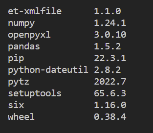
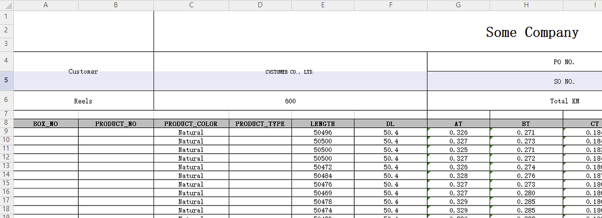
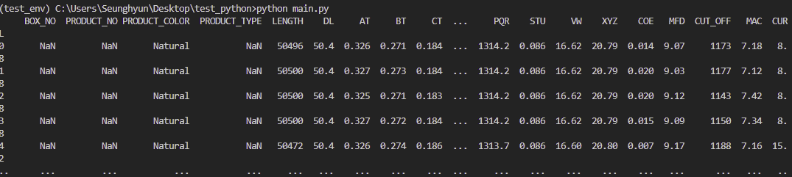
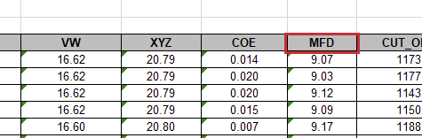
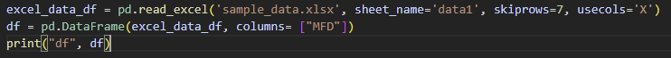
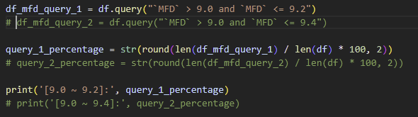

Pandas’s [official website](https://pandas.pydata.org/) says

> pandas is a fast, powerful, flexible and easy to use open source data analysis and manipulation tool, built on top of the Python programming language.

Especially, **pandas** is an incredibly easy tool to deal with and analyze data stored in an excel file. We will learn how to implement pandas for excel and practice an example with a real world data.

## Prerequisite
- Set up a virtual environment — _I have already covered up how to set up one on my previous [post](https://shkim04.github.io/en/how-to-set-up-python-virtual-env)_

## Install pandas
```
pip install pandas
pip list
```

Once you install it, check out the list of packages to see if the package is installed properly that looks like as shown below:



You can see the other packages in addition to pandas. They are peer packages of pandas so it would not work out properly without them.

## Analyze Data From Excel
If you do not have any sample data, I will create a [**repository**](https://github.com/shkim04/python_practice) for this simple project so, you can download the code and the sample data. It looks like:



Now, we will read this excel file in the Python script. Before starting, make sure to activate a virtual environment if you follow how to set up one from my previous post — _recommended to get used to using a virtual environment from the beginner level_. 

Once you activate the virtual environment, create a file named main.py. Inside main.py, we will import pandas and then, write a code that actually reads this excel file using pandas.

```python
import pandas as pd

excel_data_df = pd.read_excel('sample_data.xlsx', sheet_name='data1', skiprows=7)
print(excel_data_df)
```

**read_excel** method takes in a few parameters. They are the path to the excel file, the name of the sheet and how many rows you want to skip here in this case. There are actually more parameters you can put in the method as you desire so check out the [**official documentation**](https://pandas.pydata.org/docs/reference/api/pandas.read_excel.html) of pandas for more. Enter `python main.py` in the terminal and it will print out like:



## Practice
Let’s say our goal is to calculate the ratio of the number of values that are between 9.0 and 9.4 to the whole in the column, **MFD**.



It is really simple to read the column. We can specify the name of the header in the data frame. If you print it out, you can see the only one column printed.



There are lots of ways to achieve our goal from here. You can go over each value of the list and count the number of values that meet the condition individually, but it will be just one line code if we use one of pandas’s methods, query. We will just pass a query in the valid form designated by their API to query method as an argument.



When we pass the query **\`MFD\` > 9.0 and \`MFD\` <= 9.4** and print the result out, it will show only values that meet the condition. Now we know the number of allthe values in the whole MFD columns and the number of the values that are between 9.0 and 9.4. so we can do the final math. The ratio is **58.17**.

## Conclusion
We have just learned a tiny piece of pandas now. There are thousands of real world use cases for data analysis on excel. I hope you go further than this and deal with lots of examples so, you can make your tasks much easier or even automate them eventually.

_**THANKS FOR READING. SEE YOU NEXT TIME!**_

_This is originally posted on my [Medium](https://medium.com/@shkim04/how-to-use-pandas-for-excel-on-python-45ffb15af57e)._
_Let's connect!_