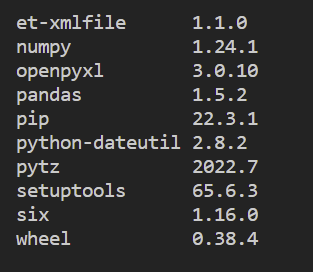
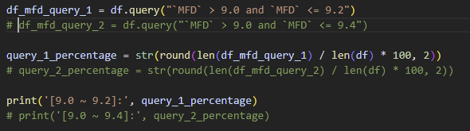

Pandas의 공식 [웹페이지](https://pandas.pydata.org/) 따르면

> pandas is a fast, powerful, flexible and easy to use open source data analysis and manipulation tool, built on top of the Python programming language.

특히, **pandas**는 엑셀 파일에 저장된 데이터를 분석하고 가공할 때 아주 용이하다. 실제 데이터 모델을 가지고 pandas를 엑셀에 활용하는 방법을 알아보자.

## 필수
- 가상 환경 설치 — _[이전 글](https://medium.com/@shkim04/python-how-to-set-up-a-virtual-environment-on-windows-3d4858e44a74)에 가상 환경 설치에 대해 글을 적었으니 읽어보길 바란다_

## pandas 설치
```
pip install pandas
pip list
```

설치가 완료가 되면 패키지 목록에 있는지 확인하여 설치가 잘 되었는지 확인해보자. 목록은 다음과 같이 생겼다:



다른 패키지도 설치된 것을 확인할 수 있는데 이들은 pandas를 설치하면 같이 설치되는 일종의 묶음 패키지이다. 이 패키지들이 없으면 pandas가 정상적으로 동작하지 않을 수 있다.

## 엑셀 데이터 분석
실제 데이터 모델과 이 글에 적혀 있는 코드가 개인 [**레파지토리**](https://github.com/shkim04/python_practice) 있으니 따로 연습할 데이터가 없는 독자들은 다운로드 받아도 된다. 샘플 데이터는 다음과 생겼다:


Python 스크립트에 이 엑셀 파일을 읽어보자. 먼저 시작하기 전에 이전 글에서 다룬 가상 환경을 꼭 설치하고 활성화하길 바란다 - _Python에 입문한 독자들도 미리 익숙해질 수 있게 설치를 권장한다_.

가상 환경을 활성화시켰다면 **main.py**라는 이름의 파일을 생성한다. pandas를 import하고 아래와 같이 엑셀 파일을 읽는 코드를 입력한다.

```python
import pandas as pd

excel_data_df = pd.read_excel('sample_data.xlsx', sheet_name='data1', skiprows=7)
print(excel_data_df)
```

**read_excel** 메소드는 여러 인자를 받는다. 위의 코드에서는 엑셀 파일의 경로, 시트 이름, 건너 뛸 행의 개수가 되겠다. 더 많은 인자들을 해당 메소드에 입력할 수 있는데 필요에 따라 pandas [공식 문서](https://pandas.pydata.org/docs/reference/api/pandas.read_excel.html)에서 확인 바란다. 터미널을 열어 `python main.py`을 입력하여 실행하면 다음과 같이 출력된다:


## 연습
**MFD** 열에 있는 값들 중 9.0과 9.4 사이에 존재하는 값의 수 대 전체 값의 개수의 비를 계산해보자.


해당 열은 data frame에서 해당 열의 헤더의 이름, 즉 MFD를 입력하면 읽을 수 있다. 로그를 출력해보면 해당 열만 출력될 것이다.


사실 목표값을 찾는 방법은 여럿이 될 수 있다. 열의 값으로 이루어진 배열을 일일이 확인하여 조건에 맞는 값들만 센 후 계산할 수도 있다. 하지만 pandas의 query를 이용하면 단 한 줄의 코드로 원하는 값을 얻을 수 있다. pandas API에 지정된 형태로 정확히 query를 입력하면 된다.



query **\`MFD\` > 9.0 and \`MFD\` <= 9.4** 를 입력하고 로그를 출력하면 조건에 맞는 값들만 출력될 것이다. MFD 열의 값 전체 개수와 9.0와 9.4사이에 존재하는 값의 개수를 알게 되었고 계산하게 되면 답은 58.17이란 걸 알 수 있다.

## 결론
pandas의 아주 작은 일부만 살펴보앗다. pandas가 엑셀 혹은 기타 데이터를 다루는 예는 무궁무진할 것이다. 독자들이 다른 많은 예제들을 접하면서 pandas를 유용하게 사용하셨으면 좋겠다.

_**읽어 주셔서 감사합니다. To be continued!**_

_이 글은 [Medium](https://medium.com/@shkim04/how-to-use-pandas-for-excel-on-python-45ffb15af57e)에도 업로드 되었습니다._
_놀러 오세요!_