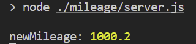
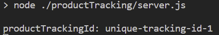

By the definition in the dictionary, **queue** for computing is

> a list of data items, commands, etc., stored so as to be retrievable in a definite order, usually the order of insertion.

I think this tells us a lot about what queue does in development. Queue lets you deal with things later, or retrieve them in other applications. When a service grows and as a result, its server needs to handle an enormous amount of requests or process intensive jobs, it is recommended to have more than one server, each of which has its own function. 

However, since all those servers might need to share a single source of data, the data should not be lost when communicating with each server. This is exactly where a queue messaging is needed. To see how a queue messaging works and practice in Node.js development, we will learn to use one of queue messaging services, AWS SQS on Node.js.

## Prerequisite
- Node
- VScode
- AWS account
- Insomnia

## Use Scenario
Imagine that there is an e-commerce website like Amazon. Its server is expected to handle thousands of order requests and plus, it might send a response back to a client that contains information such as delivery status, mileage, personal recommendations, etc. If there are just 1000 requests to handle, then it is totally fine to do all these jobs in one single server. But, if there are 10,000,000 or 100,000,000 in split second, we have to run more than one server, each of which is in charge of a specific function.

To imitate this scenario, we will have a server that handles purchase request from client and send the information to two queues we will create in the next step. Also, we will have two more servers which handles mileage and product tracking. These two servers are where the messages held in queues will be consumed.

## Create Queues In AWS SQS
We should create queues that will receive messages from **purchase** server. One is for **mileage** server and the other is for **product tracking** server. To do that, Navigate to SQS. Click _**create**_ queue and in the following page, give it a specific name related to what is expected to do, set _**encryption**_ to disabled and leave the rest as default — it is fine for testing although there are a few of parameters you can change as you desire — Note that you should remember each url of the queues in the detail of the queues to use them for API.


## Practice
Install libraries that we need to practice and bring AWS SQS into our app.
```
npm install --save express dotenv aws-sdk sqs-consumer
```
> sqs-consumer — Can build SQS-based applications without the boilerplate by just definining an async function that handles the SQS message processing.

You can find a whole code that is discussed in this post — https://github.com/shkim04/sqs-scenario

We will have the simplest servers so we can just focus on how to implement AWS SQS and what happens between servers with queue messages. For the sake of simplicity, we will create three folders that represents each server as mentioned, under the same project folder and name them **purchase, mileage** and **productTracking** respectively. Then, create `server.js` under each of the folders. Now, In `server.js` under **purchase** folder, we will have the code below:

```js
require('dotenv').config('./.env');
const express = require('express');
const aws = require('aws-sdk');

const sqsClient = new aws.SQS({
  region: process.env.AWS_REGION,
  accessKeyId: process.env.AWS_ACCESS_KEY_ID,
  secretAccessKey: process.env.AWS_SECRET_ACCESS_KEY
  // always recommended to save credentials in .env file
});

const app = express();
const PORT = 3000;
const AWS_SQS_MILEAGE_URL = process.env.AWS_SQS_MILEAGE_URL;
const AWS_SQS_PRODUCT_TRACKING_URL = process.env.AWS_SQS_PRODUCT_TRACKING_URL;

app.use(express.json());

app.get('/purchase', async (req, res) => {
  const id = req.body.id;
  const username = req.body.username;
  const price = req.body.price;
  const mileageAccumulated = req.body.mileageAccumulated;
  const trackingId = req.body.trackingId;
 
  const mileagePayload = {
    'MessageBody': JSON.stringify({
      id: id,
      username: username,
      mileageAccumulated: mileageAccumulated,
      price: price
    }),
    'QueueUrl': AWS_SQS_MILEAGE_URL
  };

  const trackingPayload = {
    'MessageBody': JSON.stringify({
      id: id,
      username: username,
      trackingId: trackingId
    }),
    'QueueUrl': AWS_SQS_PRODUCT_TRACKING_URL
  };

  try {
    const mileageResponse = await sqsClient.sendMessage(mileagePayload).promise();
    const trackingReponse = await sqsClient.sendMessage(trackingPayload).promise();
    console.log(mileageResponse, trackingReponse);
    res.status(200).send('Order Request Success');
  }
  catch(err) {
    console.log('get /purchase error', err);
    res.status(500).send('Order Request Fail From Server');
  }  
});

app.listen(PORT, () => {
  console.log(`Server is running on ${PORT}`);
});
```
I assume that you already knew how to deal with environment variables and put the relevant keys and url for the code above by yourself.

If you are all ready, enter `node ./purchase/server.js` to run **purchase** server. It is time to test the server with Insomnia by making a request to `/purchase` route and see if the message will be sent properly to the queue in SQS that we have just created.


The data above is the source of a queue message that purchase server will send to SQS. Click _**send**_ and you will get logs looking like below in the terminal:


We have successfully sent the messages!

To make **mileage** and **productTracking** server consume the messages, We will have the code in `server.js` under mileage folder:

```js
require('dotenv').config('./.env');
const { Consumer } = require('sqs-consumer');

const AWS_SQS_MILEAGE_URL = process.env.AWS_SQS_MILEAGE_URL;

const mileageConsumerApp = Consumer.create({
  queueUrl: AWS_SQS_MILEAGE_URL,
  handleMessage: async (message) => {
    let messageBody = JSON.parse(message.Body);
    let mileageInfo = parseInt(messageBody.mileageAccumulated);
    let price = parseInt(messageBody.price);
    let newMileage = mileageInfo + (price * 0.02);
    console.log("newMileage:", newMileage);
  }
});

mileageConsumerApp.on('error', (err) => {
  console.error(err.message);
});

mileageConsumerApp.on('processing_error', (err) => {
  console.error(err.message);
});

mileageConsumerApp.start();
```

And in `server.js` under **productTracking** folder — _Notice that both servers do not have the same queue url_.

```js
require('dotenv').config('./.env');
const { Consumer } = require('sqs-consumer');

const AWS_SQS_PRODUCT_TRACKING_URL = process.env.AWS_SQS_PRODUCT_TRACKING_URL;

const productTrackingConsumerApp = Consumer.create({
  queueUrl: AWS_SQS_PRODUCT_TRACKING_URL,
  handleMessage: async (message) => {
    let messageBody = JSON.parse(message.Body);
    let productTrackingId = messageBody.trackingId;
    // tracking logic here
    console.log("productTrackingId:", productTrackingId);
  }
});

productTrackingConsumerApp.on('error', (err) => {
  console.error(err.message);
});

productTrackingConsumerApp.on('processing_error', (err) => {
  console.error(err.message);
});

productTrackingConsumerApp.start();
```
Open two more terminals and then run both servers. Both servers will receive messages from SQS and will be ready to process the data stored in them. To see what really happens, we will make the same request to `/purchase` route with Insomnia. Check out the logs in each of the terminals.





You can see the data made in Insomnia and they are processed in each of two servers as desired. It worked well!

## Conclusion
Queue messaging gives us a great ability to handle unexpected circumstances when there are an enormous amount of data, requests or such. Although SQS is a great solution, it is not only way to apply queue messaging to your application. So, I hope you also find other solutions as well and see what fits the best for your application or elaborate what you have learned in the post.

_**THANKS FOR READING. SEE YOU NEXT TIME!**_

_This is originally posted on my [Medium](https://medium.com/@shkim04/how-to-use-aws-sqs-on-node-js-e932fea9f2ef)._
_Let's connect!_