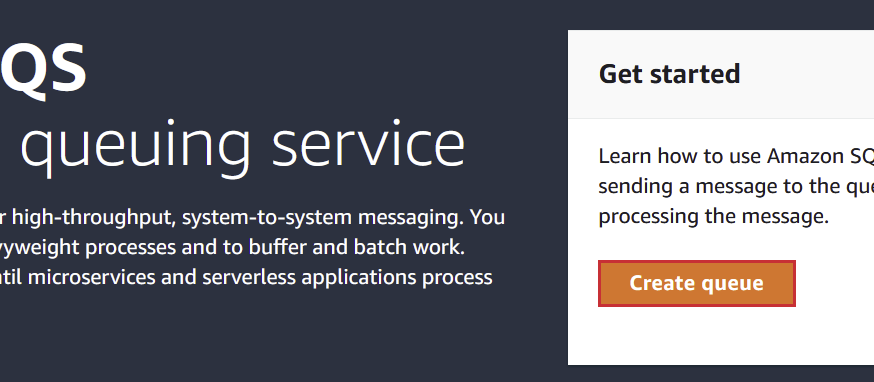
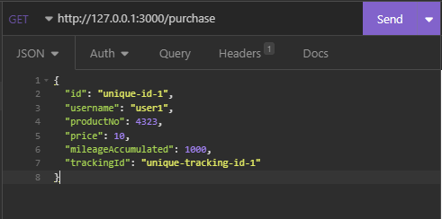
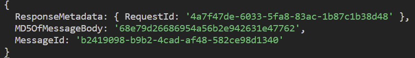

사전적 의미로 컴퓨터에서 의미하는 **queue**는 다음과 같다

> a list of data items, commands, etc., stored so as to be retrievable in a definite order, usually the order of insertion.

필자는 이 정의가 개발에서 말하는 queue에 대해 많은 것을 설명할 수 있다고 생각한다. Queue는 처리를 나중에 가능하게 하며 다른 어플리케이션에서 그 처리 데이터를 불러올 수 있다. 서비스가 커지고 그 결과로 서버가 처리해야 하는 요청의 수나 처리 복잡도가 증가할 때, 하나 이상의 서버를 가지고 서버에 각각 다른 기능을 부여해야 할지도 모른다.

하지만, 모든 서버가 동일한 원천의 데이터를 필요하기 때문에 서버들 간의 통신에서 손실이 있어서는 안된다. 이러한 시나리오에서 queue 메시징이 필요하다. queue 메시징이 Node.js에서 어떻게 동작하는지 자주 쓰이는 queue 메시징 서비스 중 하나인 AWS SQS를 통해 알아보자.

## 필수
- Node
- VScode
- AWS account
- Insomnia

## 시나리오
Amazon같은 이커머스 웹사이트가 있다고 가정하자. 서버가 무수히 많은 주문 요청을 받고 배달, 마일리지, 개인화 추천같은 응답을 일일이 보내주는 상황이 그려질 것이다. 만약 1000개의 요청을 다룬다면 하나의 서버로 처리하는 건 문제가 없을 수 있다. 만약 ms당 10,000,000 혹은 100,000,000 개를 처리해야 한다면 스케일 업을 해야 한다.

이 시나리오를 간략하게 구현하기 위해 클라이언트에서 구매 요청을 받는 서버를 만든 후 이 정보를 두 개의 다른 queue에 보내게 한다. 또 마일리지와 상품 추적을 담당할 두 개의 서버를 만든다. 이 두 서버가 처음에 보낸 queue로 전달한 메시지가 사용되는 지점이다. 

## AWS SQS Queue 생성
**purchase** 서버로부터 메시지를 받는 Queue를 생성하려고 한다. 하나는 **mileage** 서버용이고 다른 하나는 **product tracking** 서버용이다. AWS 콘솔에 로그인하여 SQS로 페이지를 이동한다. _**create**_ queue를 누르고 queue의 역할에 맞는 특정한 이름을 준다. _**encryption**_ 과 다른 설정은 디폴트로 둔다 - _사용자의 목적에 맞게 몇가지 파라미터를 설정할 수 있지만 테스트용이니 넘어간다_ - API에서 queue에 접근하기 위해서는 각 queue의 url을 기억해두어야 한다.



## 연습
AWS SQS를 어플리케이션에 사용할 때 필요한 라이브러리들을 설치한다.
```
npm install --save express dotenv aws-sdk sqs-consumer
```
> sqs-consumer - SQS메시지를 처리하는 async 함수를 정의하여 SQS 기반의 어플리케이션을 만들어 준다.

이 글에 사용된 코드는 개인 github에서 찾아볼 수 있다 — https://github.com/shkim04/sqs-scenario

아주 간단한 형태의 서버로 적용하는데 이는 AWS SQS를 적용하고 queue 메시지들이 어떻게 이동되는지에 더 초점을 맞추기 위함이다. 하나의 프로젝트 폴더 하위에 **purchase, mileage**와  **productTracking**라는 세 개의 폴더를 만든다. 그리고 각각 폴더 하위에 `server.js`라는 파일을 생성한다. **purchase** 하위에 있는 `server.js`에 아래 코드를 입력한다:

```js
require('dotenv').config('./.env');
const express = require('express');
const aws = require('aws-sdk');

const sqsClient = new aws.SQS({
  region: process.env.AWS_REGION,
  accessKeyId: process.env.AWS_ACCESS_KEY_ID,
  secretAccessKey: process.env.AWS_SECRET_ACCESS_KEY
  // always recommended to save credentials in .env file
});

const app = express();
const PORT = 3000;
const AWS_SQS_MILEAGE_URL = process.env.AWS_SQS_MILEAGE_URL;
const AWS_SQS_PRODUCT_TRACKING_URL = process.env.AWS_SQS_PRODUCT_TRACKING_URL;

app.use(express.json());

app.get('/purchase', async (req, res) => {
  const id = req.body.id;
  const username = req.body.username;
  const price = req.body.price;
  const mileageAccumulated = req.body.mileageAccumulated;
  const trackingId = req.body.trackingId;
 
  const mileagePayload = {
    'MessageBody': JSON.stringify({
      id: id,
      username: username,
      mileageAccumulated: mileageAccumulated,
      price: price
    }),
    'QueueUrl': AWS_SQS_MILEAGE_URL
  };

  const trackingPayload = {
    'MessageBody': JSON.stringify({
      id: id,
      username: username,
      trackingId: trackingId
    }),
    'QueueUrl': AWS_SQS_PRODUCT_TRACKING_URL
  };

  try {
    const mileageResponse = await sqsClient.sendMessage(mileagePayload).promise();
    const trackingReponse = await sqsClient.sendMessage(trackingPayload).promise();
    console.log(mileageResponse, trackingReponse);
    res.status(200).send('Order Request Success');
  }
  catch(err) {
    console.log('get /purchase error', err);
    res.status(500).send('Order Request Fail From Server');
  }  
});

app.listen(PORT, () => {
  console.log(`Server is running on ${PORT}`);
});
```
여기서 독자들이 환경 변수를 설정하고 불어오는 법에 대해 알고 위의 코드에 필요한 키와 url 값들을 입력했다고 가정하겠다.

준비가 완료되면 `node ./purchase/server.js`를 입력하여 **purchase** 서버를 실행한다. `/purchase` 라우트에 Insomnia를 통해 요청을 보내서 기대한 대로 SQS에서 메시지가 queue에 보내지는지 확인해보자.



위의 데이터가 **purchase** 서버에서 받아 SQS로 보낼 queue 메시지의 내용이다.  _**send**_를 누르면 서버의 터미널에 다음과 같은 로그가 출력된다:



메시지가 성공적으로 보내졌다.

**mileage**서버와 **productTracking** 서버가 이 메시지를 사용하기 위해 mileage 폴더 하위에 있는 `server.js`에 아래 코드를 입력한다:

```js
require('dotenv').config('./.env');
const { Consumer } = require('sqs-consumer');

const AWS_SQS_MILEAGE_URL = process.env.AWS_SQS_MILEAGE_URL;

const mileageConsumerApp = Consumer.create({
  queueUrl: AWS_SQS_MILEAGE_URL,
  handleMessage: async (message) => {
    let messageBody = JSON.parse(message.Body);
    let mileageInfo = parseInt(messageBody.mileageAccumulated);
    let price = parseInt(messageBody.price);
    let newMileage = mileageInfo + (price * 0.02);
    console.log("newMileage:", newMileage);
  }
});

mileageConsumerApp.on('error', (err) => {
  console.error(err.message);
});

mileageConsumerApp.on('processing_error', (err) => {
  console.error(err.message);
});

mileageConsumerApp.start();
```

**productTracking** 폴더 하위에 있는 `server.js`에 아래 코드를 입력한다 — _앞서 언급했듯이 두 서버는 동일한 queue url을 사용하지 않는다_.

```js
require('dotenv').config('./.env');
const { Consumer } = require('sqs-consumer');

const AWS_SQS_PRODUCT_TRACKING_URL = process.env.AWS_SQS_PRODUCT_TRACKING_URL;

const productTrackingConsumerApp = Consumer.create({
  queueUrl: AWS_SQS_PRODUCT_TRACKING_URL,
  handleMessage: async (message) => {
    let messageBody = JSON.parse(message.Body);
    let productTrackingId = messageBody.trackingId;
    // tracking logic here
    console.log("productTrackingId:", productTrackingId);
  }
});

productTrackingConsumerApp.on('error', (err) => {
  console.error(err.message);
});

productTrackingConsumerApp.on('processing_error', (err) => {
  console.error(err.message);
});

productTrackingConsumerApp.start();
```
터미널 두 개를 추가로 열어 두 서버를 실행한다. 두 서버는 queue로부터 메시지를 받고 메시지 안에 담긴 데이터를 처리할 것이다. 이를 확인하기 위해 `/purchase` 라우트로 다시 요청을 보내본 후 각 터미널에 출력된 로그를 확인한다.


Insomnia에 입력했던 데이터가 두 서버에서 기대했던 바와 같이 처리됐다.

## 결론
Queue 메시지는 방대한 양의 데이터와 요청이 있을 때 발생할 예상치 못한 상황을 통제하는데 도움이 될 수 있다. SQS가 괜찮은 솔루션이지만 적용할 수 있는 유일한 queue 메시지 플랫폼은 아니다. 이 글에서 얻은 기초를 통해 각자의 어플리케이션에 적용할 수 있는 최적의 queue 플랫폼을 찾아보기를 권하며 글을 마친다.

_**읽어 주셔서 감사합니다. To be continued!**_

_이 글은 [Medium](https://medium.com/@shkim04/how-to-use-aws-sqs-on-node-js-e932fea9f2ef)에도 업로드 되었습니다._
_놀러 오세요!_