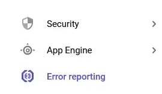
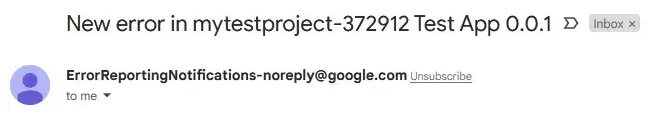

For developers, it cannot be mentioned enough that we should catch and alert errors as soon as possible, when an application is in service. There are many tools that help you accomplish this mission. Among many candidates, i will talk about **Google Error Reporting + Cloud Monitoring** here.

## Prerequisite
- Google Cloud Account
- Google Service Account — _if you do not know how to create this, check out [this article](https://shkim04.github.io/en/how-to-use-google-sheet-on-nodejs/)_
- Node
- Insomnia

## Enable Google Error Reporting
- Go to the dashboard of your google cloud project
- Click **APIs and services**
- Click **ENABLE APIS AND SERVICE**
- Type Error reporting on searching bar and enable it

## Set Up Node.js — Express
In order to focus solely on learning how to set up Google Error Reporting and grasp it, we won’t set up Express API from the scratch. Those who do not have one can download a simple express API boilerplate from [**my repository**](https://github.com/shkim04/express_typescript_simple_api). If you are done downloading, open the project so we can begin.

## Set Up Google Error Reporting For Express
```
npm install --save @google-cloud/error-reporting
```
We will download the library required as shown above. To activate the error reporting properly, we have to fill the fields in **ErrorReporting** object with corresponding values from the key `json` file you have added after creating **google service account**. 

Add this code as shown below to the main script and fill the values required:

```js
const { ErrorReporting } = require('@google-cloud/error-reporting');
// Instantiates a client
const errorReporting = new ErrorReporting({
                           projectId: 'your-project-id',
                           keyFilename: 'key.json name',
                           // this should look like 'hello.json'
                           credentials: require(`/path/to/key.json`),
                           reportMode: 'always',
                           // the reason why I set this to 'always' is 
                           // because the application is run in development mode
                           logLevel: 2,
                           serviceContext: {
                              service: "Name your app",
                              // ex) Test_APP
                              version: "specify your version",
                              // ex) 0.0.1
                           }
                           // serviceContext field should be filled
                      });
```

## Add Test Route
```js
app.get("/error", async (req: Request, res: Response, next: NextFunction): Promise<void> => {
   try {
      throw new Error("this is an intended error in '/error' route");
   }
   catch(err) {
      next(`<GET '/error route error>: ${err}`);
   }
});
```

We will create `/error` route. What happens in the route is that we deliberately throw an error when any request is made to the route so it can catch the error in the catch block for testing. Notice there is **next** object in the catch block, which means it works as a _**middleware**_. 

Simply put, it passes the string that contains what the error is about onto a function defined after the middleware. The code below does take in the error string from the middleware and does its job:

```js
app.use(errorReporting.express);
```

Make sure you write this line after the test route or it won’t work.

## Create Notification Channel in Cloud Monitoring
We expect that if any error occurs in Express application, it will report the error to **Google Error Reporting** Console. But, it does not tell us whether there was an error. It is so crucial to be alerted in this situation. Fortunately, google cloud has its own monitoring service. Here is the instruction for creating email notification channel:

- Go to Could Monitoring Dashboard
- Click **Alerting** and then click **Edit notification channels**
- In the **Email** section, click **Add new**
- Complete the dialog and click **Save**

We will add the notification channel to **google error reporting**. As soon as any error occurs, not only will errors be reported on google error reporting, but also will it be sent to the email you have registered. Here is the instruction to register the notification channel on **google error reporting**:



- Go to Error Reporting
- Click Configure Notification Channels
- Choose the notification you have created
- Click Save

## Test Request
After running the application in development mode, open Insominia so that we will make a request to the test route. Feel free to send a request that looks like:


As we desire, it will send a response containing the error string we have created in the previous section. Now, it is time to check whether this error is reported on google cloud console.

There will be an error newly reported on **google error reporting** console and you will see the content of the error and the app that the error came from. Plus, since we did add the notification channel via **cloud monitoring** — _we did add an email here_ — to **google error reporting**, you will get the notification email that looks like:



That’s for it about how to use google error reporting on Node.js.

_**THANKS FOR READING. SEE YOU NEXT TIME!**_

_This is originally posted on my [Medium](https://medium.com/@shkim04/how-to-use-google-error-reporting-on-node-js-45b0a6b3054c)._
_Let's connect!_