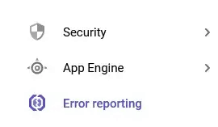
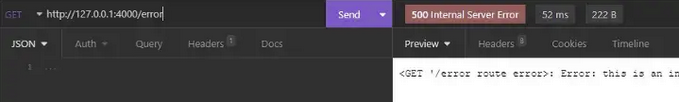
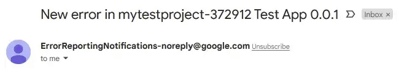

서비스중인 어플리케이션에 에러가 발생했을 때 개발자에게 에러를 신속하게 확인하고 알리는 것만큼 중요한 것도 없다. 이 목적으로 사용할 수 있는 많은 플랫폼들이 있는데 그 중 **Google Error Reporting + Cloud Monitoring**에 대해서 알아보려고 한다.

## 필수
- google cloud 계정
- google service 계정 — _만드는 법을 모르시는 분들은 [이 글](https://shkim04.github.io/nodejs-에서-google-sheet-사용하는법)을 보시면 된다_
- Node
- Insomnia

## Google Error Reporting 허용
- google clould 프로젝트 대시보드로 이동한다
- **APIs and services** 클릭
- **ENABLE APIS AND SERVICE** 클릭
- 검색 창에 Error reporting을 입력하고 해당 API를 허용한다

## Node.js — Express
Google Error Reporting을 사용하는 법에 중점을 두기 위해 Express API 서버를 만드는 것은 생략한다. 테스트용 Express API가 없는 분은 개인 **[레파지토리]**(https://github.com/shkim04/express_typescript_simple_api)에서 다운로드 받길 바란다. 준비가 되면 프로젝트를 열어 시작해보자.

##  Express에 Google Error Reporting 설정
```
npm install --save @google-cloud/error-reporting
```
필요한 라이브러리를 받은 후 error reproting을 정상적으로 동작시키기 위해 **ErrorReporting** 객체 안에 필요한 키 값들을 알맞게 넣어줘야 한다. 이 키 값들은 **google service account** 생성하고 난 뒤 추가한 key `json` 파일에서 얻을 수 있다. 

아래 코드를 메인 스크립트에 추가한 뒤 필요한 값들을 입력한다:

```js
const { ErrorReporting } = require('@google-cloud/error-reporting');
// Instantiates a client
const errorReporting = new ErrorReporting({
                           projectId: 'your-project-id',
                           keyFilename: 'key.json name',
                           // this should look like 'hello.json'
                           credentials: require(`/path/to/key.json`),
                           reportMode: 'always',
                           // the reason why I set this to 'always' is 
                           // because the application is run in development mode
                           logLevel: 2,
                           serviceContext: {
                              service: "Name your app",
                              // ex) Test_APP
                              version: "specify your version",
                              // ex) 0.0.1
                           }
                           // serviceContext field should be filled
                      });
```

## 테스트 Route 추가
```js
app.get("/error", async (req: Request, res: Response, next: NextFunction): Promise<void> => {
   try {
      throw new Error("this is an intended error in '/error' route");
   }
   catch(err) {
      next(`<GET '/error route error>: ${err}`);
   }
});
```
`/error` 라우트를 만드는데 이 라우트에 요청을 보내면 에러를 생성하게 만들어 catch 블락에서 에러를 잡아낼 수 있도록 한다. 이 catch 블락에 **next** 객체가 있는데 _**middleware**_로써 역할을 한다. 

간단히 말하자면 에러 내용이 담긴 문자열을 다른 함수에 전달한다. 아래 코드는 그 에러 내용을 받아 처리하는 부분이다:

```js
app.use(errorReporting.express);
```

위 코드를 테스트 라우트 다음에 적어야 정상적으로 동작하지 주의한다.

## Cloud Monitoring Notification 채널 생성
Expresss 어플리케이션에서 에러가 발생하면 즉각적으로 **Google Error Reporting** 콘솔에 기록이 되는 것을 예상할 수 있다. 하지만 에러가 발생해도 에러가 났는지 알려주는 기능은 없다. 에러가 발생된 것을 알리는 것이 중요한데 google cloud에는 자체적으로 모니터링 서비스가 존재한다. notificiation 채널을 만드는 법은 다음과 같다:

- Could Monitoring 대시보드로 이동한다
- **Alerting** 클릭 후 **Edit notification channels** 클릭한다
- **Email** 란에 있는 **Add new**를 클릭한다
- 대화 상자를 완료하고 **Save**를 클릭한다

이 notification 채널을 **google error reporting**에 추가한다. 에러가 발생하면 google error reporting에만 기록되고 notification 채널에 등록한 이메일로 알림을 받을 수 있다.
**google error reporting**에 notification 채널을 등록하는 법은 다음과 같다:



- Error Reporting 이동한다
- Configure Notification Channels 클릭한다
- 생성한 notification 선택한다
- Save 클릭한다

## 테스트 요청
개발 모드에서 어플리케이션을 실행한 후, Insomnia를 통해 테스트 라우트에 다음과 같은 요청을 보내보자:



예상한대로 에러 내용이 담긴 응답을 보내준다. 이제 google cloud 콘솔에 에러가 기록이 되었는지 확인한다.

**google error reporting** 콘솔에 에러가 기록되는 것을 확인할 수 있고 에러의 내용, 어떤 어플리케이션에서 에러가 발생했는지도 확인할 수 있다. 또한, **cloud monitoring**을 통해 notification 채널을 **google error reporting**에 추가했으므로 다음과 같이 이메일로 알림을 받게 된다 - _이메일을 선택했다는 것을 기억하자_:



여기까지 Node.js에 google error reporting을 사용하는 법을 알아보았다.

_**읽어 주셔서 감사합니다. To be continued!**_

_이 글은 [Medium](https://medium.com/@shkim04/how-to-use-google-error-reporting-on-node-js-45b0a6b3054c)에도 업로드 되었습니다._
_놀러 오세요!_